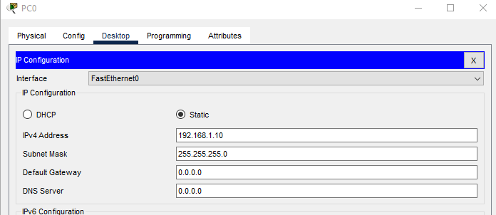
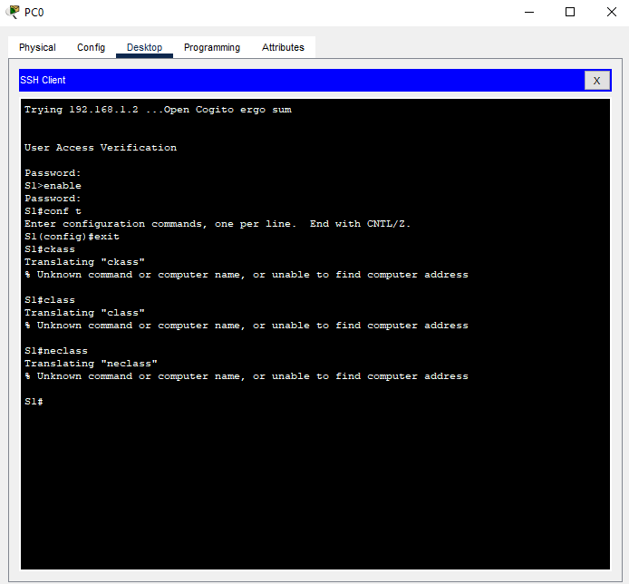

# 网作业

Работа выполнена на ПК с установленным Cisco Packet Tracer.

### Часть 1. Создание сети и проверка настроек коммутатора по умолчанию

#### 1.1 Топология


#### 1.2 Проверка настроек коммутатора по умолчанию 

a. Введём команду *enable*, чтобы войти в привилегированный режим EXEC. Далее вводим команду 

       *show running-config*

 На коммутатор находиться пустой файл конфигурации по умолчанию. Оставляем. 

b. Изучите текущий файл running configuration.

Сколько интерфейсов FastEthernet имеется на коммутаторе 2960? 
- 24

Сколько интерфейсов Gigabit Ethernet имеется на коммутаторе 2960?
- 2

Каков диапазон значений, отображаемых в vty-линиях?

- 0-4; 5-15.

c. Изучите файл загрузочной конфигурации (startup configuration), который содержится в энергонезависимом ОЗУ (NVRAM).

Вводим команду 

       *show startup-config*

-	startup-config is not present

d. Изучите характеристики SVI для VLAN 1.

Вводим команду 

       *show vlan* и *show vlan brief*

Назначен ли IP-адрес сети VLAN 1?

- Нет

Данный интерфейс включен?

- Нет

e.	Изучите IP-свойства интерфейса SVI сети VLAN 1.

Какие выходные данные вы видите?

     *show ip int br*
     
     Interface              IP-Address      OK? Method Status                Protocol 
     FastEthernet0/1        unassigned      YES manual down                  down 
     FastEthernet0/2        unassigned      YES manual down                  down 
     FastEthernet0/3        unassigned      YES manual down                  down 
     FastEthernet0/4        unassigned      YES manual down                  down 
     FastEthernet0/5        unassigned      YES manual down                  down 
     FastEthernet0/6        unassigned      YES manual doun                  down 
     FastEthernet0/7        unassigned      YES manual down                  down 
     FastEthernet0/8        unassigned      YES manual down                  down 
     FastEthernet0/9        unassigned      YES manual down                  down 
     FastEthernet0/10       unassigned      YES manual down                  down 
     FastEthernet0/11       unassigned      YES manual down                  down 
     FastEthernet0/12       unassigned      YES manual down                  down 
     FastEthernet0/13       unassigned      YES manual down                  down 
     FastEthernet0/14       unassigned      YES manual down                  down 
     FastEthernet0/15       unassigned      YES manual down                  down 
     FastEthernet0/16       unassigned      YES manual down                  down 
     FastEthernet0/17       unassigned      YES manual down                  down 
     FastEthernet0/18       unassigned      YES manual down                  down 
     FastEthernet0/19       unassigned      YES manual down                  down 
     FastEthernet0/20       unassigned      YES manual down                  down 
     FastEthernet0/21       unassigned      YES manual down                  down 

f.	Подсоедините кабель Ethernet компьютера PC-A к порту 6 на коммутаторе и изучите IP-свойства интерфейса SVI сети VLAN 1. Дождитесь согласования параметров скорости и дуплекса между коммутатором и ПК.

Какие выходные данные вы видите?

     *show ip int br*

     Interface              IP-Address      OK? Method Status                Protocol 
     FastEthernet0/1        unassigned      YES manual down                  down 
     FastEthernet0/2        unassigned      YES manual down                  down 
     FastEthernet0/3        unassigned      YES manual down                  down 
     FastEthernet0/4        unassigned      YES manual down                  down 
     FastEthernet0/5        unassigned      YES manual down                  down 
     FastEthernet0/6        unassigned      YES manual up                    up 
     FastEthernet0/7        unassigned      YES manual down                  down 
     FastEthernet0/8        unassigned      YES manual down                  down 
     FastEthernet0/9        unassigned      YES manual down                  down 
     FastEthernet0/10       unassigned      YES manual down                  down 
     FastEthernet0/11       unassigned      YES manual down                  down 
     FastEthernet0/12       unassigned      YES manual down                  down 
     FastEthernet0/13       unassigned      YES manual down                  down 
     FastEthernet0/14       unassigned      YES manual down                  down 
     FastEthernet0/15       unassigned      YES manual down                  down 
     FastEthernet0/16       unassigned      YES manual down                  down 
     FastEthernet0/17       unassigned      YES manual down                  down 
     FastEthernet0/18       unassigned      YES manual down                  down 
     FastEthernet0/19       unassigned      YES manual down                  down 
     FastEthernet0/20       unassigned      YES manual down                  down 
     FastEthernet0/21       unassigned      YES manual down                  down        

g.	Изучите сведения о версии ОС Cisco IOS на коммутаторе.

Вводим команду 

      *show version*

Под управлением какой версии ОС Cisco IOS работает коммутатор?

- Version 15.0(2)SE4

Как называется файл образа системы?

- C2960 Software (C2960-LANBASEK9-M)

h.	Изучите свойства по умолчанию интерфейса FastEthernet, который используется компьютером PC-A.

Вводим 

     *show interface f0/6*.

Интерфейс включен или выключен?

- Выключен.

Что нужно сделать, чтобы включить интерфейс?

- Зайти в глобальную конфигурацию 

     *conf t*; 
   
войти в нужный интерфейс 
   
      *int f0/6* ; 
      
разрешить интерфейсу работать 

     *no shutdown*.

i.	Изучите флеш-память.

Выполнияем следующие команды, чтобы изучить содержимое флеш-каталога.(команды равнозначны):

     *show flash*
     *dir flash:* 

В конце имени файла указано расширение, например .bin. Каталоги не имеют расширения файла.

Какое имя присвоено образу Cisco IOS?

- 2960-lanbasek9-mz.150-2.SE4.bin

### Часть 2. Настройка базовых параметров сетевых устройств

#### 2.1 Настройка базовых параметров коммутатора

a. В режиме глобальной конфигурации выставляем базовые параметры

     *enable;* 
     *conf t;*
     *no ip domain-lookup
     hostname S1
     service password-encryption
     enable secret class
     banner motd # Unauthorized access is strictly prohibited. #* 

b. Назначаем IP-адрес интерфейсу SVI на коммутаторе. Благодаря этому получаем возможность удаленного управления коммутатором. Прежде чем сможем управлять коммутатором S1 удаленно с компьютера PC-A, коммутатору нужно назначить IP-адрес. Согласно конфигурации по умолчанию коммутатором можно управлять через VLAN 1.
 
 Устройство | Интерфейс | IP-адрес/префикс
:------------:|:-----------:|:------------------:
 S1         | VLAN 1    | 192.168.1.2/24
 PC-1       | NIC       | 192.168.1.10/24

       *enable*
       *conf t*
       *int vlan 1*
       *ip address 192.168.1.2 255.255.255.0*


c. Доступ через порт консоли ограничиваем с помощью пароля. Используем *cisco* в качестве пароля для входа в консоль. Конфигурация по умолчанию разрешает все консольные подключения без пароля. Чтобы консольные сообщения не прерывали выполнение команд, используем параметр *logging synchronous*.
  
      *enable*
      *conf t*
      *enable secret cisco*
      *exit*
      *line con 0*
      *logging synchronous*

d. Настроим каналы виртуального соединения для удаленного управления (vty), чтобы коммутатор разрешил доступ через Telnet. Если не настроить пароль VTY, будет невозможно подключиться к коммутатору по протоколу Telnet.

      *enable*
      *conf t*
      *line vty 0 15*
      *password cisco*
      *login*

Для чего нужна команда login?

- Для включения требования аутентификации, которая обязательна для подключения.

#### 2.2 Настройка IP-адрес на компьютере PC-A.

Назначаем компьютеру IP-адрес и маску подсети в соответствии с таблицей адресации.



### Часть 3. Проверка сетевых подключений

#### 3.1 Отображаем конфигурацию коммутатора

a.	Параметры, которые мы настроили выделены жирным шрифтом. Другие параметры конфигурации — значения IOS по умолчанию.

```
*show running-config*

Building configuration...

Current configuration : 1296 bytes
!
version 15.0
no service timestamps log datetime msec
no service timestamps debug datetime msec
**service password-encryption**
!
**hostname S1**
!
**enable secret 5 $1$mERr$hx5rVt7rPNoS4wqbXKX7m0**
!
!
!
no ip domain-lookup
!
!
!
spanning-tree mode pvst
spanning-tree extend system-id
!
interface FastEthernet0/1
!
interface FastEthernet0/2
!
interface FastEthernet0/3
!
interface FastEthernet0/4
!
interface FastEthernet0/5
!
interface FastEthernet0/6
!
interface FastEthernet0/7
!
interface FastEthernet0/8
!
interface FastEthernet0/9
!
interface FastEthernet0/10
!
interface FastEthernet0/11
!
interface FastEthernet0/12
!
interface FastEthernet0/13
!
interface FastEthernet0/14
!
interface FastEthernet0/15
!
interface FastEthernet0/16
!
interface FastEthernet0/17
!
interface FastEthernet0/18
!
interface FastEthernet0/19
!
interface FastEthernet0/20
!
interface FastEthernet0/21
!
interface FastEthernet0/22
!
interface FastEthernet0/23
!
interface FastEthernet0/24
!
interface GigabitEthernet0/1
!
interface GigabitEthernet0/2
!
**interface Vlan1**
 **ip address 192.168.1.2 255.255.255.0**
 **shutdown**
!
**banner motd ^C**
**Unauthorized access is strictly prohibited. ^C**
!
!
!
line con 0
 **logging synchronous**
**password 7 0822455D0A1**
**login**
!
line vty 0 4
 **password 7 0822455D0A16**
 **login**
line vty 5 15
 **password 7 0822455D0A16**
 **login**
```

#### 3.2 Протестируем сквозное соединение, отправив эхо-запрос.

a. В командной строке компьютера PC-A с помощью утилиты ping проверяем связь с адресом PC-A.

 ```
ping 192.168.1.10

Pinging 192.168.1.10 with 32 bytes of data:

Reply from 192.168.1.10: bytes=32 time<1ms TTL=128
Reply from 192.168.1.10: bytes=32 time=4ms TTL=128
Reply from 192.168.1.10: bytes=32 time=4ms TTL=128
Reply from 192.168.1.10: bytes=32 time=4ms TTL=128

Ping statistics for 192.168.1.10:
    Packets: Sent = 4, Received = 4, Lost = 0 (0% loss),
Approximate round trip times in milli-seconds:
 Minimum = 0ms, Maximum = 4ms, Average = 3ms 
 ```


b. Из командной строки компьютера PC-A отправляем эхо-запрос на административный адрес интерфейса SVI коммутатора S1.C:\>ping 192.168.1.2

```
Pinging 192.168.1.2 with 32 bytes of data:

Request timed out.
Request timed out.
Request timed out.
Request timed out.

Ping statistics for 192.168.1.2:
    Packets: Sent = 4, Received = 0, Lost = 4 (100% loss)
```

**Ищем проблему, предположительно vlan1 находиться в состоянии административного отключения, так как ранее активировали только порт6. Решение: **

```
*enable*
*conf t*
*int vlan 1*
*no shutdown*
```

Проверяем:

```
C:\>ping 192.168.1.2

Pinging 192.168.1.2 with 32 bytes of data:

Reply from 192.168.1.2: bytes=32 time<1ms TTL=255
Reply from 192.168.1.2: bytes=32 time<1ms TTL=255
Reply from 192.168.1.2: bytes=32 time<1ms TTL=255
Reply from 192.168.1.2: bytes=32 time<1ms TTL=255

Ping statistics for 192.168.1.2:
    Packets: Sent = 4, Received = 4, Lost = 0 (0% loss),
Approximate round trip times in milli-seconds:
    Minimum = 0ms, Maximum = 0ms, Average = 0ms
```
Проблема решена.


#### 3.3 Проверяем удаленное управление коммутатором S1

Используем удаленный доступ к устройству с помощью Telnet. В нашем случпе устройства PC-A и S1 расположены рядом. В производственной сети коммутатор может находиться в коммутационном шкафу на последнем этаже, в то время как административный компьютер находится на первом этаже. На данном этапе вам предстоит использовать Telnet для удаленного доступа к коммутатору S1 через его административный адрес SVI. Telnet — это не безопасный протокол, но мы можем использовать его для проверки удаленного доступа. В случае с Telnet вся информация, включая пароли и команды, отправляется через сеанс в незашифрованном виде. В последующих лабораторных работах мы будем использовать протокол SSH для удаленного доступа к сетевым устройствам.

При подключении выбран протокол telnet, однако система автоматически подключается по SSH.



### 4. Вопросы для повторения

1.	Зачем необходимо настраивать пароль VTY для коммутатора?

- VTY линии отвечают за подключения по протоколам Telnet, SSH (иногда и по другим). Если пароль не установлен, любой пользователь в сети, имеющий сетевой доступ к коммутатору, сможет подключиться к нему по Telnet/SSH и получить полный доступ к консоли (уровень привилегий EXEC) без какого-либо подтверждения личности. Кратко - для безопасности.

2.	Что нужно сделать, чтобы пароли не отправлялись в незашифрованном виде?

- Использовать протокол SSH вместо Telnet и включить глобальное шифрование паролей командой *service password-encryption*. 


