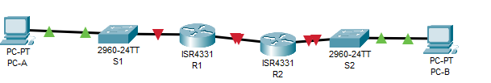
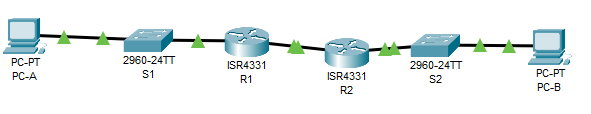

# Настройка DHCPv6

Работа выполнена на ПК с установленным Cisco Packet Tracer.

#### Топология



#### Таблица адресации

 Устройство | Интерфейс | IP-адрес/префикс 
:----------:|:---------:|:----------------:
 R1         | G0/0/0    | 2001:db8:acad:2::1/64 fe80::1  
            | G0/0/1    | 2001:db8:acad:1::1/64 fe80::1     
 R2         | G0/0/0    | 2001:db8:acad:2::2/64 fe80::2     
            | G0/0/1    | 2001:db8:acad:3::1/64 fe80::1 
  PC-A      | NIC       | DHCP             
   PC-B     | NIC       | DHCP           


### Часть 1. Создание сети и настройка основных параметров устройства

#### Шаг 1.1. Настройка базовых параметров каждого коммутатора

a.	Присвойте коммутатору имя устройства.

```
Switch(config)#hostname S1
```

```
Switch(config)#hostname S2
```

b.	Отключите поиск DNS, чтобы предотвратить попытки маршрутизатора неверно преобразовывать введенные команды таким образом, как будто они являются именами узлов.

```
S1(config)#no ip domain-lookup 
```

```
S2(config)#no ip domain-lookup 

```

c.	Назначьте class в качестве зашифрованного пароля привилегированного режима EXEC.

-

d.	Назначьте cisco в качестве пароля консоли и включите вход в систему по паролю.

-

e.	Назначьте cisco в качестве пароля VTY и включите вход в систему по паролю.

-

f.	Зашифруйте открытые пароли.

```
S1(config)#service password-encryption 
```

```
S2(config)#service password-encryption 
```

g.	Создайте баннер с предупреждением о запрете несанкционированного доступа к устройству.

```
S1(config)#banner motd #AAAAA#
```


```
S2(config)#banner motd #BBBBB#
```

h.	Отключите все неиспользуемые порты.

```
S1(config)#vlan 999
S1(config-vlan)#na
S1(config-vlan)#name Parking_Lot
S1(config-vlan)#exit
S1(config)#int range f0/1-4 ,f0/7-24, g0/1-2
S1(config-if-range)#sw
S1(config-if-range)#switchport m
S1(config-if-range)#switchport mode ac
S1(config-if-range)#switchport mode access 
S1(config-if-range)#sw
S1(config-if-range)#switchport ac
S1(config-if-range)#switchport access vlan 999
S1(config-if-range)#shut
S1(config-if-range)#shutdown 

%LINK-5-CHANGED: Interface FastEthernet0/1, changed state to administratively down

%LINK-5-CHANGED: Interface FastEthernet0/2, changed state to administratively down

%LINK-5-CHANGED: Interface FastEthernet0/3, changed state to administratively down

%LINK-5-CHANGED: Interface FastEthernet0/4, changed state to administratively down

%LINK-5-CHANGED: Interface FastEthernet0/7, changed state to administratively down

%LINK-5-CHANGED: Interface FastEthernet0/8, changed state to administratively down

%LINK-5-CHANGED: Interface FastEthernet0/9, changed state to administratively down

%LINK-5-CHANGED: Interface FastEthernet0/10, changed state to administratively down

%LINK-5-CHANGED: Interface FastEthernet0/11, changed state to administratively down

%LINK-5-CHANGED: Interface FastEthernet0/12, changed state to administratively down

%LINK-5-CHANGED: Interface FastEthernet0/13, changed state to administratively down

%LINK-5-CHANGED: Interface FastEthernet0/14, changed state to administratively down

%LINK-5-CHANGED: Interface FastEthernet0/15, changed state to administratively down

%LINK-5-CHANGED: Interface FastEthernet0/16, changed state to administratively down

%LINK-5-CHANGED: Interface FastEthernet0/17, changed state to administratively down

%LINK-5-CHANGED: Interface FastEthernet0/18, changed state to administratively down

%LINK-5-CHANGED: Interface FastEthernet0/19, changed state to administratively down

%LINK-5-CHANGED: Interface FastEthernet0/20, changed state to administratively down

%LINK-5-CHANGED: Interface FastEthernet0/21, changed state to administratively down

%LINK-5-CHANGED: Interface FastEthernet0/22, changed state to administratively down

%LINK-5-CHANGED: Interface FastEthernet0/23, changed state to administratively down

%LINK-5-CHANGED: Interface FastEthernet0/24, changed state to administratively down

%LINK-5-CHANGED: Interface GigabitEthernet0/1, changed state to administratively down

%LINK-5-CHANGED: Interface GigabitEthernet0/2, changed state to administratively down
```


```
S2(config)#vlan 999
S2(config-vlan)#na,
S2(config-vlan)#na
S2(config-vlan)#name Parking_Lot
S2(config-vlan)#exit
S2(config)#int range f0/1-4 , f0/6-17 ,f0/19-24, g0/1-2
S2(config-if-range)#sw
S2(config-if-range)#switchport m
S2(config-if-range)#switchport mode ac
S2(config-if-range)#switchport mode access 
S2(config-if-range)#sw
S2(config-if-range)#switchport ac
S2(config-if-range)#switchport access vlan 999
S2(config-if-range)#sg
S2(config-if-range)#sh

%LINK-5-CHANGED: Interface FastEthernet0/1, changed state to administratively down

%LINK-5-CHANGED: Interface FastEthernet0/2, changed state to administratively down

%LINK-5-CHANGED: Interface FastEthernet0/3, changed state to administratively down

%LINK-5-CHANGED: Interface FastEthernet0/4, changed state to administratively down

%LINK-5-CHANGED: Interface FastEthernet0/6, changed state to administratively down

%LINK-5-CHANGED: Interface FastEthernet0/7, changed state to administratively down

%LINK-5-CHANGED: Interface FastEthernet0/8, changed state to administratively down

%LINK-5-CHANGED: Interface FastEthernet0/9, changed state to administratively down

%LINK-5-CHANGED: Interface FastEthernet0/10, changed state to administratively down

%LINK-5-CHANGED: Interface FastEthernet0/11, changed state to administratively down

%LINK-5-CHANGED: Interface FastEthernet0/12, changed state to administratively down

%LINK-5-CHANGED: Interface FastEthernet0/13, changed state to administratively down

%LINK-5-CHANGED: Interface FastEthernet0/14, changed state to administratively down

%LINK-5-CHANGED: Interface FastEthernet0/15, changed state to administratively down

%LINK-5-CHANGED: Interface FastEthernet0/16, changed state to administratively down

%LINK-5-CHANGED: Interface FastEthernet0/17, changed state to administratively down

%LINK-5-CHANGED: Interface FastEthernet0/19, changed state to administratively down

%LINK-5-CHANGED: Interface FastEthernet0/20, changed state to administratively down

%LINK-5-CHANGED: Interface FastEthernet0/21, changed state to administratively down

%LINK-5-CHANGED: Interface FastEthernet0/22, changed state to administratively down

%LINK-5-CHANGED: Interface FastEthernet0/23, changed state to administratively down

%LINK-5-CHANGED: Interface FastEthernet0/24, changed state to administratively down

%LINK-5-CHANGED: Interface GigabitEthernet0/1, changed state to administratively down

%LINK-5-CHANGED: Interface GigabitEthernet0/2, changed state to administratively down
S2(config-if-range)#
```


i.	Сохраните текущую конфигурацию в файл загрузочной конфигурации.

```
S1#copy running-config st
S1#copy running-config startup-config 
Destination filename [startup-config]? 
Building configuration...
[OK]
```

```
S2#copy running-config startup-config 
Destination filename [startup-config]? 
Building configuration...
[OK]
```

#### Шаг 1.2. Произведите базовую настройку маршрутизаторов.

a.	Назначьте маршрутизатору имя устройства.

```
Router(config)#hostname R1
```


```
Router(config)#hostname R2
```

b.	Отключите поиск DNS, чтобы предотвратить попытки маршрутизатора неверно преобразовывать введенные команды таким образом, как будто они являются именами узлов.

```
R1(config)#no ip domain-lookup 
```

```
R2(config)#no ip domain-lookup 
```

c.	Назначьте class в качестве зашифрованного пароля привилегированного режима EXEC.

```
R1(config)#enable secret class
```

```
R2(config)#enable secret class
```

d.	Назначьте cisco в качестве пароля консоли и включите вход в систему по паролю.

```
R1(config)#line console 0
R1(config-line)#oas
R1(config-line)#pas
R1(config-line)#password cisco
R1(config-line)#login
R1(config-line)#exit
```

```
R2(config)#line console 0
R2(config-line)#oas
R2(config-line)#pas
R2(config-line)#password cisco
R2(config-line)#login
R2(config-line)#exit
```


e.	Назначьте cisco в качестве пароля VTY и включите вход в систему по паролю.

```
R1(config)#line vt
R1(config)#line vty 0 4
R1(config-line)#pas
R1(config-line)#password cisco
R1(config-line)#login
R1(config-line)#exit
```

```
R2(config)#line vt
R2(config)#line vty 0 4
R2(config-line)#pas
R2(config-line)#password cisco
R2(config-line)#login
```

f.	Зашифруйте открытые пароли.

```
R1(config)#service password-encryption 
```

```
R2(config)#service password-encryption 
```

g.	Создайте баннер с предупреждением о запрете несанкционированного доступа к устройству.

```
R1(config)#banner motd #GO#
```

```
R2(config)#banner motd #NOT GO#
```

h.	Активация IPv6-маршрутизации

```
R1(config)#ipv6 unicast-routing
```

```
R2(config)#ipv6 un
R2(config)#ipv6 unicast-routing 
```

i.	Сохраните текущую конфигурацию в файл загрузочной конфигурации.

```
R1#copy running-config st
R1#copy running-config startup-config 
Destination filename [startup-config]? 
Building configuration...
[OK]
```

```
R2#copy running-config startup-config 
Destination filename [startup-config]? 
Building configuration...
[OK]
```

#### Шаг 1.3.Настройка интерфейсов и маршрутизации для обоих маршрутизаторов.

a.	Настройте интерфейсы G0/0/0 и G0/1 на R1 и R2 с адресами IPv6, указанными в таблице выше.

```
R1#conf t
Enter configuration commands, one per line.  End with CNTL/Z.
R1(config)#int g0/0/0
R1(config-if)#des
R1(config-if)#description To_R2
R1(config-if)#description To_R2_g0/0/0
R1(config-if)#ipv6 address 2001:db8:acad:2::1/64
R1(config-if)#ipv6 address fe80::1 li
R1(config-if)#ipv6 address fe80::1 link-local 
R1(config-if)#no sh
R1(config-if)#no shutdown 

R1(config-if)#
%LINK-5-CHANGED: Interface GigabitEthernet0/0/0, changed state to up

R1(config-if)#exit
R1(config)#int g0/0/1
R1(config-if)#description To_S1_g0/0/1
R1(config-if)#ipv6 address 2001:db8:acad:1::1/64
R1(config-if)#ipv6 address fe80::1 link-local 
R1(config-if)#no shutdown 

R1(config-if)#
%LINK-5-CHANGED: Interface GigabitEthernet0/0/1, changed state to up

%LINEPROTO-5-UPDOWN: Line protocol on Interface GigabitEthernet0/0/1, changed state to up
```

```
R2(config)#int g0/0/0
R2(config-if)#de
R2(config-if)#des
R2(config-if)#description To_R1_g0/0/0
R2(config-if)#ipv6 address 2001:db8:acad:2::2/64
R2(config-if)#ipv6 address fe80::2 li
R2(config-if)#ipv6 address fe80::2 link-local 
R2(config-if)#no sh
R2(config-if)#no shutdown 

R2(config-if)#
%LINK-5-CHANGED: Interface GigabitEthernet0/0/0, changed state to up

%LINEPROTO-5-UPDOWN: Line protocol on Interface GigabitEthernet0/0/0, changed state to up
rxit
              ^
% Invalid input detected at '^' marker.
	
R2(config-if)#int g0/0/1
R2(config-if)#description To_S2_g0/0/1
R2(config-if)#ipv6 address 2001:db8:acad:3::1/64
R2(config-if)#ipv6 address fe80::1 link-local 
R2(config-if)#no shutdown 

R2(config-if)#
%LINK-5-CHANGED: Interface GigabitEthernet0/0/1, changed state to up

%LINEPROTO-5-UPDOWN: Line protocol on Interface GigabitEthernet0/0/1, changed state to up
```


b.	Настройте маршрут по умолчанию на каждом маршрутизаторе, который указывает на IP-адрес G0/0/0 на другом маршрутизаторе.

```
ipv6 route ::/0 g0/0/0 fe80::2
```

```
R2(config)#ipv6 route ::/0 g0/0/0 fe80::1
```

c.	Убедитесь, что маршрутизация работает с помощью пинга адреса G0/0/1 R2 из R1

```
R1#ping 2001:db8:acad:3::1

Type escape sequence to abort.
Sending 5, 100-byte ICMP Echos to 2001:db8:acad:3::1, timeout is 2 seconds:
!!!!!
Success rate is 100 percent (5/5), round-trip min/avg/max = 0/0/0 ms
```

d.	Сохраните текущую конфигурацию в файл загрузочной конфигурации.

```
R1#copy running-config st
R1#copy running-config startup-config 
Destination filename [startup-config]? 
Building configuration...
[OK]
```

```
R2#copy running-config st
R2#copy running-config startup-config 
Destination filename [startup-config]? 
Building configuration...
[OK]
```

### Часть 2. Проверка назначения адреса SLAAC от R1

В части 2 вы убедитесь, что узел PC-A получает адрес IPv6 с помощью метода SLAAC.
Включите PC-A и убедитесь, что сетевой адаптер настроен для автоматической настройки IPv6.
Через несколько минут результаты команды ipconfig должны показать, что PC-A присвоил себе адрес из сети 2001:db8:1::/64.

```
C:\>ipconfig

FastEthernet0 Connection:(default port)

   Connection-specific DNS Suffix..: 
   Link-local IPv6 Address.........: FE80::201:63FF:FEEE:5955
   IPv6 Address....................: 2001:DB8:ACAD:1:201:63FF:FEEE:5955
   IPv4 Address....................: 0.0.0.0
   Subnet Mask.....................: 0.0.0.0
   Default Gateway.................: FE80::1
                                     0.0.0.0

Bluetooth Connection:

   Connection-specific DNS Suffix..: 
   Link-local IPv6 Address.........: ::
   IPv6 Address....................: ::
   IPv4 Address....................: 0.0.0.0
   Subnet Mask.....................: 0.0.0.0
   Default Gateway.................: ::
                                     0.0.0.0
```

Присвоил.

- Откуда взялась часть адреса с идентификатором хоста?
Ответ: Идентефикатор сгенерирован из МАК-адреса ПК-А, посредством преобразования EUI-64.

### Часть 3. Часть 3. Настройка и проверка сервера DHCPv6 на R1

#### Шаг 3.1. Более подробно изучите конфигурацию PC-A

a.	Выполните команду ipconfig /all на PC-A и посмотрите на результат.

```
C:\>ipconfig /all

FastEthernet0 Connection:(default port)

   Connection-specific DNS Suffix..: 
   Physical Address................: 0001.63EE.5955
   Link-local IPv6 Address.........: FE80::201:63FF:FEEE:5955
   IPv6 Address....................: 2001:DB8:ACAD:1:201:63FF:FEEE:5955
   IPv4 Address....................: 0.0.0.0
   Subnet Mask.....................: 0.0.0.0
   Default Gateway.................: FE80::1
                                     0.0.0.0
   DHCP Servers....................: 0.0.0.0
   DHCPv6 IAID.....................: 
   DHCPv6 Client DUID..............: 00-01-00-01-50-53-B7-B5-00-01-63-EE-59-55
   DNS Servers.....................: ::
                                     0.0.0.0

Bluetooth Connection:

   Connection-specific DNS Suffix..: 
   Physical Address................: 0001.4226.C4DD
   Link-local IPv6 Address.........: ::
   IPv6 Address....................: ::
   IPv4 Address....................: 0.0.0.0
   Subnet Mask.....................: 0.0.0.0
   Default Gateway.................: ::
                                     0.0.0.0
   DHCP Servers....................: 0.0.0.0
   DHCPv6 IAID.....................: 
   DHCPv6 Client DUID..............: 00-01-00-01-50-53-B7-B5-00-01-63-EE-59-55
   DNS Servers.....................: ::
                                     0.0.0.0
```

b.	Обратите внимание, что основной DNS-суффикс отсутствует. Также обратите внимание, что предоставленные адреса DNS-сервера являются адресами «локального сайта anycast», а не одноадресные адреса, как ожидалось.


#### Шаг 3.2. Настройте R1 для предоставления DHCPv6 без состояния для PC-A

a.	Создайте пул DHCP IPv6 на R1 с именем R1-STATELESS. В составе этого пула назначьте адрес DNS-сервера как 2001:db8:acad: :1, а имя домена — как stateless.com.

```
R1(config)#ipv6 dhcp pool R1-STATELESS
R1(config-dhcpv6)#dn
R1(config-dhcpv6)#dns-server 2001:db8:acad::254
R1(config-dhcpv6)#dom
R1(config-dhcpv6)#domain-name 
R1(config-dhcpv6)#domain-name STATELESS.com
```

b.	Настройте интерфейс G0/0/1 на R1, чтобы предоставить флаг конфигурации OTHER для локальной сети R1 и укажите только что созданный пул DHCP в качестве ресурса DHCP для этого интерфейса.

```
R1(config)#int g0/0/1
R1(config-if)#ipv
R1(config-if)#ipv6 n
R1(config-if)#ipv6 nd
R1(config-if)#ipv6 nd othe
R1(config-if)#ipv6 nd other-config-flag 
R1(config-if)#ipv6 d
R1(config-if)#ipv6 dhcp se
R1(config-if)#ipv6 dhcp server R1-STATELESS
```

c.	Сохраните текущую конфигурацию в файл загрузочной конфигурации.

```
R1#copy running-config startup-config
Destination filename [startup-config]? 
Building configuration...
[OK]
```

d.	Перезапустите PC-A.

```
C:\>ipconfig /release
Port is not using DHCP.
C:\>ipconfig /renew
DHCP request failed. 

```

e.	Проверьте вывод ipconfig /all и обратите внимание на изменения.

```
C:\>ipconfig /all

FastEthernet0 Connection:(default port)

   Connection-specific DNS Suffix..: STATELESS.com 
   Physical Address................: 0001.63EE.5955
   Link-local IPv6 Address.........: FE80::201:63FF:FEEE:5955
   IPv6 Address....................: 2001:DB8:ACAD:1:201:63FF:FEEE:5955
   Autoconfiguration IP Address....: 169.254.89.85
   Subnet Mask.....................: 255.255.0.0
   Default Gateway.................: FE80::1
                                     0.0.0.0
   DHCP Servers....................: 0.0.0.0
   DHCPv6 IAID.....................: 1283548595
   DHCPv6 Client DUID..............: 00-01-00-01-50-53-B7-B5-00-01-63-EE-59-55
   DNS Servers.....................: 2001:DB8:ACAD::254
                                     0.0.0.0

Bluetooth Connection:

   Connection-specific DNS Suffix..: STATELESS.com 
   Physical Address................: 0001.4226.C4DD
   Link-local IPv6 Address.........: ::
   IPv6 Address....................: ::
   IPv4 Address....................: 0.0.0.0
   Subnet Mask.....................: 0.0.0.0
   Default Gateway.................: ::
                                     0.0.0.0
   DHCP Servers....................: 0.0.0.0
   DHCPv6 IAID.....................: 1283548595
   DHCPv6 Client DUID..............: 00-01-00-01-50-53-B7-B5-00-01-63-EE-59-55
   DNS Servers.....................: ::
                                     0.0.0.0

```

f.	Тестирование подключения с помощью пинга IP-адреса интерфейса G0/1 R2.

```
C:\>ping  2001:db8:acad:3::1

Pinging 2001:db8:acad:3::1 with 32 bytes of data:

Reply from 2001:DB8:ACAD:3::1: bytes=32 time<1ms TTL=254
Reply from 2001:DB8:ACAD:3::1: bytes=32 time<1ms TTL=254
Reply from 2001:DB8:ACAD:3::1: bytes=32 time<1ms TTL=254
Reply from 2001:DB8:ACAD:3::1: bytes=32 time<1ms TTL=254

Ping statistics for 2001:DB8:ACAD:3::1:
    Packets: Sent = 4, Received = 4, Lost = 0 (0% loss),
Approximate round trip times in milli-seconds:
    Minimum = 0ms, Maximum = 0ms, Average = 0ms
```
 
### Часть 4. Настройка сервера DHCPv6 с сохранением состояния на R1

a.	Создайте пул DHCPv6 на R1 для сети 2001:db8:acad:3:aaa::/80. Это предоставит адреса локальной сети, подключенной к интерфейсу G0/0/1 на R2. В составе пула задайте DNS-сервер 2001:db8:acad: :254 и задайте доменное имя STATEFUL.com.

```
R1(config)#ipv
R1(config)#ipv6 dh
R1(config)#ipv6 dhcp p
R1(config)#ipv6 dhcp pool R2-STATEFUL
R1(config-dhcpv6)#Ad
R1(config-dhcpv6)#Address pr
R1(config-dhcpv6)#Address prefix 2001:db8:acad:3:aaa::/80
R1(config-dhcpv6)#dn
R1(config-dhcpv6)#dns-server 2001:db8:acad::254
R1(config-dhcpv6)#do
R1(config-dhcpv6)#domain-name STATEFUL.com
R1(config-dhcpv6)#exit
```

b.	Назначьте только что созданный пул DHCPv6 интерфейсу g0/0/0 на R1.

```
R1(config)#int g0/0/0 
R1(config-if)#ipv
R1(config-if)#ipv6 dg
R1(config-if)#ipv6 d
R1(config-if)#ipv6 dhcp se
R1(config-if)#ipv6 dhcp server R2-STATEFUL
```

### Часть 5. Настройка и проверка ретрансляции DHCPv6 на R2.

#### Шаг 5.1. Включите PC-B и проверьте адрес SLAAC, который он генерирует.

```
C:\>ipconfig /all

FastEthernet0 Connection:(default port)

   Connection-specific DNS Suffix..: 
   Physical Address................: 00D0.58D7.0B96
   Link-local IPv6 Address.........: FE80::2D0:58FF:FED7:B96
   IPv6 Address....................: 2001:DB8:ACAD:3:2D0:58FF:FED7:B96
   IPv4 Address....................: 0.0.0.0
   Subnet Mask.....................: 0.0.0.0
   Default Gateway.................: FE80::1
                                     0.0.0.0
   DHCP Servers....................: 0.0.0.0
   DHCPv6 IAID.....................: 
   DHCPv6 Client DUID..............: 00-01-00-01-67-64-38-BB-00-D0-58-D7-0B-96
   DNS Servers.....................: ::
                                     0.0.0.0

Bluetooth Connection:

   Connection-specific DNS Suffix..: 
   Physical Address................: 00D0.585E.23C1
   Link-local IPv6 Address.........: ::
   IPv6 Address....................: ::
   IPv4 Address....................: 0.0.0.0
   Subnet Mask.....................: 0.0.0.0
   Default Gateway.................: ::
                                     0.0.0.0
   DHCP Servers....................: 0.0.0.0
   DHCPv6 IAID.....................: 
   DHCPv6 Client DUID..............: 00-01-00-01-67-64-38-BB-00-D0-58-D7-0B-96
   DNS Servers.....................: ::
                                     0.0.0.0
```

#### Шаг 5.2. Настройте R2 в качестве агента DHCP-ретрансляции для локальной сети на G0/0/1.

```
R2(config)#int g0/0/1
R2(config-if)#ipv
R2(config-if)#ipv6 nd ma
R2(config-if)#ipv6 nd managed-config-flag 
R2(config-if)#ipv6 d
R2(config-if)#ipv6 dhcp re
R2(config-if)#ipv6 dhcp rel
R2(config-if)#ipv6 dhcp r
R2(config-if)#ipv6 dhcp relay de
R2(config-if)#ipv6 dhcp 
% Incomplete command.
R2(config-if)#ipv6 dhcp ?
  client  Act as an IPv6 DHCP client
  server  Act as an IPv6 DHCP server
R2(config-if)#ipv6 nd o
R2(config-if)#ipv6 nd other-config-flag 
R2(config-if)#ipv6 dhcp re
R2(config-if)#ipv6 dhcp relay destination 2001:db8:acad:2::1 g0/0/0
                        ^
% Invalid input detected at '^' marker.
```

Команда ipv6 dhcp relay destination отсутствует в этой версии пакеттрейсера, бробую без неё. 

#### Шаг 5.3. Попытка получить адрес IPv6 из DHCPv6 на PC-B.

```
C:\>ping 2001:db8:acad:3::1

Pinging 2001:db8:acad:3::1 with 32 bytes of data:

Reply from 2001:DB8:ACAD:3::1: bytes=32 time<1ms TTL=255
Reply from 2001:DB8:ACAD:3::1: bytes=32 time<1ms TTL=255
Reply from 2001:DB8:ACAD:3::1: bytes=32 time<1ms TTL=255
Reply from 2001:DB8:ACAD:3::1: bytes=32 time<1ms TTL=255

Ping statistics for 2001:DB8:ACAD:3::1:
    Packets: Sent = 4, Received = 4, Lost = 0 (0% loss),
Approximate round trip times in milli-seconds:
    Minimum = 0ms, Maximum = 0ms, Average = 0ms

C:\>ping 2001:db8:acad:1::1

Pinging 2001:db8:acad:1::1 with 32 bytes of data:

Reply from FE80::1: Destination host unreachable.
Reply from FE80::1: Destination host unreachable.
Reply from FE80::1: Destination host unreachable.
Reply from FE80::1: Destination host unreachable.

Ping statistics for 2001:DB8:ACAD:1::1:
    Packets: Sent = 4, Received = 0, Lost = 4 (100% loss),    
```
Как видим, результат неудовлетворительный, попробую сделать через пул. Ясно, что тогда R1 не будет учавствовать с схеме, которая планировалась изначально.

```
R2(config)#ipv
R2(config)#ipv6 d
R2(config)#ipv6 dhcp p
R2(config)#ipv6 dhcp pool R2-STATEFUL
R2(config-dhcpv6)#ad
R2(config-dhcpv6)#address pr
R2(config-dhcpv6)#address prefix 2001:db8:acad:3:aaa::/80
R2(config-dhcpv6)#dn
R2(config-dhcpv6)#dns-server 2001:db8:acad::254
R2(config-dhcpv6)#do
R2(config-dhcpv6)#domain-name STATEFUL.com
R2(config-dhcpv6)#exit
R2(config)#g0/0/1
           ^
% Invalid input detected at '^' marker.
	
R2(config)#ip
R2(config)#ipv
R2(config)# int g0/0/1
R2(config-if)#ip
R2(config-if)#ip
R2(config-if)#ipv
R2(config-if)#ipv6 nd ma
R2(config-if)#ipv6 nd managed-config-flag 
R2(config-if)#ipv6 nd managed-config-flag 
R2(config-if)#ipv6 nd o
R2(config-if)#ipv6 nd other-config-flag 
R2(config-if)#ipv6 d
R2(config-if)#ipv6 dhcp se
R2(config-if)#ipv6 dhcp server R2-STATEFUL
R2(config-if)#exit
R2(config)#ens
             ^
% Invalid input detected at '^' marker.
	
R2(config)#end
R2#
%SYS-5-CONFIG_I: Configured from console by console
cop
R2#copy r
R2#copy running-config s
R2#copy running-config st
R2#copy running-config startup-config 
Destination filename [startup-config]? 
Building configuration...
[OK]
```


```
C:\>ipconfig /all

FastEthernet0 Connection:(default port)

   Connection-specific DNS Suffix..: STATEFUL.com 
   Physical Address................: 00D0.58D7.0B96
   Link-local IPv6 Address.........: FE80::2D0:58FF:FED7:B96
   IPv6 Address....................: 2001:DB8:ACAD:3:AAA:E3DF:D53D:BA19
   IPv4 Address....................: 0.0.0.0
   Subnet Mask.....................: 0.0.0.0
   Default Gateway.................: FE80::1
                                     0.0.0.0
   DHCP Servers....................: 0.0.0.0
   DHCPv6 IAID.....................: 1277457158
   DHCPv6 Client DUID..............: 00-01-00-01-67-64-38-BB-00-D0-58-D7-0B-96
   DNS Servers.....................: 2001:DB8:ACAD::254
                                     0.0.0.0

Bluetooth Connection:

   Connection-specific DNS Suffix..: STATEFUL.com 
   Physical Address................: 00D0.585E.23C1
   Link-local IPv6 Address.........: ::
   IPv6 Address....................: ::
   IPv4 Address....................: 0.0.0.0
   Subnet Mask.....................: 0.0.0.0
   Default Gateway.................: ::
                                     0.0.0.0
   DHCP Servers....................: 0.0.0.0
   DHCPv6 IAID.....................: 1277457158
   DHCPv6 Client DUID..............: 00-01-00-01-67-64-38-BB-00-D0-58-D7-0B-96
   DNS Servers.....................: ::
                                     0.0.0.0
```

Таким способом ПК-Б получил адрес от R2, но без участия R1

```
C:\>ping 2001:db8:acad:1::1

Pinging 2001:db8:acad:1::1 with 32 bytes of data:

Reply from 2001:DB8:ACAD:1::1: bytes=32 time<1ms TTL=254
Reply from 2001:DB8:ACAD:1::1: bytes=32 time<1ms TTL=254
Reply from 2001:DB8:ACAD:1::1: bytes=32 time<1ms TTL=254
Reply from 2001:DB8:ACAD:1::1: bytes=32 time<1ms TTL=254

Ping statistics for 2001:DB8:ACAD:1::1:
    Packets: Sent = 4, Received = 4, Lost = 0 (0% loss),
Approximate round trip times in milli-seconds:
    Minimum = 0ms, Maximum = 0ms, Average = 0ms
```