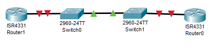
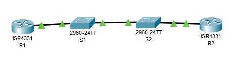

# LR10_Настройка протокола OSPFv2 для одной области

Работа выполнена на ПК с установленным Cisco Packet Tracer.

#### Топология



#### Таблица адресации

 Устройство | Интерфейс | IP-адрес         | Маска подсети.
:----------:|:---------:|:----------------:| :---------:
 R1         |G0/0/1     | 10.53.0.1        | 255.255.255.0
 R1         | LOOPBACK1  | 172.16.1.1      |  255.255.255.0
 R2         | G0/0/1     | 10.53.0.2       | 255.255.255.0
 R2         | LOOPBACK1  | 192.168.1.1     | 255.255.255.0


### Часть 1. Настройка основного сетевого устройства

#### Шаг 1.1. Базовая настройка маршрутизаторов.


```
Router>
Router>en
Router#conf t
Enter configuration commands, one per line.  End with CNTL/Z.
Router(config)#hos
Router(config)#hostname R1
R1(config)#no ip domain-lookup
R1(config)#en
R1(config)#ena
R1(config)#enable s
R1(config)#enable secret class
R1(config)#lin
R1(config)#line co
R1(config)#line console 0
R1(config-line)#pas
R1(config-line)#password cisco
R1(config-line)#login
R1(config-line)#exit
R1(config)#lin
R1(config)#line v
R1(config)#line vty 0 4
R1(config-line)#pas
R1(config-line)#password cisco
R1(config-line)#login
R1(config-line)#exit
R1(config)#service password-encryption
R1(config)#ban
R1(config)#banner m
R1(config)#banner motd #gooo#
R1(config)#end
R1#
%SYS-5-CONFIG_I: Configured from console by console
copy
R1#copy r
R1#copy running-config st
R1#copy running-config startup-config 
Destination filename [startup-config]? 
Building configuration...
[OK]
```

```
Router>en
Router#conf t
Enter configuration commands, one per line.  End with CNTL/Z.
Router(config)#ho
Router(config)#hostname R2
R2(config)#no ip domain-lookup
R2(config)#EN
R2(config)#ENa
R2(config)#ENable se
R2(config)#ENable secret class
R2(config)#lin 
R2(config)#lin
R2(config)#line c
R2(config)#line console 0
R2(config-line)#pas
R2(config-line)#password cisco
R2(config-line)#login
R2(config-line)#exit
R2(config)#line
R2(config)#line v
R2(config)#line vty 0 4
R2(config-line)#pas
R2(config-line)#password cisco
R2(config-line)#login
R2(config-line)#exit
R2(config)#
R2(config)#service password-encryption
R2(config)#ban
R2(config)#banner m
R2(config)#banner motd #GOOO#
R2(config)#ENA
% Incomplete command.
R2(config)#CO
R2(config)#COp
R2(config)#en
R2(config)#end
R2#
%SYS-5-CONFIG_I: Configured from console by console
cop
R2#copy r
R2#copy running-config st
R2#copy running-config startup-config 
Destination filename [startup-config]? 
Building configuration...
[OK]
```

#### Шаг 1.2. Настройте базовые параметры каждого коммутатора

```
Switch>
Switch>en
Switch#conf t
Enter configuration commands, one per line.  End with CNTL/Z.
Switch(config)#hos
Switch(config)#hostname S1
S1(config)#no ip domain-lookup
S1(config)#en
S1(config)#ena
S1(config)#enable s
S1(config)#enable secret class
S1(config)#lin
S1(config)#line c
S1(config)#line console 0
S1(config-line)#pas
S1(config-line)#password cisco
S1(config-line)#login
S1(config-line)#exit
S1(config)#li
S1(config)#line vt
S1(config)#line vty 0 4
S1(config-line)#pas
S1(config-line)#password cisco
S1(config-line)#login
S1(config-line)#exit
S1(config)#service password-encryption
S1(config)#ban
S1(config)#banner m
S1(config)#banner motd #nooo#
S1(config)#end
S1#
%SYS-5-CONFIG_I: Configured from console by console
cop
S1#copy r
S1#copy running-config st
Destination filename [startup-config]? 
Building configuration...
[OK]
```

```
Switch>en
Switch#conf
Switch#configure t
Switch#configure terminal 
Enter configuration commands, one per line.  End with CNTL/Z.
Switch(config)#hos
Switch(config)#hostname S2
S2(config)#no ip domain-lookup
S2(config)#en
S2(config)#ena
S2(config)#enable se
S2(config)#enable secret class
S2(config)#li
S2(config)#line co
S2(config)#line console 0
S2(config-line)#pas
S2(config-line)#password cisco
S2(config-line)#login
S2(config-line)#exit
S2(config)#li
S2(config)#line vt
S2(config)#line vty 0 4
S2(config-line)#pas
S2(config-line)#password cisco
S2(config-line)#login
S2(config-line)#exit
S2(config)#service password-encryption
S2(config)#bab
S2(config)#ban
S2(config)#banner m
S2(config)#banner motd #no go#
S2(config)#end
S2#
%SYS-5-CONFIG_I: Configured from console by console
cop
S2#copy r
S2#copy running-config st
S2#copy running-config startup-config 
Destination filename [startup-config]? 
Building configuration...
[OK]
```

### Часть 2. Настройка и проверка базовой работы протокола OSPFv2 для одной области

#### Шаг 2.1. Настройте адреса интерфейса и базового OSPFv2 на каждом маршрутизаторе.

a.	Настройте адреса интерфейсов на каждом маршрутизаторе, как показано в таблице адресации выше.

```
R1>en
Password: 
R1#conf t
Enter configuration commands, one per line.  End with CNTL/Z.
R1(config)#int g0/0/1
R1(config-if)#des
R1(config-if)#description to_R2
R1(config-if)#ip ad
R1(config-if)#ip address 10.53.0.1 255.255.255.0
R1(config-if)#no sh
R1(config-if)#no shutdown 

R1(config-if)#
%LINK-5-CHANGED: Interface GigabitEthernet0/0/1, changed state to up

%LINEPROTO-5-UPDOWN: Line protocol on Interface GigabitEthernet0/0/1, changed state to up
exit
R1(config)#int
R1(config)#interface loo
R1(config)#interface loopback 1

R1(config-if)#
%LINK-5-CHANGED: Interface Loopback1, changed state to up

%LINEPROTO-5-UPDOWN: Line protocol on Interface Loopback1, changed state to up
de
R1(config-if)#des
R1(config-if)#description loopback_1
R1(config-if)#ip ad
R1(config-if)#ip address 172.16.1.1 255.255.255.0
R1(config-if)#exit
```

```
R2(config)#int g0/0/1
R2(config-if)#de
R2(config-if)#des
R2(config-if)#description to_R1
R2(config-if)#ip ad
R2(config-if)#ip address 10.53.0.2 255.255.255.0
R2(config-if)#no sh
R2(config-if)#no shutdown 

R2(config-if)#
%LINK-5-CHANGED: Interface GigabitEthernet0/0/1, changed state to up

%LINEPROTO-5-UPDOWN: Line protocol on Interface GigabitEthernet0/0/1, changed state to up
exit
R2(config)#int lo
R2(config)#int loopback 1

R2(config-if)#
%LINK-5-CHANGED: Interface Loopback1, changed state to up

%LINEPROTO-5-UPDOWN: Line protocol on Interface Loopback1, changed state to up
des
R2(config-if)#description loopback_r2
R2(config-if)#ip ad
R2(config-if)#ip address 192.168.1.1 255.255.255.0
R2(config-if)#exit
R2(config)#
```



b.	Перейдите в режим конфигурации маршрутизатора OSPF, используя идентификатор процесса 56.

```
R1(config)#ro
R1(config)#router os
R1(config)#router ospf 56
```

```
R2(config)#rou
R2(config)#router os
R2(config)#router ospf 56
R2(config-router)#rou
```

c.	Настройте статический идентификатор маршрутизатора для каждого маршрутизатора (1.1.1.1 для R1, 2.2.2.2 для R2).

```
R1(config-router)#ro
R1(config-router)#router-id 1.1.1.1
```

```
R2(config-router)#rou
R2(config-router)#router-id 2.2.2.2
```

d.	Настройте инструкцию сети для сети между R1 и R2, поместив ее в область 0.

```
R1(config-router)#ne
R1(config-router)#net
R1(config-router)#network 10.53.0.0 0.0.0.255 a
R1(config-router)#network 10.53.0.0 0.0.0.255 area 0
```

```
R2(config-router)#net
R2(config-router)#network 10.53.0.0 0.0.0.255 ar
R2(config-router)#network 10.53.0.0 0.0.0.255 area 0
R2(config-router)#
19:54:02: %OSPF-5-ADJCHG: Process 56, Nbr 1.1.1.1 on GigabitEthernet0/0/1 from LOADING to FULL, Loading Done
```

e.	Только на R2 добавьте конфигурацию, необходимую для объявления сети Loopback 1 в область OSPF 0.

```
R2(config-router)#net
R2(config-router)#network 192.168.1.0 0.0.0.255 ar
R2(config-router)#network 192.168.1.0 0.0.0.255 area 0
```

f.	Убедитесь, что OSPFv2 работает между маршрутизаторами. Выполните команду, чтобы убедиться, что R1 и R2 сформировали смежность.

```
R1#show ip ospf ne
R1#show ip ospf neighbor 


Neighbor ID     Pri   State           Dead Time   Address         Interface
2.2.2.2           1   FULL/BDR        00:00:31    10.53.0.2       GigabitEthernet0/0/1
```

```
R2#show ip ospf ne
R2#show ip ospf neighbor 

Neighbor ID     Pri   State           Dead Time   Address         Interface
1.1.1.1           1   FULL/DR         00:00:37    10.53.0.1       GigabitEthernet0/0/1
```

- Какой маршрутизатор является DR? Какой маршрутизатор является BDR? Каковы критерии отбора?
R1 - BDR R2 - DR. Отбор идёт по набольшему приоритету (в нашем случае он одинакв), по наибольшему айди маршрутизатора (которые мы назначили сами и следовательно R1 имеет большее значение) и по наибольшему айпи-адресу интерфейса.

g.	На R1 выполните команду show ip route ospf, чтобы убедиться, что сеть R2 Loopback1 присутствует в таблице маршрутизации. Обратите внимание, что поведение OSPF по умолчанию заключается в объявлении интерфейса обратной связи в качестве маршрута узла с использованием 32-битной маски.

```
R1#show ip route os
R1#show ip route ospf 
     192.168.1.0/32 is subnetted, 1 subnets
O       192.168.1.1 [110/2] via 10.53.0.2, 00:07:00, GigabitEthernet0/0/1
```

h.	Запустите Ping до  адреса интерфейса R2 Loopback 1 из R1. Выполнение команды ping должно быть успешным.

```
R1#ping 192.168.1.1

Type escape sequence to abort.
Sending 5, 100-byte ICMP Echos to 192.168.1.1, timeout is 2 seconds:
!!!!!
Success rate is 100 percent (5/5), round-trip min/avg/max = 0/0/2 ms
```

### Часть 3. Оптимизация и проверка конфигурации OSPFv2 для одной области

#### Шаг 3.1. Реализация различных оптимизаций на каждом маршрутизаторе.

a.	На R1 настройте приоритет OSPF интерфейса G0/0/1 на 50, чтобы убедиться, что R1 является назначенным маршрутизатором.

```
R1(config)#
R1(config)#int g0/0/1
R1(config-if)#ip os
R1(config-if)#ip ospf pr
R1(config-if)#ip ospf priority 50
```

b.	Настройте таймеры OSPF на G0/0/1 каждого маршрутизатора для таймера приветствия, составляющего 30 секунд.

```
R1(config-if)#ip ospf h
R1(config-if)#ip ospf hello-interval 30
```

```
R2(config-if)#ip ospf h
R2(config-if)#ip ospf hello-interval 30
R2(config-if)#exit
```

c.	На R1 настройте статический маршрут по умолчанию, который использует интерфейс Loopback 1 в качестве интерфейса выхода. Затем распространите маршрут по умолчанию в OSPF. Обратите внимание на сообщение консоли после установки маршрута по умолчанию.

```
R1(config)#ip r
R1(config)#ip ro
R1(config)#ip rou
R1(config)#ip rout
R1(config)#ip route 0.0.0.0 0.0.0.0 lo
R1(config)#ip route 0.0.0.0 0.0.0.0 loopback 1
%Default route without gateway, if not a point-to-point interface, may impact performance
R1(config)#rou
R1(config)#router os
R1(config)#router ospf 56
R1(config-router)#def
R1(config-router)#default-information OR
R1(config-router)#default-information ORiginate 
```

d.	добавьте конфигурацию, необходимую для OSPF для обработки R2 Loopback 1 как сети точка-точка. Это приводит к тому, что OSPF объявляет Loopback 1 использует маску подсети интерфейса.

```
R2(config)#interface lo
R2(config)#interface loopback 1
R2(config-if)#ip os
R2(config-if)#ip ospf ne
R2(config-if)#ip ospf network po
R2(config-if)#ip ospf network point-to-point 
R2(config-if)#
```

e.	Только на R2 добавьте конфигурацию, необходимую для предотвращения отправки объявлений OSPF в сеть Loopback 1.

```
R2(config)#router os
R2(config)#router ospf 56
R2(config-router)#pas
R2(config-router)#passive-interface lo
R2(config-router)#passive-interface loopback 1
```

f.	Измените базовую пропускную способность для маршрутизаторов. После этой настройки перезапустите OSPF с помощью команды clear ip ospf process . Обратите внимание на сообщение консоли после установки новой опорной полосы пропускания.

```
R1(config)#router ospf 56
R1(config-router)#au
R1(config-router)#auto-cost re
R1(config-router)#auto-cost reference-bandwidth 10
% OSPF: Reference bandwidth is changed.
        Please ensure reference bandwidth is consistent across all routers.

R1#clear ip os
R1#clear ip ospf pr
R1#clear ip ospf process 
Reset ALL OSPF processes? [no]: y

R1#
20:29:00: %OSPF-5-ADJCHG: Process 56, Nbr 2.2.2.2 on GigabitEthernet0/0/1 from FULL to DOWN, Neighbor Down: Adjacency forced to reset

20:29:00: %OSPF-5-ADJCHG: Process 56, Nbr 2.2.2.2 on GigabitEthernet0/0/1 from FULL to DOWN, Neighbor Down: Interface down or detached

R1#
20:29:01: %OSPF-5-ADJCHG: Process 56, Nbr 2.2.2.2 on GigabitEthernet0/0/1 from LOADING to FULL, Loading Done
```

```
R2(config-router)#auto-cost RE
R2(config-router)#auto-cost REference-bandwidth 10
% OSPF: Reference bandwidth is changed.
        Please ensure reference bandwidth is consistent across all routers.

R2#clear ip
R2#clear ip os
R2#clear ip ospf pr
R2#clear ip ospf process 
Reset ALL OSPF processes? [no]: 

R2#clear ip ospf process 
Reset ALL OSPF processes? [no]: y

R2#
20:28:14: %OSPF-5-ADJCHG: Process 56, Nbr 1.1.1.1 on GigabitEthernet0/0/1 from FULL to DOWN, Neighbor Down: Adjacency forced to reset

20:28:14: %OSPF-5-ADJCHG: Process 56, Nbr 1.1.1.1 on GigabitEthernet0/0/1 from FULL to DOWN, Neighbor Down: Interface down or detached
```

#### Шаг 3.2. бедитесь, что оптимизация OSPFv2 реализовалась.

a.	Выполните команду show ip ospf interface g0/0/1 на R1 и убедитесь, что приоритет интерфейса установлен равным 50, а временные интервалы — Hello 30, Dead 120, а тип сети по умолчанию — Broadcast

```
R1#show  ip ospf interface g0/0/1

GigabitEthernet0/0/1 is up, line protocol is up
  Internet address is 10.53.0.1/24, Area 0
  Process ID 56, Router ID 1.1.1.1, Network Type BROADCAST, Cost: 0
  Transmit Delay is 1 sec, State DR, Priority 50
  Designated Router (ID) 1.1.1.1, Interface address 10.53.0.1
  Backup Designated Router (ID) 2.2.2.2, Interface address 10.53.0.2
  Timer intervals configured, Hello 30, Dead 40, Wait 40, Retransmit 5
    Hello due in 00:00:07
  Index 1/1, flood queue length 0
  Next 0x0(0)/0x0(0)
  Last flood scan length is 1, maximum is 1
  Last flood scan time is 0 msec, maximum is 0 msec
  Neighbor Count is 1, Adjacent neighbor count is 1
    Adjacent with neighbor 2.2.2.2  (Backup Designated Router)
  Suppress hello for 0 neighbor(s)
```

Время смерти не установилось равным 120, сделаем это сами.

```
R1(config)#interface G0/0/1
R1(config-if)#ip os
R1(config-if)#ip ospf ?
  <1-65535>           Process ID
  authentication      Enable authentication
  authentication-key  Authentication password (key)
  cost                Interface cost
  dead-interval       Interval after which a neighbor is declared dead
  hello-interval      Time between HELLO packets
  message-digest-key  Message digest authentication password (key)
  network             Network type
  priority            Router priority
R1(config-if)#ip ospf dea
R1(config-if)#ip ospf dead-interval 120
```

```
R2(config)#int
R2(config)#interface g0/0/1
R2(config-if)#ip os
R2(config-if)#ip ospf de
R2(config-if)#ip ospf dead-interval 120
```

```
R1#show  ip ospf interface g0/0/1

GigabitEthernet0/0/1 is up, line protocol is up
  Internet address is 10.53.0.1/24, Area 0
  Process ID 56, Router ID 1.1.1.1, Network Type BROADCAST, Cost: 0
  Transmit Delay is 1 sec, State DR, Priority 50
  Designated Router (ID) 1.1.1.1, Interface address 10.53.0.1
  No backup designated router on this network
  Timer intervals configured, Hello 30, Dead 120, Wait 120, Retransmit 5
    Hello due in 00:00:11
  Index 1/1, flood queue length 0
  Next 0x0(0)/0x0(0)
  Last flood scan length is 1, maximum is 1
  Last flood scan time is 0 msec, maximum is 0 msec
  Neighbor Count is 0, Adjacent neighbor count is 0
  Suppress hello for 0 neighbor(s)
```

b.	На R1 выполните команду show ip route ospf, чтобы убедиться, что сеть R2 Loopback1 присутствует в таблице маршрутизации. Обратите внимание на разницу в метрике между этим выходным и предыдущим выходным. Также обратите внимание, что маска теперь составляет 24 бита, в отличие от 32 битов, ранее объявленных.

```
R1#show ip route ospf 
O    192.168.1.0 [110/0] via 10.53.0.2, 00:01:16, GigabitEthernet0/0/1
```

c.	Введите команду show ip route ospf на маршрутизаторе R2. Единственная информация о маршруте OSPF должна быть распространяемый по умолчанию маршрут R1.

```
R2#show ip route ospf 
O*E2 0.0.0.0/0 [110/1] via 10.53.0.1, 00:03:21, GigabitEthernet0/0/1
```

d.	Запустите Ping до адреса интерфейса R1 Loopback 1 из R2. Выполнение команды ping должно быть успешным.

```
R2#ping 172.16.1.1

Type escape sequence to abort.
Sending 5, 100-byte ICMP Echos to 172.16.1.1, timeout is 2 seconds:
!!!!!
Success rate is 100 percent (5/5), round-trip min/avg/max = 0/0/0 ms
```
Мне не нравится, что cost=0 у первого маршрутизатора, есть подозрения, что это связано с неправильно назначенной скоростью передачи. Меняю.


```
R1(config)#router ospf 56
R1(config-router)#au
R1(config-router)#auto-cost re
R1(config-router)#auto-cost reference-bandwidth 10000
```

```
R2(config)#router ospf 56
R2(config-router)#auto-cost REference-bandwidth 10000
```

```
R1#show  ip ospf interface g0/0/1

GigabitEthernet0/0/1 is up, line protocol is up
  Internet address is 10.53.0.1/24, Area 0
  Process ID 56, Router ID 1.1.1.1, Network Type BROADCAST, Cost: 100
  Transmit Delay is 1 sec, State DR, Priority 50
  Designated Router (ID) 1.1.1.1, Interface address 10.53.0.1
  Backup Designated Router (ID) 2.2.2.2, Interface address 10.53.0.2
  Timer intervals configured, Hello 30, Dead 120, Wait 120, Retransmit 5
    Hello due in 00:00:19
  Index 1/1, flood queue length 0
  Next 0x0(0)/0x0(0)
  Last flood scan length is 1, maximum is 1
  Last flood scan time is 0 msec, maximum is 0 msec
  Neighbor Count is 1, Adjacent neighbor count is 1
    Adjacent with neighbor 2.2.2.2  (Backup Designated Router)
  Suppress hello for 0 neighbor(s)

 R1#show ip route ospf 
O    192.168.1.0 [110/101] via 10.53.0.2, 00:00:21, GigabitEthernet0/0/1 
```

```
R2#show ip route ospf 
O*E2 0.0.0.0/0 [110/1] via 10.53.0.1, 00:18:09, GigabitEthernet0/0/1

R2#show  ip ospf interface g0/0/1

GigabitEthernet0/0/1 is up, line protocol is up
  Internet address is 10.53.0.2/24, Area 0
  Process ID 56, Router ID 2.2.2.2, Network Type BROADCAST, Cost: 100
  Transmit Delay is 1 sec, State BDR, Priority 1
  Designated Router (ID) 1.1.1.1, Interface address 10.53.0.1
  Backup Designated Router (ID) 2.2.2.2, Interface address 10.53.0.2
  Timer intervals configured, Hello 30, Dead 120, Wait 120, Retransmit 5
    Hello due in 00:00:15
  Index 1/1, flood queue length 0
  Next 0x0(0)/0x0(0)
  Last flood scan length is 1, maximum is 1
  Last flood scan time is 0 msec, maximum is 0 msec
  Neighbor Count is 1, Adjacent neighbor count is 1
    Adjacent with neighbor 1.1.1.1  (Designated Router)
  Suppress hello for 0 neighbor(s)
```


