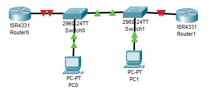
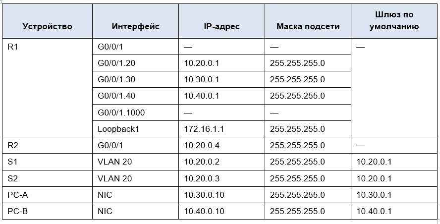
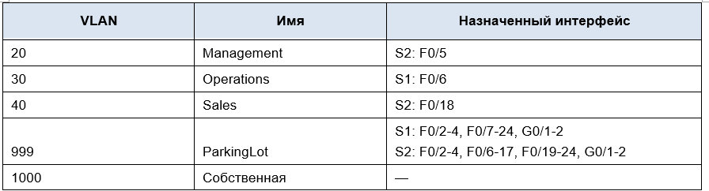
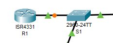
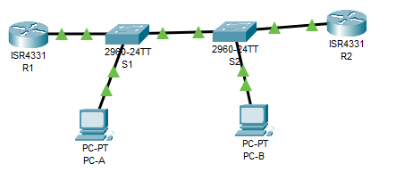
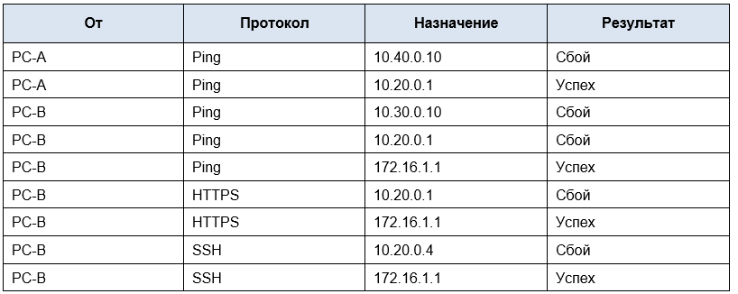

# Настройка и проверка расширенных списков контроля доступа

Работа выполнена на ПК с установленным Cisco Packet Tracer.

#### Топология



#### Таблица адресации



#### Таблица VLAN



### Часть 1. Создание сети и настройка основных параметров устройства

#### Шаг 1.1.  Произведите базовую настройку маршрутизаторов.


```
Router>Enable 
Router#conf t
Enter configuration commands, one per line.  End with CNTL/Z.
Router(config)#host
Router(config)#hostname R1
R1(config)#no ip domain-l
R1(config)#no ip domain-lookup 
R1(config)#ena
R1(config)#enable s
R1(config)#enable secret class
R1(config)#li
R1(config)#lic
R1(config)#lin
R1(config)#line c
R1(config)#line console 0
R1(config-line)#pa
R1(config-line)#pas
R1(config-line)#password cisco
R1(config-line)#login
R1(config-line)#exit
R1(config)#lin
R1(config)#line v
R1(config)#line vty 0 4
R1(config-line)#pas
R1(config-line)#password 
% Incomplete command.
R1(config-line)#password cisco
R1(config-line)#exit
R1(config)#service password-encryption
R1(config)#
R1(config)#banner motd #NOOO#
R1(config)#END
R1#
%SYS-5-CONFIG_I: Configured from console by console
co
R1#cop
R1#copy r
R1#copy running-config st
R1#copy running-config startup-config 
Destination filename [startup-config]? 
Building configuration...
[OK]
```

```
Router>en
Router#conf t
Enter configuration commands, one per line.  End with CNTL/Z.
Router(config)#host
Router(config)#hostname 
% Incomplete command.
Router(config)#hostname  R2
R2(config)#no ip domain-lookup 
R2(config)#LIN
R2(config)#LINe c
R2(config)#LINe console 0
R2(config-line)#pas
R2(config-line)#password cisco
R2(config-line)#login
R2(config-line)#exit
R2(config)#LINe v
R2(config)#LINe vty 0 4
R2(config-line)#pas
R2(config-line)#password cisco
R2(config-line)#login
R2(config-line)#exit
R2(config)#en
R2(config)#ena
R2(config)#enable s
R2(config)#enable secret class
R2(config)#service password-encryption
R2(config)#banner motd #NOOO#
R2(config)#end
R2#
%SYS-5-CONFIG_I: Configured from console by console
cop
R2#copy r
R2#copy running-config st
R2#copy running-config startup-config 
Destination filename [startup-config]? 
Building configuration...
[OK]
```

#### Шаг 1.2.  Настройте базовые параметры каждого коммутатора.

```
Switch>en
Switch#conf t
Enter configuration commands, one per line.  End with CNTL/Z.
Switch(config)#host
Switch(config)#hostname S1
S1(config)#no ip domain-lookup
S1(config)#li
S1(config)#line c
S1(config)#line console 0
S1(config-line)#pas
S1(config-line)#password cisco
S1(config-line)#login
S1(config-line)#exit
S1(config)#line v
S1(config)#line vty 0 4
S1(config-line)#pas
S1(config-line)#password cisco
S1(config-line)#login
S1(config-line)#exit
S1(config)#en
S1(config)#ena
S1(config)#enable se
S1(config)#enable secret class
S1(config)#enable secret class
S1(config)#service password-encryption
S1(config)#banner motd #NOOO#
S1(config)#ens
             ^
% Invalid input detected at '^' marker.
	
S1(config)#end
S1#
%SYS-5-CONFIG_I: Configured from console by console
c
S1#co
S1#cop
S1#copy r
S1#copy running-config st
S1#copy running-config startup-config 
Destination filename [startup-config]? 
Building configuration...
[OK]
```

```
Switch>en
Switch#conf t
Enter configuration commands, one per line.  End with CNTL/Z.
Switch(config)#hos
Switch(config)#hostname S2
S2(config)#no ip domain-lookup
S2(config)#ena
S2(config)#enable se
S2(config)#enable secret class
S2(config)#service password-encryption
S2(config)#banner motd #NOOO#
S2(config)#lin
S2(config)#line c
S2(config)#line console 0
S2(config-line)#pas
S2(config-line)#password cisco
S2(config-line)#login
S2(config-line)#exit
S2(config)#lin
S2(config)#line v
S2(config)#line vty 0 4
S2(config-line)#pas
S2(config-line)#password cisco
S2(config-line)#
S2(config-line)#login
S2(config-line)#exit
S2(config)#end
S2#
%SYS-5-CONFIG_I: Configured from console by console
cop
S2#copy s
S2#copy r
S2#copy running-config st
S2#copy running-config startup-config 
Destination filename [startup-config]? 
Building configuration...
[OK]
```

### Часть 2. Настройка сетей VLAN на коммутаторах.

#### Шаг 2.1. Создайте сети VLAN на коммутаторах.

a.	Создайте необходимые VLAN и назовите их на каждом коммутаторе из приведенной выше таблицы.

```
S1>en
Password: 
S1#conf t
Enter configuration commands, one per line.  End with CNTL/Z.
S1(config)#vlan 20
S1(config-vlan)#nam
S1(config-vlan)#name management
S1(config-vlan)#exit
S1(config)#vlan 30
S1(config-vlan)#na
S1(config-vlan)#name operations
S1(config-vlan)#exit
S1(config)#vlan 40
S1(config-vlan)#na
S1(config-vlan)#name sales
S1(config-vlan)#exit
S1(config)#vlan 999
S1(config-vlan)#na
S1(config-vlan)#name parkinglot
S1(config-vlan)#exit
S1(config)#vlan 1000
S1(config-vlan)#nam
S1(config-vlan)#name mine
S1(config-vlan)#exit
```

```
Enter configuration commands, one per line.  End with CNTL/Z.
S2(config)#vlan 10
S2(config-vlan)#exit
S2(config)#vlan 10
S2(config-vlan)#exit
S2(config)#vlan 20
S2(config-vlan)#na
S2(config-vlan)#name management
S2(config-vlan)#exit
S2(config)#vlan 30
S2(config-vlan)#name operations
S2(config-vlan)#exit
S2(config)#vlan 40 
S2(config-vlan)#name sales
S2(config-vlan)#exit
S2(config)#vlan 999
S2(config-vlan)#name parkinglot
S2(config-vlan)#exit
S2(config)#vlan 1000
S2(config-vlan)#name mine
S2(config-vlan)#exit
S2(config)#
```

b.	Настройте интерфейс управления и шлюз по умолчанию на каждом коммутаторе, используя информацию об IP-адресе в таблице адресации. 

```
(config)#int vlan 20
S1(config-if)#
%LINK-5-CHANGED: Interface Vlan20, changed state to up
ip ad
S1(config-if)#ip address 10.20.0.2 255.255.255.0
S1(config-if)#np sh
S1(config-if)#no sh
S1(config-if)#no shutdown 
S1(config-if)#ex
S1(config-if)#exit 
S1(config)#de
S1(config)#ip default
S1(config)#ip default-gateway 10.20.0.1
```

```
S2(config)#int
S2(config)#interface vlan 20
S2(config-if)#ip a
S2(config-if)#ip address 10.20.0.3 255.255.255.0
S2(config-if)#no sh
S2(config-if)#no shutdown 
S2(config-if)#exit
S2(config)#ip de
S2(config)#ip default-gateway 10.20.0.1
S2(config)#
```

c.	Назначьте все неиспользуемые порты коммутатора VLAN Parking Lot, настройте их для статического режима доступа и административно деактивируйте их.
Примечание. Команда interface range полезна для выполнения этой задачи с помощью необходимого количества команд. 

```
S1(config)#int ra
S1(config)#int range f0/2-4, f0/7-24, g0/1-2
S1(config-if-range)#sw
S1(config-if-range)#switchport m
S1(config-if-range)#switchport mode a
S1(config-if-range)#switchport mode access 
S1(config-if-range)#sw
S1(config-if-range)#switchport ac
S1(config-if-range)#switchport access vlan 999
S1(config-if-range)#shu
S1(config-if-range)#shutdown 

%LINK-5-CHANGED: Interface FastEthernet0/2, changed state to administratively down

%LINK-5-CHANGED: Interface FastEthernet0/3, changed state to administratively down

%LINK-5-CHANGED: Interface FastEthernet0/4, changed state to administratively down

%LINK-5-CHANGED: Interface FastEthernet0/7, changed state to administratively down

%LINK-5-CHANGED: Interface FastEthernet0/8, changed state to administratively down

%LINK-5-CHANGED: Interface FastEthernet0/9, changed state to administratively down

%LINK-5-CHANGED: Interface FastEthernet0/10, changed state to administratively down

%LINK-5-CHANGED: Interface FastEthernet0/11, changed state to administratively down

%LINK-5-CHANGED: Interface FastEthernet0/12, changed state to administratively down

%LINK-5-CHANGED: Interface FastEthernet0/13, changed state to administratively down

%LINK-5-CHANGED: Interface FastEthernet0/14, changed state to administratively down

%LINK-5-CHANGED: Interface FastEthernet0/15, changed state to administratively down

%LINK-5-CHANGED: Interface FastEthernet0/16, changed state to administratively down

%LINK-5-CHANGED: Interface FastEthernet0/17, changed state to administratively down

%LINK-5-CHANGED: Interface FastEthernet0/18, changed state to administratively down

%LINK-5-CHANGED: Interface FastEthernet0/19, changed state to administratively down

%LINK-5-CHANGED: Interface FastEthernet0/20, changed state to administratively down

%LINK-5-CHANGED: Interface FastEthernet0/21, changed state to administratively down

%LINK-5-CHANGED: Interface FastEthernet0/22, changed state to administratively down

%LINK-5-CHANGED: Interface FastEthernet0/23, changed state to administratively down

%LINK-5-CHANGED: Interface FastEthernet0/24, changed state to administratively down

%LINK-5-CHANGED: Interface GigabitEthernet0/1, changed state to administratively down

%LINK-5-CHANGED: Interface GigabitEthernet0/2, changed state to administratively down
```

```
S2(config)#int ra
S2(config)#int range f0/2-4, f0/6-17, f0/19-24, g0/1-2
S2(config-if-range)#sw
S2(config-if-range)#switchport ma
S2(config-if-range)#switchport mao
S2(config-if-range)#switchport m
S2(config-if-range)#switchport mode a
S2(config-if-range)#switchport mode access 
S2(config-if-range)#sw
S2(config-if-range)#switchport a
S2(config-if-range)#switchport access vlan 999
S2(config-if-range)#sh
S2(config-if-range)#shutdown 

%LINK-5-CHANGED: Interface FastEthernet0/2, changed state to administratively down

%LINK-5-CHANGED: Interface FastEthernet0/3, changed state to administratively down

%LINK-5-CHANGED: Interface FastEthernet0/4, changed state to administratively down

%LINK-5-CHANGED: Interface FastEthernet0/6, changed state to administratively down

%LINK-5-CHANGED: Interface FastEthernet0/7, changed state to administratively down

%LINK-5-CHANGED: Interface FastEthernet0/8, changed state to administratively down

%LINK-5-CHANGED: Interface FastEthernet0/9, changed state to administratively down

%LINK-5-CHANGED: Interface FastEthernet0/10, changed state to administratively down

%LINK-5-CHANGED: Interface FastEthernet0/11, changed state to administratively down

%LINK-5-CHANGED: Interface FastEthernet0/12, changed state to administratively down

%LINK-5-CHANGED: Interface FastEthernet0/13, changed state to administratively down

%LINK-5-CHANGED: Interface FastEthernet0/14, changed state to administratively down

%LINK-5-CHANGED: Interface FastEthernet0/15, changed state to administratively down

%LINK-5-CHANGED: Interface FastEthernet0/16, changed state to administratively down

%LINK-5-CHANGED: Interface FastEthernet0/17, changed state to administratively down

%LINK-5-CHANGED: Interface FastEthernet0/19, changed state to administratively down

%LINK-5-CHANGED: Interface FastEthernet0/20, changed state to administratively down

%LINK-5-CHANGED: Interface FastEthernet0/21, changed state to administratively down

%LINK-5-CHANGED: Interface FastEthernet0/22, changed state to administratively down

%LINK-5-CHANGED: Interface FastEthernet0/23, changed state to administratively down

%LINK-5-CHANGED: Interface FastEthernet0/24, changed state to administratively down

%LINK-5-CHANGED: Interface GigabitEthernet0/1, changed state to administratively down

%LINK-5-CHANGED: Interface GigabitEthernet0/2, changed state to administratively down
```

#### Шаг 2.2. Назначьте сети VLAN соответствующим интерфейсам коммутатора.

a. Назначьте используемые порты соответствующей VLAN (указанной в таблице VLAN выше) и настройте их для режима статического доступа.

```
S1(config)#int f0/6
S1(config-if)#sw
S1(config-if)#switchport m
S1(config-if)#switchport mode a
S1(config-if)#switchport mode access 
S1(config-if)#sw
S1(config-if)#switchport a
S1(config-if)#switchport access vlan 30
S1(config-if)#no sh
S1(config-if)#no shutdown 
S1(config-if)#exit
```

```
S2(config)#int f0/5
S2(config-if)#sw
S2(config-if)#switchport ma
S2(config-if)#switchport mo
S2(config-if)#switchport mode a
S2(config-if)#switchport mode access 
S2(config-if)#sw
S2(config-if)#switchport a
S2(config-if)#switchport access vl
S2(config-if)#switchport access vlan 20
S2(config-if)#no sh
S2(config-if)#no shutdown 
S2(config-if)#exit
S2(config)#int f0/18
S2(config-if)#sw
S2(config-if)#switchport ma
S2(config-if)#switchport m
S2(config-if)#switchport mode a
S2(config-if)#switchport mode access 
S2(config-if)#sw
S2(config-if)#switchport a
S2(config-if)#switchport access vlan 40
S2(config-if)#no sh
S2(config-if)#no shutdown 
S2(config-if)#exit
```

b. Выполните команду show vlan brief, чтобы убедиться, что сети VLAN назначены правильным интерфейсам.

```
S1#show vlan brief 

VLAN Name                             Status    Ports
---- -------------------------------- --------- -------------------------------
1    default                          active    Fa0/1, Fa0/5
20   management                       active    
30   operations                       active    Fa0/6
40   sales                            active    
999  parkinglot                       active    Fa0/2, Fa0/3, Fa0/4, Fa0/7
                                                Fa0/8, Fa0/9, Fa0/10, Fa0/11
                                                Fa0/12, Fa0/13, Fa0/14, Fa0/15
                                                Fa0/16, Fa0/17, Fa0/18, Fa0/19
                                                Fa0/20, Fa0/21, Fa0/22, Fa0/23
                                                Fa0/24, Gig0/1, Gig0/2
1000 mine                             active    
1002 fddi-default                     active    
1003 token-ring-default               active    
1004 fddinet-default                  active    
1005 trnet-default                    active    
```

```
S2#show vlan brief 

VLAN Name                             Status    Ports
---- -------------------------------- --------- -------------------------------
1    default                          active    Fa0/1
10   VLAN0010                         active    
20   management                       active    Fa0/5
30   operations                       active    
40   sales                            active    Fa0/18
999  parkinglot                       active    Fa0/2, Fa0/3, Fa0/4, Fa0/6
                                                Fa0/7, Fa0/8, Fa0/9, Fa0/10
                                                Fa0/11, Fa0/12, Fa0/13, Fa0/14
                                                Fa0/15, Fa0/16, Fa0/17, Fa0/19
                                                Fa0/20, Fa0/21, Fa0/22, Fa0/23
                                                Fa0/24, Gig0/1, Gig0/2
1000 mine                             active    
1002 fddi-default                     active    
1003 token-ring-default               active    
1004 fddinet-default                  active    
1005 trnet-default                    active 
```

### Часть 3. Настройте транки (магистральные каналы).

#### Шаг 3.1. Вручную настройте магистральный интерфейс F0/1.

a. Измените режим порта коммутатора на интерфейсе F0/1, чтобы принудительно создать магистральную связь. Не забудьте сделать это на обоих коммутаторах.

```
S1(config-if)#switchport m
S1(config-if)#switchport tr
S1(config-if)#switchport trunk e
S1(config-if)#switchport trunk en
S1(config-if)#switchport trunk enc
S1(config-if)#switchport trunk enca
S1(config-if)#switchport trunk ?
  allowed  Set allowed VLAN characteristics when interface is in trunking mode
  native   Set trunking native characteristics when interface is in trunking
           mode
S1(config-if)#switchport trunk encapsulation dot1q
                               ^
% Invalid input detected at '^' marker.
	
S1(config-if)#switchport m
S1(config-if)#switchport mode tr
S1(config-if)#switchport mode trunk 

S1(config-if)#
%LINEPROTO-5-UPDOWN: Line protocol on Interface FastEthernet0/1, changed state to down

%LINEPROTO-5-UPDOWN: Line protocol on Interface FastEthernet0/1, changed state to up

%LINEPROTO-5-UPDOWN: Line protocol on Interface Vlan20, changed state to up
switchport tr
S1(config-if)#switchport trunk e
S1(config-if)#switchport trunk ?
  allowed  Set allowed VLAN characteristics when interface is in trunking mode
  native   Set trunking native characteristics when interface is in trunking
           mode
S1(config-if)#switchport trunk 
S1(config-if)#switchport trunk 
S1(config-if)#switchport trunk 
S1(config-if)#switchport trunk A
S1(config-if)#switchport trunk Allowed ?
  vlan  Set allowed VLANs when interface is in trunking mode
S1(config-if)#switchport trunk Allowed vl
S1(config-if)#switchport trunk Allowed vlan 
% Incomplete command.
S1(config-if)#switchport trunk Allowed vlan 10?
WORD  
S1(config-if)#switchport trunk Allowed vlan 20, 30, 40, 999, 1000
                                                ^
% Invalid input detected at '^' marker.
	
S1(config-if)#switchport trunk Allowed vlan?
vlan  
S1(config-if)#switchport trunk Allowed vlan
% Incomplete command.
S1(config-if)#switchport ?
  access         Set access mode characteristics of the interface
  mode           Set trunking mode of the interface
  nonegotiate    Device will not engage in negotiation protocol on this
                 interface
  port-security  Security related command
  priority       Set appliance 802.1p priority
  protected      Configure an interface to be a protected port
  trunk          Set trunking characteristics of the interface
  voice          Voice appliance attributes
S1(config-if)#switchport tr
S1(config-if)#switchport trunk all
S1(config-if)#switchport trunk allowed vl
S1(config-if)#switchport trunk allowed vlan 20,30,40,1000
```

```
S2(config)#int f0/1
S2(config-if)#sw
S2(config-if)#switchport tr
S2(config-if)#switchport m
S2(config-if)#switchport mode tr
S2(config-if)#switchport mode trunk 
S2(config-if)#sw
S2(config-if)#switchport tr
S2(config-if)#switchport trunk al
S2(config-if)#switchport trunk allowed vl
S2(config-if)#switchport trunk allowed vlan 20,30,40,1000
```

b. В рамках конфигурации транка установите для native vlan значение 1000 на обоих коммутаторах. При настройке двух интерфейсов для разных собственных VLAN сообщения об ошибках могут отображаться временно.

```
S1(config-if)#switchport trunk native vlan 1000
```

```
S2(config-if)#switchport trunk native vlan 1000
S2(config-if)#%SPANTREE-2-RECV_PVID_ERR: Received BPDU with inconsistent peer vlan id 1 on FastEthernet0/1 VLAN1000.

%SPANTREE-2-BLOCK_PVID_LOCAL: Blocking FastEthernet0/1 on VLAN1000. Inconsistent local vlan.
```

c. В качестве другой части конфигурации транка укажите, что VLAN 20, 30, 40 и 1000 разрешены в транке.

Сделано в пункте а.

d. Выполните команду show interfaces trunk для проверки портов магистрали, собственной VLAN и разрешенных VLAN через магистраль.

```
S1#show interfaces trunk 
Port        Mode         Encapsulation  Status        Native vlan
Fa0/1       on           802.1q         trunking      1000

Port        Vlans allowed on trunk
Fa0/1       20,30,40,1000

Port        Vlans allowed and active in management domain
Fa0/1       20,30,40,1000

Port        Vlans in spanning tree forwarding state and not pruned
Fa0/1       20,30,40,1000
```

```
S2#show interfaces trunk 
Port        Mode         Encapsulation  Status        Native vlan
Fa0/1       on           802.1q         trunking      1000

Port        Vlans allowed on trunk
Fa0/1       20,30,40,1000

Port        Vlans allowed and active in management domain
Fa0/1       20,30,40,1000

Port        Vlans in spanning tree forwarding state and not pruned
Fa0/1       20,30,40,1000
```

#### Шаг 3.2. Вручную настройте магистральный интерфейс F0/5 на коммутаторе S1.

a. Настройте интерфейс S1 F0/5 с теми же параметрами транка, что и F0/1. Это транк до маршрутизатора.

```
S1(config)#in f0/6
S1(config-if)#exit
S1(config)#in f0/5
S1(config-if)#
S1(config-if)#sw
S1(config-if)#switchport m
S1(config-if)#switchport mode tr
S1(config-if)#switchport mode trunk 
S1(config-if)#sw
S1(config-if)#switchport tr
S1(config-if)#switchport trunk n
S1(config-if)#switchport trunk native vl
S1(config-if)#switchport trunk native vlan 1000
S1(config-if)#sw
S1(config-if)#switchport tr
S1(config-if)#switchport trunk al
S1(config-if)#switchport trunk allowed vl
S1(config-if)#switchport trunk allowed vlan 20,30,40,1000
S1(config-if)#
```

b. Сохраните текущую конфигурацию в файл загрузочной конфигурации.

```
S1#copy running-config st
S1#copy running-config startup-config 
Destination filename [startup-config]? 
Building configuration...
[OK]
```

c. Используйте команду show interfaces trunk для проверки настроек транка.

```
S1#show interfaces trunk 
Port        Mode         Encapsulation  Status        Native vlan
Fa0/1       on           802.1q         trunking      1000

Port        Vlans allowed on trunk
Fa0/1       20,30,40,1000

Port        Vlans allowed and active in management domain
Fa0/1       20,30,40,1000

Port        Vlans in spanning tree forwarding state and not pruned
Fa0/1       20,30,40,1000
```
Линка нет так как маршрутизаторы еще не настроены

НО

из-за того что в таблице не было указано к какому влану принадлежит порт f0/5, то он не был настроен на влан. Делаю по аналогии со вторым коммутатором 

```
S1(config)#int f0/5
S1(config-if)#sw
S1(config-if)#switchport m
S1(config-if)#switchport mode ac
S1(config-if)#switchport mode access 
S1(config-if)#sw
S1(config-if)#switchport a
S1(config-if)#switchport access vl
S1(config-if)#switchport access vlan 20
S1(config-if)#no sh
S1(config-if)#no shutdown 
S1(config-if)#exit
```

### Часть 4. Настройте маршрутизацию.

#### Шаг 4.1. Настройка маршрутизации между сетями VLAN на R1.

a. Активируйте интерфейс G0/0/1 на маршрутизаторе.

```
R1(config)#int g0/0/1
R1(config-if)#no sh
R1(config-if)#no shutdown 

R1(config-if)#exit
```



b. Настройте подинтерфейсы для каждой VLAN, как указано в таблице IP-адресации. Все подинтерфейсы используют инкапсуляцию 802.1Q. Убедитесь, что подинтерфейс для собственной VLAN не имеет назначенного IP-адреса. Включите описание для каждого подинтерфейса.

```
R1(config)#int g0/0/1.20
R1(config-subif)#des
R1(config-subif)#description management_vlan20
R1(config-subif)#en
R1(config-subif)#encapsulation d
R1(config-subif)#encapsulation dot1Q 20
R1(config-subif)#ip ad
R1(config-subif)#ip address 10.20.0.1 255.255.255.0
R1(config)#int g0/0/1.30
R1(config-subif)#description operations_vlan30
R1(config-subif)#encapsulation dot1Q 30
R1(config-subif)#ip address 10.30.0.1 255.255.255.0
R1(config-subif)#exit
R1(config)#int g0/0/1.40
R1(config-subif)#description sales_vlan40
R1(config-subif)#encapsulation dot1Q 40
R1(config-subif)# ip address 10.40.0.1 255.255.255.0
R1(config-subif)#exit
R1(config)#int g0/0/1.1000
R1(config-subif)#de
R1(config-subif)#des
R1(config-subif)#description mine_vlan1000
R1(config-subif)#en
R1(config-subif)#encapsulation d
R1(config-subif)#encapsulation dot1Q 1000 na
R1(config-subif)#encapsulation dot1Q 1000 native 
```

c. Настройте интерфейс Loopback 1 на R1 с адресацией из приведенной выше таблицы.

```
R1(config-if)#des
R1(config-if)#description l
R1(config-if)#description 
R1(config-if)#description 
R1(config-if)#description loopback_R1
R1(config-if)#ip address 172.16.1.1 255.255.255.0
```

d. С помощью команды show ip interface brief проверьте конфигурацию подынтерфейса.

```
R1#show ip interface brief 
Interface              IP-Address      OK? Method Status                Protocol 
GigabitEthernet0/0/0   unassigned      YES unset  administratively down down 
GigabitEthernet0/0/1   unassigned      YES unset  up                    up 
GigabitEthernet0/0/1.20unassigned      YES manual up                    up 
GigabitEthernet0/0/1.3010.30.0.1       YES manual up                    up 
GigabitEthernet0/0/1.4010.40.0.1       YES manual up                    up 
GigabitEthernet0/0/1.1000unassigned      YES unset  up                    up 
GigabitEthernet0/0/2   unassigned      YES unset  administratively down down 
Loopback1              172.16.1.1      YES manual up                    up 
Vlan1                  unassigned      YES unset  administratively down down
```

потерялся адрес для влан 20

```
R1(config-subif)#ip address 10.20.0.1 255.255.255.0
R1(config-subif)#exit
R1(config)#end
R1#show ip interface brief 
Interface              IP-Address      OK? Method Status                Protocol 
GigabitEthernet0/0/0   unassigned      YES unset  administratively down down 
GigabitEthernet0/0/1   unassigned      YES unset  up                    up 
GigabitEthernet0/0/1.2010.20.0.1       YES manual up                    up 
GigabitEthernet0/0/1.3010.30.0.1       YES manual up                    up 
GigabitEthernet0/0/1.4010.40.0.1       YES manual up                    up 
GigabitEthernet0/0/1.1000unassigned      YES unset  up                    up 
GigabitEthernet0/0/2   unassigned      YES unset  administratively down down 
Loopback1              172.16.1.1      YES manual up                    up 
Vlan1                  unassigned      YES unset  administratively down down
```

#### Шаг 4.2. Настройка интерфейса R2 g0/0/1 с использованием адреса из таблицы и маршрута по умолчанию с адресом следующего перехода 10.20.0.1

```
R2(config)#int g0/0/1
R2(config-if)#de
R2(config-if)#des
R2(config-if)#description management_vlan20
R2(config-if)#ip ad
R2(config-if)#ip address 10.20.0.4 255.255.255.0
R2(config-if)#no sh
R2(config-if)#no shutdown 
R2(config)#exit
R2(config)#ip rou
R2(config)#ip rout
R2(config)#ip route 0.0.0.0 0.0.0.0 10.20.0.1
R2(config)#exit
```

пришлось перезапустить циско, так как программа зависла на моменте пинга от маршрутизатора 2 до маршрутизатора 1. ПРри этом весь линк сталзеленым, до этого были проблемные участки. Семь бед - один ресет.



```R2#show ip interface brief 
Interface              IP-Address      OK? Method Status                Protocol 
GigabitEthernet0/0/0   unassigned      YES unset  administratively down down 
GigabitEthernet0/0/1   10.20.0.4       YES manual up                    up 
GigabitEthernet0/0/2   unassigned      YES unset  administratively down down 
Vlan1                  unassigned      YES unset  administratively down down
R2#
```

```R2#ping 10.20.0.1

Type escape sequence to abort.
Sending 5, 100-byte ICMP Echos to 10.20.0.1, timeout is 2 seconds:
.....
Success rate is 0 percent (0/5)

R2#ping 10.20.0.1

Type escape sequence to abort.
Sending 5, 100-byte ICMP Echos to 10.20.0.1, timeout is 2 seconds:
.....
Success rate is 0 percent (0/5)
```

Не отвечает, разбираюсь.

```
R2#ping 10.20.0.3

Type escape sequence to abort.
Sending 5, 100-byte ICMP Echos to 10.20.0.3, timeout is 2 seconds:
..!!!
Success rate is 60 percent (3/5), round-trip min/avg/max = 0/0/0 ms

R2#ping 10.20.0.2

Type escape sequence to abort.
Sending 5, 100-byte ICMP Echos to 10.20.0.2, timeout is 2 seconds:
..!!!
Success rate is 60 percent (3/5), round-trip min/avg/max = 0/0/0 ms

R2#ping 10.20.0.1

Type escape sequence to abort.
Sending 5, 100-byte ICMP Echos to 10.20.0.1, timeout is 2 seconds:
.....
Success rate is 0 percent (0/5)
```

Вспомнила, что зачем-то сломала транк f0/5 между R1 И R2... Настраиваю заново этот порт.

```
S1(config)#int f0/5
S1(config-if)#sw
S1(config-if)#switchport m
S1(config-if)#switchport mode tr
S1(config-if)#switchport mode trunk 

S1(config-if)#
%LINEPROTO-5-UPDOWN: Line protocol on Interface FastEthernet0/5, changed state to down

%LINEPROTO-5-UPDOWN: Line protocol on Interface FastEthernet0/5, changed state to up
sw
S1(config-if)#switchport tr
S1(config-if)#switchport trunk al
S1(config-if)#switchport trunk allowed vl
S1(config-if)#switchport trunk allowed vlan 20,30,40,1000
S1(config-if)#no sh
S1(config-if)#no shutdown 
```

Проверяю

```
R2#ping 10.20.0.1

Type escape sequence to abort.
Sending 5, 100-byte ICMP Echos to 10.20.0.1, timeout is 2 seconds:
.!!!!
Success rate is 80 percent (4/5), round-trip min/avg/max = 0/0/0 ms

```

Успешно, дело было в поломанном транке.

### Часть 5. Настройте удаленный доступ

#### Шаг 1.2. Настройте все сетевые устройства для базовой поддержки SSH.

a.	Создайте локального пользователя с именем пользователя SSHadmin и зашифрованным паролем $cisco123!

```
R1(config)#us
R1(config)#username SSHadmin pr
R1(config)#username SSHadmin privilege 15 se
R1(config)#username SSHadmin privilege 15 secret $cisco123!
```

```
S1(config)#username SSHadmin privilege 15 secret $cisco123!
```

```
S2(config)#username SSHadmin privilege 15 secret $cisco123!
```

```
R2(config)#username SSHadmin privilege 15 secret $cisco123!
```

b.	Используйте ccna-lab.com в качестве доменного имени.

```
R1(config)#ip domain-name ccna-lab.com
```
Прописано всем устройствам

c.	Генерируйте криптоключи с помощью 1024 битного модуля.

```
R1(config)#crypto key generate rsa general-keys modulus 1024
The name for the keys will be: R1.ccna-lab.com

% The key modulus size is 1024 bits
% Generating 1024 bit RSA keys, keys will be non-exportable...[OK]
*Mar 1 0:27:35.745: %SSH-5-ENABLED: SSH 1.99 has been enabled
```

Прописано всем устройствам

d.	Настройте первые пять линий VTY на каждом устройстве, чтобы поддерживать только SSH-соединения и с локальной аутентификацией.

```
R1(config)#line vt
R1(config)#line vty 0 4
R1(config-line)#tr
R1(config-line)#transport in
R1(config-line)#transport input ss
R1(config-line)#transport input ssh ?
  <cr>
R1(config-line)#transport input ssh 2
                                    ^
% Invalid input detected at '^' marker.
R1(config-line)#transport input ssh 
R1(config-line)#lo
R1(config-line)#log
R1(config-line)#login
R1(config-line)#login ?
  authentication  authenticate using aaa method list
  local           Local password checking
  <cr>
R1(config-line)#login lo
R1(config-line)#login local 
R1(config-line)#exit
```

```
S1(config)#line v
S1(config)#line vty 0 4
S1(config-line)#tr
S1(config-line)#transport in
S1(config-line)#transport input ssh
S1(config-line)#login l
S1(config-line)#login local 
S1(config-line)#exit
```
S2(config)#line vty 0 4
S2(config-line)#tra
S2(config-line)#transport in
S2(config-line)#transport input s
S2(config-line)#transport input ssh 
S2(config-line)#login l
S2(config-line)#login local 
S2(config-line)#exit
```
R2(config)#lin
R2(config)#line v
R2(config)#line vty 0 4
R2(config)#line vty 0 4
R2(config-line)#tr
R2(config-line)#transport in
R2(config-line)#transport input ss
R2(config-line)#transport input ssh 
R2(config-line)#login
R2(config-line)#login lo
R2(config-line)#login local 
R2(config-line)#
```

#### Шаг 5.2. Включите защищенные веб-службы с проверкой подлинности на R1.

a.	Включите сервер HTTPS на R1.
R1(config)# ip http secure-server 

```
R1(config)#ip httpse
R1(config)#ip http ?
% Unrecognized command
R1(config)#ip http se
R1(config)#ip http secure-server 
               ^
% Invalid input detected at '^' marker.
```

не поддерживается моей версией пакет трейсера

### Часть 6. Проверка подключения

#### Шаг 6.1. Настройте узлы ПК.
Адреса ПК можно посмотреть в таблице адресации.

Настороено

#### Шаг 6.2. Выполните следующие тесты. Эхозапрос должен пройти успешно.

        от  | протокол  | назначение         
:----------:|:---------:|:----------------:
 PC-A         |Ping    | 10.40.0.10      
 PC-A         |Ping    | 10.20.0.1    
 PC-B        | Ping    | 10.30.0.10       
 PC-B        | Ping     | 10.20.0.1    
 PC-B        | Ping     | 172.16.1.1       
 PC-B        | HTTPS    | 10.20.0.1
 PC-B        | HTTPS    | 172.16.1.1  
 PC-B        | SSH      | 10.20.0.1
 PC-B        | SSH      | 172.16.1.1     


```
C:\>ping 10.40.0.10

Pinging 10.40.0.10 with 32 bytes of data:

Request timed out.
Reply from 10.40.0.10: bytes=32 time<1ms TTL=127
Reply from 10.40.0.10: bytes=32 time<1ms TTL=127
Reply from 10.40.0.10: bytes=32 time=1ms TTL=127

Ping statistics for 10.40.0.10:
    Packets: Sent = 4, Received = 3, Lost = 1 (25% loss),
Approximate round trip times in milli-seconds:
    Minimum = 0ms, Maximum = 1ms, Average = 0ms

C:\>ping 10.20.0.1

Pinging 10.20.0.1 with 32 bytes of data:

Reply from 10.20.0.1: bytes=32 time=4ms TTL=255
Reply from 10.20.0.1: bytes=32 time<1ms TTL=255
Reply from 10.20.0.1: bytes=32 time=3ms TTL=255
Reply from 10.20.0.1: bytes=32 time<1ms TTL=255
```

```
C:\>ping 10.30.0.10      

Pinging 10.30.0.10 with 32 bytes of data:

Reply from 10.30.0.10: bytes=32 time<1ms TTL=127
Reply from 10.30.0.10: bytes=32 time<1ms TTL=127
Reply from 10.30.0.10: bytes=32 time<1ms TTL=127
Reply from 10.30.0.10: bytes=32 time<1ms TTL=127

Ping statistics for 10.30.0.10:
    Packets: Sent = 4, Received = 4, Lost = 0 (0% loss),
Approximate round trip times in milli-seconds:
    Minimum = 0ms, Maximum = 0ms, Average = 0ms

C:\>ping 10.20.0.1  

Pinging 10.20.0.1 with 32 bytes of data:

Reply from 10.20.0.1: bytes=32 time<1ms TTL=255
Reply from 10.20.0.1: bytes=32 time<1ms TTL=255
Reply from 10.20.0.1: bytes=32 time<1ms TTL=255
Reply from 10.20.0.1: bytes=32 time<1ms TTL=255

Ping statistics for 10.20.0.1:
    Packets: Sent = 4, Received = 4, Lost = 0 (0% loss),
Approximate round trip times in milli-seconds:
    Minimum = 0ms, Maximum = 0ms, Average = 0ms

C:\>ping 172.16.1.1 

Pinging 172.16.1.1 with 32 bytes of data:

Reply from 172.16.1.1: bytes=32 time<1ms TTL=255
Reply from 172.16.1.1: bytes=32 time<1ms TTL=255
Reply from 172.16.1.1: bytes=32 time=2ms TTL=255
Reply from 172.16.1.1: bytes=32 time<1ms TTL=255

Ping statistics for 172.16.1.1:
    Packets: Sent = 4, Received = 4, Lost = 0 (0% loss),
Approximate round trip times in milli-seconds:
    Minimum = 0ms, Maximum = 2ms, Average = 0ms
```

```
C:\>ssh -l SSHadmin 10.20.0.1

Password: 

NOOO

R1#
R1#exit

[Connection to 10.20.0.1 closed by foreign host]
C:\>ssh -l SSHadmin 172.16.1.1    

Password: 

NOOO

R1#
```

### Часть 7.  Настройка и проверка списков контроля доступа (ACL)

#### Шаг 7.2. Проанализируйте требования к сети и политике безопасности для планирования реализации ACL.

При проверке базового подключения компания требует реализации следующих политик безопасности:

- Политика 1. Сеть Sales не может использовать SSH в сети Management (но в  другие сети SSH разрешен). 

В нашем случае это влан 40 sales. Логично делать это на маршрутизаторе G0/0/1.40 во входящем направлении. Так как будем использовать расширенные листы(стандартные не помогут нам точечно запретить доступ и тогда продажи вообще не будут иметь доступа наружу), то располгагаем правила ближе кисточнику - маршрутизатору.

- Политика 2. Сеть Sales не имеет доступа к IP-адресам в сети Management с помощью любого веб-протокола (HTTP/HTTPS). Сеть Sales также не имеет доступа к интерфейсам R1 с помощью любого веб-протокола. Разрешён весь другой веб-трафик (обратите внимание — Сеть Sales  может получить доступ к интерфейсу Loopback 1 на R1).

Логично делать это на G0/0/1.30 во входящем направлении. Но из-за того что у нас есть оговоркаЮ чо sales имеет доступ, то первоочередно пропишем это правило. А уже потом будем запрещать sales доступ к management и интерфейсам маршрутизатора. также добавим разрешение для продажи к неуказанному трафику из интернета.    

- Политика 3. Сеть Sales не может отправлять эхо-запросы ICMP в сети Operations или Management. Разрешены эхо-запросы ICMP к другим адресатам. 

Делаем тамже гщде и первая политика, важно обратить внимание, что нелдьзя только эхо-запросы.

- Политика 4: Cеть Operations  не может отправлять ICMP эхозапросы в сеть Sales. Разрешены эхо-запросы ICMP к другим адресатам. 

Сделаем на G0/0/1.30 

После проверки должно получится вот так:



#### Шаг 7.2.  Разработка и применение расширенных списков доступа, которые будут соответствовать требованиям политики безопасности.


```
R1(config)#ip access-list e
R1(config)#ip access-list extended SALES
R1(config-ext-nacl)#PER
R1(config-ext-nacl)#PERmit t
R1(config-ext-nacl)#PERmit tcp 10.40.0.0 0.0.0.255 host 172.16.1.1 eq 443
R1(config-ext-nacl)#per
R1(config-ext-nacl)#permit t
R1(config-ext-nacl)#permit tcp 10.40.0.0 0.0.0.255 host 172.16.1.1 eq 80
R1(config-ext-nacl)#de
R1(config-ext-nacl)#den
R1(config-ext-nacl)#deny t
R1(config-ext-nacl)#deny tcp 10.40.0.0 0.0.0.255 10.20.0.0 0.0.0.255 eq 22
```

```
R1(config-ext-nacl)#deny t
R1(config-ext-nacl)#deny tcp 10.40.0.0 0.0.0.255 10.20.0.0 0.0.0.255 eq 80
R1(config-ext-nacl)#deny t
R1(config-ext-nacl)#deny tcp 10.40.0.0 0.0.0.255 10.20.0.0 0.0.0.255 eq 443
R1(config-ext-nacl)#deny tcp 10.40.0.0 0.0.0.255 host 10.20.0.1 eq 80
R1(config-ext-nacl)#deny tcp 10.40.0.0 0.0.0.255 host 10.20.0.1 eq 443
R1(config-ext-nacl)#deny tcp 10.40.0.0 0.0.0.255 host 10.30.0.1 eq 80
R1(config-ext-nacl)#deny tcp 10.40.0.0 0.0.0.255 host 10.30.0.1 eq 443
R1(config-ext-nacl)#deny tcp 10.40.0.0 0.0.0.255 host 10.40.0.1 eq 80
R1(config-ext-nacl)#deny tcp 10.40.0.0 0.0.0.255 host 10.40.0.1 eq 443
```

```
R1(config-ext-nacl)#deny i
R1(config-ext-nacl)#deny ic
R1(config-ext-nacl)#deny icmp 10.40.0.0 0.0.0.255 10.30.0.0 0.0.0.255 echo
R1(config-ext-nacl)#deny icmp 10.40.0.0 0.0.0.255 10.20.0.0 0.0.0.255 echo
R1(config-ext-nacl)#per
R1(config-ext-nacl)#permit ip
R1(config-ext-nacl)#permit ip an
R1(config-ext-nacl)#permit ip any ?
  A.B.C.D  Destination address
  any      Any destination host
  host     A single destination host
R1(config-ext-nacl)#permit ip any an
R1(config-ext-nacl)#permit ip any any 
R1(config-ext-nacl)#
```

```
R1(config)#ip a
R1(config)#ip access-list e
R1(config)#ip access-list extended OPERATIONS
R1(config-ext-nacl)#
R1(config-ext-nacl)#de
R1(config-ext-nacl)#den
R1(config-ext-nacl)#deny i
R1(config-ext-nacl)#deny ic
R1(config-ext-nacl)#deny icmp 10.30.0.0 0.0.0.255 10.40.0.0 0.0.0.255 echo
R1(config-ext-nacl)#permit ip any any 
```

Расписали правила, теперь листы нужно включить

```
R1(config-ext-nacl)#exit
R1(config)#int g0/0/1.40
R1(config-subif)#ip
R1(config-subif)#ip a
R1(config-subif)#ip ac
R1(config-subif)#ip access-group SALES ?
  in   inbound packets
  out  outbound packets
R1(config-subif)#ip access-group SALES in
```

```
R1(config-subif)#exit
R1(config)#int g0/0/1.30
R1(config-subif)#ip ad
R1(config-subif)#ip acc
R1(config-subif)#ip access-group OPERATIONS in
```

#### Шаг 7.3. Убедитесь, что политики безопасности применяются развернутыми списками доступа.

PC-A
```
C:\>ping 10.40.0.10 

Pinging 10.40.0.10 with 32 bytes of data:

Reply from 10.30.0.1: Destination host unreachable.
Reply from 10.30.0.1: Destination host unreachable.
Reply from 10.30.0.1: Destination host unreachable.
Reply from 10.30.0.1: Destination host unreachable.

Ping statistics for 10.40.0.10:
    Packets: Sent = 4, Received = 0, Lost = 4 (100% loss),

C:\>ping 10.20.0.1

Pinging 10.20.0.1 with 32 bytes of data:

Reply from 10.20.0.1: bytes=32 time<1ms TTL=255
Reply from 10.20.0.1: bytes=32 time<1ms TTL=255
Reply from 10.20.0.1: bytes=32 time=2ms TTL=255
Reply from 10.20.0.1: bytes=32 time<1ms TTL=255

Ping statistics for 10.20.0.1:
    Packets: Sent = 4, Received = 4, Lost = 0 (0% loss),
Approximate round trip times in milli-seconds:
    Minimum = 0ms, Maximum = 2ms, Average = 0ms
```

PC-B

```
C:\>
C:\>ping 10.30.0.10

Pinging 10.30.0.10 with 32 bytes of data:

Reply from 10.40.0.1: Destination host unreachable.
Reply from 10.40.0.1: Destination host unreachable.
Reply from 10.40.0.1: Destination host unreachable.
Reply from 10.40.0.1: Destination host unreachable.

Ping statistics for 10.30.0.10:
    Packets: Sent = 4, Received = 0, Lost = 4 (100% loss),

C:\>ping 10.20.0.1

Pinging 10.20.0.1 with 32 bytes of data:

Reply from 10.40.0.1: Destination host unreachable.
Reply from 10.40.0.1: Destination host unreachable.
Reply from 10.40.0.1: Destination host unreachable.
Reply from 10.40.0.1: Destination host unreachable.

Ping statistics for 10.20.0.1:
    Packets: Sent = 4, Received = 0, Lost = 4 (100% loss),

C:\>ping 172.16.1.1

Pinging 172.16.1.1 with 32 bytes of data:

Reply from 172.16.1.1: bytes=32 time<1ms TTL=255
Reply from 172.16.1.1: bytes=32 time<1ms TTL=255
Reply from 172.16.1.1: bytes=32 time<1ms TTL=255
Reply from 172.16.1.1: bytes=32 time<1ms TTL=255

Ping statistics for 172.16.1.1:
    Packets: Sent = 4, Received = 4, Lost = 0 (0% loss),
Approximate round trip times in milli-seconds:
    Minimum = 0ms, Maximum = 0ms, Average = 0ms

C:\>ssh -1 SSHadmin 10.20.0.4
Invalid Command.

C:\>ssh -l SSHadmin 10.20.0.4

% Connection timed out; remote host not responding
C:\>ssh -l SSHadmin 172.16.1.1

Password: 
% Login invalid


Password: 
% Login invalid


Password: 

[Connection to 172.16.1.1 closed by foreign host]
```


