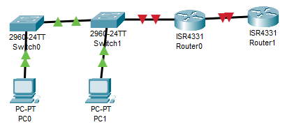
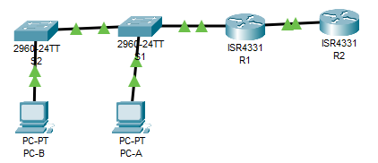

# LR12_Настройка NAT для IPv4

Работа выполнена на ПК с установленным Cisco Packet Tracer.

#### Топология



#### Таблица адресации

 Устройство | Интерфейс | IP-адрес         | Маска подсети.
:----------:|:---------:|:----------------:| :---------:
 R1         |G0/0/0     | 10.53.0.1        | 255.255.255.248
 R1         | G0/0/1    | 172.16.1.1      |  255.255.255.0
 R2         | G0/0/0     | 10.53.0.2       | 255.255.255.248
 R2         | LOOPBACK1  | 192.168.1.1     | 255.255.255.224
 S1         | VLAN 1     | 192.168.1.1     | 255.255.255.0
 S2         | VLAN 1     | 192.168.1.1     | 255.255.255.0
 PC-A       | NIC        | 192.168.1.1     | 255.255.255.0
 PC-B       | NIC       | 192.168.1.1     | 255.255.255.0


### Часть 1. Настройка основного сетевого устройства

#### Шаг 1.1. Базовая настройка маршрутизаторов.

```
Router>EN
Router#conf t
Enter configuration commands, one per line.  End with CNTL/Z.
Router(config)#ho
Router(config)#hostname R1
R1(config)#no ip domain-l
R1(config)#no ip domain-lookup 
R1(config)#en
R1(config)#ena
R1(config)#enable s
R1(config)#enable secret class
R1(config)#lin
R1(config)#line co
R1(config)#line console 0
R1(config-line)#pas
R1(config-line)#password cisco
R1(config-line)#login
R1(config-line)#exit
R1(config)#li
R1(config)#liv
R1(config)#lin
R1(config)#line v
R1(config)#line vty 0 4
R1(config-line)#pas
R1(config-line)#password cisco
R1(config-line)#login
R1(config-line)#exit
R1(config)#ser
R1(config)#service pas
R1(config)#service password-encryption 
R1(config)#ba
R1(config)#banner m
R1(config)#banner motd #aaaaaa#
R1(config)#in
R1(config)#interface g0/0/0
R1(config-if)#des
R1(config-if)#description TO_R2
R1(config-if)#ip ad
R1(config-if)#ip address 209.165.200.230 255.255.255.248
R1(config-if)#NO SH
R1(config-if)#NO SHutdown 

R1(config-if)#
%LINK-5-CHANGED: Interface GigabitEthernet0/0/0, changed state to up

R1(config-if)#exit
R1(config)#interface g0/0/1
R1(config-if)#de
R1(config-if)#des
R1(config-if)#description TO_S1
R1(config-if)#IP ad
R1(config-if)#IP address 192.168.1.1 255.255.255.0
R1(config-if)#no sh
R1(config-if)#no shutdown 

R1(config-if)#
%LINK-5-CHANGED: Interface GigabitEthernet0/0/1, changed state to up

%LINEPROTO-5-UPDOWN: Line protocol on Interface GigabitEthernet0/0/1, changed state to up
exit
R1(config)#
R1(config)#ip rout
R1(config)#ip route 209.165.200.0 255.255.255.224 209.165.200.225
R1#cop running-config st
R1#cop running-config startup-config 
Destination filename [startup-config]? 
Building configuration...
```

```
Router#conf t
Enter configuration commands, one per line.  End with CNTL/Z.
Router(config)#hos
Router(config)#hostname R2
R2(config)#no ip domain-
R2(config)#no ip domain-l
R2(config)#no ip domain-lookup 
R2(config)#ena
R2(config)#enable secret class
R2(config)#lin
R2(config)#line co
R2(config)#line console 0
R2(config-line)#pas
R2(config-line)#password cisco
R2(config-line)#login
R2(config-line)#exit
R2(config)#li
R2(config)#lin
R2(config)#line vt
R2(config)#line vty 0 4
R2(config)#line vty 0 4
R2(config-line)#pas
R2(config-line)#password cisco
R2(config-line)#login
R2(config-line)#exit
R2(config)#ser
R2(config)#service pas
R2(config)#service password-encryption 
R2(config)#ba
R2(config)#banner mo
R2(config)#banner motd #nonono#
R2(config)#int g0/0/0
R2(config-if)#des
% Incomplete command.
R2(config-if)#des
R2(config-if)#description TO_R1
R2(config-if)#ip adr
R2(config-if)#ip ad
R2(config-if)#ip address 209.165.200.225 255.255.255.248
R2(config-if)#no sh
R2(config-if)#no shutdown 

R2(config-if)#
%LINK-5-CHANGED: Interface GigabitEthernet0/0/0, changed state to up

%LINEPROTO-5-UPDOWN: Line protocol on Interface GigabitEthernet0/0/0, changed state to up
exit
R2(config)#int lo
R2(config)#int loopback 1

R2(config-if)#
%LINK-5-CHANGED: Interface Loopback1, changed state to up

%LINEPROTO-5-UPDOWN: Line protocol on Interface Loopback1, changed state to up
des
R2(config-if)#description INET
R2(config-if)#IP AD
R2(config-if)#IP ADdress 209.165.200.1 255.255.255.224
R2(config-if)#exit
R2(config)#ip route 0.0.0.0 0.0.0.0 209.165.200.230
R2(config)#end
R2#
%SYS-5-CONFIG_I: Configured from console by console
cop
R2#copy r
R2#copy running-config st
R2#copy running-config startup-config 
Destination filename [startup-config]? 
Building configuration...
[OK]
```



#### Шаг 1.2. Настройте базовые параметры каждого коммутатора

```
Switch#conf t
Enter configuration commands, one per line.  End with CNTL/Z.
Switch(config)#hos
Switch(config)#hostname S1
S1(config)#no ip domain-l
S1(config)#no ip domain-lookup 
S1(config)#en
S1(config)#ena
S1(config)#enable s
S1(config)#enable secret class
S1(config)#enable secret class
S1(config)#lin
S1(config)#line co
S1(config)#line console 0
S1(config-line)#pas
S1(config-line)#password cisco
S1(config-line)#login
S1(config-line)#exit
S1(config)#li
S1(config)#line vt
S1(config)#line vty 0 4
S1(config-line)#pas
S1(config-line)#password cisco
S1(config-line)#login
S1(config-line)#exit
S1(config)#ser
S1(config)#service e
S1(config)#service en
S1(config)#service pass
S1(config)#service password-encryption 
S1(config)#ba
S1(config)#banner m
S1(config)#banner motd #gonogono#
S1(config)#int ra f0/2-4?
.  
S1(config)#int ra f0/2-4, f0/7-24, g0/1-2
S1(config-if-range)#sh
S1(config-if-range)#shutdown 

%LINK-5-CHANGED: Interface FastEthernet0/2, changed state to administratively down

%LINK-5-CHANGED: Interface FastEthernet0/3, changed state to administratively down

%LINK-5-CHANGED: Interface FastEthernet0/4, changed state to administratively down

%LINK-5-CHANGED: Interface FastEthernet0/7, changed state to administratively down

%LINK-5-CHANGED: Interface FastEthernet0/8, changed state to administratively down

%LINK-5-CHANGED: Interface FastEthernet0/9, changed state to administratively down

%LINK-5-CHANGED: Interface FastEthernet0/10, changed state to administratively down

%LINK-5-CHANGED: Interface FastEthernet0/11, changed state to administratively down

%LINK-5-CHANGED: Interface FastEthernet0/12, changed state to administratively down

%LINK-5-CHANGED: Interface FastEthernet0/13, changed state to administratively down

%LINK-5-CHANGED: Interface FastEthernet0/14, changed state to administratively down

%LINK-5-CHANGED: Interface FastEthernet0/15, changed state to administratively down

%LINK-5-CHANGED: Interface FastEthernet0/16, changed state to administratively down

%LINK-5-CHANGED: Interface FastEthernet0/17, changed state to administratively down

%LINK-5-CHANGED: Interface FastEthernet0/18, changed state to administratively down

%LINK-5-CHANGED: Interface FastEthernet0/19, changed state to administratively down

%LINK-5-CHANGED: Interface FastEthernet0/20, changed state to administratively down

%LINK-5-CHANGED: Interface FastEthernet0/21, changed state to administratively down

%LINK-5-CHANGED: Interface FastEthernet0/22, changed state to administratively down

%LINK-5-CHANGED: Interface FastEthernet0/23, changed state to administratively down

%LINK-5-CHANGED: Interface FastEthernet0/24, changed state to administratively down

%LINK-5-CHANGED: Interface GigabitEthernet0/1, changed state to administratively down

%LINK-5-CHANGED: Interface GigabitEthernet0/2, changed state to administratively down
S1(config-if-range)#exit
S1(config)#int vl
S1(config)#int vlan 1
S1(config-if)#ip add
S1(config-if)#ip address 192.168.1.11 255.255.255.0
S1(config-if)#no sh
S1(config-if)#no shutdown 

S1(config-if)#
%LINK-5-CHANGED: Interface Vlan1, changed state to up

%LINEPROTO-5-UPDOWN: Line protocol on Interface Vlan1, changed state to up
exit
S1(config)#ip de
S1(config)#ip default-gateway 192.168.1.1
S1(config)#end
S1#
%SYS-5-CONFIG_I: Configured from console by console
cop
S1#copy r
S1#copy running-config st
S1#copy running-config startup-config 
Destination filename [startup-config]? 
Building configuration...
[OK]
```

```
Switch>en
Switch#conf t
Enter configuration commands, one per line.  End with CNTL/Z.
Switch(config)#ho
Switch(config)#hostname S2
S2(config)#no ip domain-l
S2(config)#no ip domain-lookup 
S2(config)#en
S2(config)#ena
S2(config)#enable s
S2(config)#enable secret class
S2(config)#li
S2(config)#line co
S2(config)#line console 0
S2(config-line)#pass
S2(config-line)#password cisco
S2(config-line)#login
S2(config-line)#exit
S2(config)#li
S2(config)#line v
S2(config)#line vty 0 4
S2(config)#line vty 0 4
S2(config-line)#pas
S2(config-line)#password cisco
S2(config-line)#login
S2(config-line)#exit
S2(config)#ser
S2(config)#service pas
S2(config)#service password-encryption 
S2(config)#ba
S2(config)#banner m
S2(config)#banner motd #chto pisat#
S2(config)#int ra f0/2-17, f0/19-24, g0/1-2
S2(config-if-range)#sh
S2(config-if-range)#shutdown 

%LINK-5-CHANGED: Interface FastEthernet0/2, changed state to administratively down

%LINK-5-CHANGED: Interface FastEthernet0/3, changed state to administratively down

%LINK-5-CHANGED: Interface FastEthernet0/4, changed state to administratively down

%LINK-5-CHANGED: Interface FastEthernet0/5, changed state to administratively down

%LINK-5-CHANGED: Interface FastEthernet0/6, changed state to administratively down

%LINK-5-CHANGED: Interface FastEthernet0/7, changed state to administratively down

%LINK-5-CHANGED: Interface FastEthernet0/8, changed state to administratively down

%LINK-5-CHANGED: Interface FastEthernet0/9, changed state to administratively down

%LINK-5-CHANGED: Interface FastEthernet0/10, changed state to administratively down

%LINK-5-CHANGED: Interface FastEthernet0/11, changed state to administratively down

%LINK-5-CHANGED: Interface FastEthernet0/12, changed state to administratively down

%LINK-5-CHANGED: Interface FastEthernet0/13, changed state to administratively down

%LINK-5-CHANGED: Interface FastEthernet0/14, changed state to administratively down

%LINK-5-CHANGED: Interface FastEthernet0/15, changed state to administratively down

%LINK-5-CHANGED: Interface FastEthernet0/16, changed state to administratively down

%LINK-5-CHANGED: Interface FastEthernet0/17, changed state to administratively down

%LINK-5-CHANGED: Interface FastEthernet0/19, changed state to administratively down

%LINK-5-CHANGED: Interface FastEthernet0/20, changed state to administratively down

%LINK-5-CHANGED: Interface FastEthernet0/21, changed state to administratively down

%LINK-5-CHANGED: Interface FastEthernet0/22, changed state to administratively down

%LINK-5-CHANGED: Interface FastEthernet0/23, changed state to administratively down

%LINK-5-CHANGED: Interface FastEthernet0/24, changed state to administratively down

%LINK-5-CHANGED: Interface GigabitEthernet0/1, changed state to administratively down

%LINK-5-CHANGED: Interface GigabitEthernet0/2, changed state to administratively down
S2(config-if-range)#exit
S2(config)#int vlan 1
S2(config-if)#ip ad
S2(config-if)#ip address 192.168.1.12 255.255.255.0
S2(config-if)#no sh
S2(config-if)#no shutdown 

S2(config-if)#
%LINK-5-CHANGED: Interface Vlan1, changed state to up

%LINEPROTO-5-UPDOWN: Line protocol on Interface Vlan1, changed state to up
ex
S2(config)#ip d
S2(config)#ip de
S2(config)#ip default-gateway 192.168.1.1
S2(config)#end
S2#
%SYS-5-CONFIG_I: Configured from console by console
cop
S2#copy st
S2#copy startup-config r
S2#copy startup-config running-config 
S2#copy startup-config running-config 
%% Non-volatile configuration memory invalid or not present
S2#cop
S2#copy r
S2#copy running-config st
S2#copy running-config startup-config 
Destination filename [startup-config]? 
Building configuration...
[OK]
```

### Часть 2. Настройка и проверка NAT для IPv4.

#### Шаг 2.1. Настройте NAT на R1, используя пул из трех адресов 209.165.200.226-209.165.200.228. 

a.	Настройте простой список доступа, который определяет, какие хосты будут разрешены для трансляции. В этом случае все устройства в локальной сети R1 имеют право на трансляцию.
R1(config)# access-list 1 permit 192.168.1.0 0.0.0.255 

```
R1(config)#access-list 192.168.1.0 0.0.0.255
                       ^
% Invalid input detected at '^' marker.
	
R1(config)#access-list pe
R1(config)#access-list per
R1(config)#access-list 1 pe
R1(config)#access-list 1 permit 192.168.1.0 0.0.0.255
```

b.	Создайте пул NAT и укажите ему имя и диапазон используемых адресов.
R1(config)# ip nat pool PUBLIC_ACCESS 209.165.200.226 209.165.200.228 netmask 255.255.255.248 
Примечание. Параметр маски сети не является разделителем IP-адресов. Это должна быть правильная маска подсети для назначенных адресов, даже если вы используете не все адреса подсети в пуле. 

```
R1(config)#ip na
R1(config)#ip nat po
R1(config)#ip nat pool PUBLIC_ACCESS 209.165.200.226 209.165.200.228 netmask 255.255.255.248
```

c.	Настройте перевод, связывая ACL и пул с процессом преобразования.
R1(config)# ip nat inside source list 1 pool PUBLIC_ACCESS 
Примечание: Три очень важных момента. Во-первых, слово «inside» имеет решающее значение для работы такого рода NAT. Если вы опустить его, NAT не будет работать. Во-вторых, номер списка — это номер ACL, настроенный на предыдущем шаге. В-третьих, имя пула чувствительно к регистру. 

```
R1(config)#ip na
R1(config)#ip nat i
R1(config)#ip nat inside s
R1(config)#ip nat inside source l
R1(config)#ip nat inside source list 1 p
R1(config)#ip nat inside source list 1 pool PUBLIC_ACCESS
```

d.	Задайте внутренний (inside) интерфейс. 
R1(config)# interface g0/0/1
R1(config-if)# ip nat inside

```
R1(config)#int g0/0/1
R1(config-if)#ip
R1(config-if)#ip n
R1(config-if)#ip nat in
R1(config-if)#ip nat inside 
```

e.	Определите внешний (outside) интерфейс.
R1(config)# interface g0/0/0
R1(config-if)# ip nat outside

```
R1(config-if)#ex
R1(config)#int g0/0/0
R1(config-if)#ip nat ou
R1(config-if)#ip nat outside 
```

#### Шаг 2.2. Проверьте и проверьте конфигурацию. 

a.	С PC-B,  запустите эхо-запрос интерфейса Lo1 (209.165.200.1) на R2. Если эхо-запрос не прошел, выполните процес поиска и устранения неполадок. На R1 отобразите таблицу NAT на R1 с помощью команды show ip nat translations.
R1# show ip nat translations
Pro Inside global Inside local Outside local Outside global
--- 209.165.200.226 192.168.1.3 --- --- 
226:1 192.168.1. 3:1 209.165.200. 1:1 209.165.200. 1:1 
Total number of translations: 2

```
C:\>ping 209.165.200.1

Pinging 209.165.200.1 with 32 bytes of data:

Request timed out.
Request timed out.
Reply from 209.165.200.1: bytes=32 time<1ms TTL=254
Reply from 209.165.200.1: bytes=32 time<1ms TTL=254
```

```
R1#show ip nat translations 
Pro  Inside global     Inside local       Outside local      Outside global
icmp 209.165.200.227:10192.168.1.3:10     209.165.200.1:10   209.165.200.1:10
icmp 209.165.200.227:11192.168.1.3:11     209.165.200.1:11   209.165.200.1:11
icmp 209.165.200.227:12192.168.1.3:12     209.165.200.1:12   209.165.200.1:12
icmp 209.165.200.227:9 192.168.1.3:9      209.165.200.1:9    209.165.200.1:9
```

- Во что был транслирован внутренний локальный адрес PC-B?
Был транслирован в 209.165.200.226.

- Какой тип адреса NAT является переведенным адресом?
 Глобальный адрес, который выходит во внешнюю сеть.

b.	С PC-A, запустите  эхо-запрос интерфейса Lo1 (209.165.200.1) на R2. Если эхо-запрос не прошел, выполните отладку. На R1 отобразите таблицу NAT на R1 с помощью команды show ip nat translations.
R1# show ip nat translations 
Pro Inside global Inside local Outside local Outside global
--- 209.165.200.227 192.168.1.2 --- ---
--- 209.165.200.226 192.168.1.3 --- ---
227:1 192.168.1. 2:1 209.165.200. 1:1 209.165.200. 1:1
226:1 192.168.1. 3:1 209.165.200. 1:1 209.165.200. 1:1
Total number of translations: 4

```
C:\>ping 209.165.200.1

Pinging 209.165.200.1 with 32 bytes of data:

Request timed out.
Reply from 209.165.200.1: bytes=32 time<1ms TTL=254
Reply from 209.165.200.1: bytes=32 time<1ms TTL=254
Reply from 209.165.200.1: bytes=32 time<1ms TTL=254
```

```
R1#show ip nat translations 
Pro  Inside global     Inside local       Outside local      Outside global
icmp 209.165.200.228:5 192.168.1.2:5      209.165.200.1:5    209.165.200.1:5
icmp 209.165.200.228:6 192.168.1.2:6      209.165.200.1:6    209.165.200.1:6
icmp 209.165.200.228:7 192.168.1.2:7      209.165.200.1:7    209.165.200.1:7
icmp 209.165.200.228:8 192.168.1.2:8      209.165.200.1:8    209.165.200.1:8
```

c.	Обратите внимание, что предыдущая трансляция для PC-B все еще находится в таблице. Из S1, эхо-запрос интерфейса Lo1 (209.165.200.1) на R2. Если эхо-запрос не прошел, выполните отладку. На R1 отобразите таблицу NAT на R1 с помощью команды show ip nat translations.
R1# show ip nat translations
Pro Inside global Inside local Outside local Outside global
--- 209.165.200.227 192.168.1.2 --- ---
--- 209.165.200.226 192.168.1.3 --- ---
--- 209.165.200.228 192.168.1.11 --- ---
226:1 192.168.1. 3:1 209.165.200. 1:1 209.165.200. 1:1
228:0 192.168.1. 11:0 209.165.200. 1:0 209.165.200. 1:0 209.165.200. 1:0
Total number of translations: 5

```
S1#ping 209.165.200.1

Type escape sequence to abort.
Sending 5, 100-byte ICMP Echos to 209.165.200.1, timeout is 2 seconds:
.!!!!
Success rate is 80 percent (4/5), round-trip min/avg/max = 0/0/0 ms
```

```
R1#show ip nat translations 
Pro  Inside global     Inside local       Outside local      Outside global
icmp 209.165.200.226:10192.168.1.11:10    209.165.200.1:10   209.165.200.1:10
icmp 209.165.200.226:6 192.168.1.11:6     209.165.200.1:6    209.165.200.1:6
icmp 209.165.200.226:7 192.168.1.11:7     209.165.200.1:7    209.165.200.1:7
icmp 209.165.200.226:8 192.168.1.11:8     209.165.200.1:8    209.165.200.1:8
icmp 209.165.200.226:9 192.168.1.11:9     209.165.200.1:9    209.165.200.1:9
```

d.	Теперь запускаем пинг R2 Lo1 из S2. На этот раз перевод завершается неудачей, и вы получаете эти сообщения (или аналогичные) на консоли R1:
Sep 23 15:43:55.562: %IOSXE-6-PLATFORM: R0/0: cpp_cp: QFP:0.0 Thread:000 TS:00000001473688385900 %NAT-6-ADDR_ALLOC_FAILURE: Address allocation failed; pool 1 may be exhausted [2]

```
S2#ping 209.165.200.1

Type escape sequence to abort.
Sending 5, 100-byte ICMP Echos to 209.165.200.1, timeout is 2 seconds:
!!!!!
Success rate is 100 percent (5/5), round-trip min/avg/max = 0/0/0 ms
```

Пул был свободен так как в этот момент никто другой не пинговал, а вот если я запущу пинги одновременно, то у меня не успел ПК-Б

```
C:\>ping 209.165.200.1

Pinging 209.165.200.1 with 32 bytes of data:

Request timed out.
Request timed out.
Request timed out.
Request timed out.

Ping statistics for 209.165.200.1:
    Packets: Sent = 4, Received = 0, Lost = 4 (100% loss),
```

```
R1#show ip nat translations 
Pro  Inside global     Inside local       Outside local      Outside global
icmp 209.165.200.226:16192.168.1.12:16    209.165.200.1:16   209.165.200.1:16
icmp 209.165.200.226:17192.168.1.12:17    209.165.200.1:17   209.165.200.1:17
icmp 209.165.200.226:18192.168.1.12:18    209.165.200.1:18   209.165.200.1:18
icmp 209.165.200.226:19192.168.1.12:19    209.165.200.1:19   209.165.200.1:19
icmp 209.165.200.226:20192.168.1.12:20    209.165.200.1:20   209.165.200.1:20
icmp 209.165.200.227:11192.168.1.11:11    209.165.200.1:11   209.165.200.1:11
icmp 209.165.200.227:12192.168.1.11:12    209.165.200.1:12   209.165.200.1:12
icmp 209.165.200.227:13192.168.1.11:13    209.165.200.1:13   209.165.200.1:13
icmp 209.165.200.227:14192.168.1.11:14    209.165.200.1:14   209.165.200.1:14
icmp 209.165.200.227:15192.168.1.11:15    209.165.200.1:15   209.165.200.1:15
icmp 209.165.200.227:16192.168.1.11:16    209.165.200.1:16   209.165.200.1:16
icmp 209.165.200.227:17192.168.1.11:17    209.165.200.1:17   209.165.200.1:17
icmp 209.165.200.227:18192.168.1.11:18    209.165.200.1:18   209.165.200.1:18
icmp 209.165.200.227:19192.168.1.11:19    209.165.200.1:19   209.165.200.1:19
icmp 209.165.200.227:20192.168.1.11:20    209.165.200.1:20   209.165.200.1:20
icmp 209.165.200.227:21192.168.1.11:21    209.165.200.1:21   209.165.200.1:21
icmp 209.165.200.227:22192.168.1.11:22    209.165.200.1:22   209.165.200.1:22
icmp 209.165.200.227:23192.168.1.11:23    209.165.200.1:23   209.165.200.1:23
icmp 209.165.200.227:24192.168.1.11:24    209.165.200.1:24   209.165.200.1:24
icmp 209.165.200.227:25192.168.1.11:25    209.165.200.1:25   209.165.200.1:25
icmp 209.165.200.228:10192.168.1.2:10     209.165.200.1:10   209.165.200.1:10
icmp 209.165.200.228:11192.168.1.2:11     209.165.200.1:11   209.165.200.1:11
icmp 209.165.200.228:12192.168.1.2:12     209.165.200.1:12   209.165.200.1:12
icmp 209.165.200.228:9 192.168.1.2:9      209.165.200.1:9    209.165.200.1:9
```

если повторить единовременный пинг, но с небольшой задержко для второго коммутатора, то тогда пинг не пройдет уже у него по причине занятости пула. Думаю рассхождение с заданиме связано со временем жизни таблицы пула. 

e.	Это ожидаемый результат, потому что выделено только 3 адреса, и мы попытались ping Lo1 с четырех устройств. Напомним, что NAT — это трансляция «один-в-один». Введите команду show ip nat translations verbose , и вы увидите, что ответ будет 24 часа.
R1# show ip nat translations verbose 
Pro Inside global Inside local Outside local Outside global
--- 209.165.200.226 192.168.1.3 --- ---
  create: 09/23/19 15:35:27, use: 09/23/19 15:35:27, timeout: 23:56:42
  Map-Id(In): 1
<output omitted>

```
R1#show ip nat tr
R1#show ip nat translations v
R1#show ip nat translations ver
R1#show ip nat translations verb
R1#show ip nat translations ?
  <cr>
R1#show ip nat translations verbose
                            ^
% Invalid input detected at '^' marker.
```

Такой команды не имется.

f.	Учитывая, что пул ограничен тремя адресами, NAT для пула адресов недостаточно для нашего приложения. Очистите преобразование NAT и статистику, и мы перейдем к PAT.
R1# clear ip nat translations * 
R1# clear ip nat statistics 

```
R1#clear ip nat translation 
% Incomplete command.
R1#cl
R1#cle
R1#clear ?
  aaa                Clear AAA values
  access-list        Clear access list statistical information
  arp-cache          Clear the entire ARP cache
  cdp                Reset cdp information
  frame-relay        Clear Frame Relay information
  ip                 IP
  ipv6               IPv6
  line               Reset a terminal line
  mac-address-table  MAC forwarding table
  vtp                Clear VTP items
R1#clear ip ?
  bgp    Clear BGP connections
  dhcp   Delete items from the DHCP database
  nat    Clear NAT
  ospf   OSPF clear commands
  route  Delete route table entries
R1#clear ip nat 
% Incomplete command.
R1#clear ip nat 
% Incomplete command.
R1#clear ip nat ?
  translation  Clear dynamic translation
R1#clear ip nat tran
R1#clear ip nat translation ?
  *  Deletes all dynamic translations
R1#clear ip nat translation 
% Incomplete command.
R1#clear ip nat translation de
R1#clear ip nat translation*
                           ^
% Invalid input detected at '^' marker.
	
R1#clear ip nat translation *
```

### Часть 3. Настройка и проверка PAT для IPv4.

#### Шаг 3.1. Удалите команду преобразования на R1.

Компоненты конфигурации преобразования адресов в основном одинаковы; что-то (список доступа) для идентификации адресов, пригодных для перевода, дополнительно настроенный пул адресов для их преобразования и команды, необходимые для идентификации внутреннего и внешнего интерфейсов. Из части 1 наш список доступа (список доступа 1) по-прежнему корректен для сетевого сценария, поэтому нет необходимости воссоздавать его. Мы будем использовать один и тот же пул адресов, поэтому нет необходимости воссоздавать эту конфигурацию. Кроме того, внутренний и внешний интерфейсы не меняются. Чтобы начать работу в части 3, удалите команду, связывающую ACL и пул вместе.
R1(config)# no ip nat inside source list 1 pool PUBLIC_ACCESS 

```
R1(config)#no ip
R1(config)#no ip nat i
R1(config)#no ip nat inside l
R1(config)#no ip nat inside li
R1(config)#no ip nat inside lis
R1(config)#no ip nat inside ?
  source  Source address translation
R1(config)#no ip nat inside s
R1(config)#no ip nat inside source l
R1(config)#no ip nat inside source list 1 po
R1(config)#no ip nat inside source list 1 po
R1(config)#no ip nat inside source list 1 poo
R1(config)#no ip nat inside source list 1 pool PUBLIC_ACCESS
```

#### Шаг 3.2. Добавьте команду PAT на R1.

Теперь настройте преобразование PAT в пул адресов (помните, что ACL и Pool уже настроены, так что это единственная команда, которую нам нужно изменить с NAT на PAT).
R1(config)# ip nat inside source list 1 pool PUBLIC_ACCESS overload 

```
R1(config)#ip nat inside source list 1 pool PUBLIC_ACCESS overload
R1(config)#
```

#### Шаг 3.3. Протестируйте и проверьте конфигурацию.

a.	Давайте проверим, что PAT работает. С PC-B,  запустите эхо-запрос интерфейса Lo1 (209.165.200.1) на R2. Если эхо-запрос не прошел, выполните отладку. На R1 отобразите таблицу NAT на R1 с помощью команды show ip nat translations.
R1# show ip nat translations
Pro Inside global Inside local Outside local Outside global
226:1 192.168.1. 3:1 209.165.200. 1:1 209.165.200. 1:1
Total number of translations: 1#

```
Pinging 209.165.200.1 with 32 bytes of data:

Reply from 209.165.200.1: bytes=32 time=4ms TTL=254
Reply from 209.165.200.1: bytes=32 time<1ms TTL=254
Reply from 209.165.200.1: bytes=32 time<1ms TTL=254
Reply from 209.165.200.1: bytes=32 time<1ms TTL=254
```

```
R1#show ip nat translations 
Pro  Inside global     Inside local       Outside local      Outside global
icmp 209.165.200.227:21192.168.1.3:21     209.165.200.1:21   209.165.200.1:21
icmp 209.165.200.227:22192.168.1.3:22     209.165.200.1:22   209.165.200.1:22
icmp 209.165.200.227:23192.168.1.3:23     209.165.200.1:23   209.165.200.1:23
icmp 209.165.200.227:24192.168.1.3:24     209.165.200.1:24   209.165.200.1:24
```

- Во что был транслирован внутренний локальный адрес PC-B?
В адркс 209.165.200.227.

- Какой тип адреса NAT является переведенным адресом? 
Внутренний глобальный адрес.

b.	С PC-A, запустите эхо-запрос интерфейса Lo1 (209.165.200.1) на R2. Если эхо-запрос не прошел, выполните отладку. На R1 отобразите таблицу NAT на R1 с помощью команды show ip nat translations.
R1# show ip nat translations
Pro Inside global Inside local Outside local Outside global
226:1 192.168.1. 2:1 209.165.200. 1:1 209.165.200. 1:1
Total number of translations: 1
Обратите внимание, что есть только одна трансляция. Отправьте ping еще раз, и быстро вернитесь к маршрутизатору и введите команду show ip nat translations verbose , и вы увидите, что произошло.
R1# show ip nat translations verbose 
Pro Inside global Inside local Outside local Outside global
icmp 209.165.200.226:1 192.168.1.2:1 209.165.200.1:1 209.165.200.1:1 
  create: 09/23/19 16:57:22, use: 09/23/19 16:57:25, timeout: 00:01:00
<output omitted>
Как вы можете видеть, время ожидания перевода было отменено с 24 часов до 1 минуты.

```
C:\>ping 209.165.200.1

Pinging 209.165.200.1 with 32 bytes of data:

Reply from 209.165.200.1: bytes=32 time<1ms TTL=254
Reply from 209.165.200.1: bytes=32 time<1ms TTL=254
Reply from 209.165.200.1: bytes=32 time<1ms TTL=254
Reply from 209.165.200.1: bytes=32 time<1ms TTL=254
```

```
R1#show ip nat translations verbose
                            ^
% Invalid input detected at '^' marker.
```

```
R1#show ip nat translations 
Pro  Inside global     Inside local       Outside local      Outside global
icmp 209.165.200.227:17192.168.1.2:17     209.165.200.1:17   209.165.200.1:17
icmp 209.165.200.227:18192.168.1.2:18     209.165.200.1:18   209.165.200.1:18
icmp 209.165.200.227:19192.168.1.2:19     209.165.200.1:19   209.165.200.1:19
icmp 209.165.200.227:20192.168.1.2:20     209.165.200.1:20   209.165.200.1:20
icmp 209.165.200.227:21192.168.1.2:21     209.165.200.1:21   209.165.200.1:21
icmp 209.165.200.227:22192.168.1.2:22     209.165.200.1:22   209.165.200.1:22
icmp 209.165.200.227:23192.168.1.2:23     209.165.200.1:23   209.165.200.1:23
icmp 209.165.200.227:24192.168.1.2:24     209.165.200.1:24   209.165.200.1:24
icmp 209.165.200.227:25192.168.1.3:25     209.165.200.1:25   209.165.200.1:25
icmp 209.165.200.227:26192.168.1.3:26     209.165.200.1:26   209.165.200.1:26
icmp 209.165.200.227:27192.168.1.3:27     209.165.200.1:27   209.165.200.1:27
icmp 209.165.200.227:28192.168.1.3:28     209.165.200.1:28   209.165.200.1:28
```

c.	Генерирует трафик с нескольких устройств для наблюдения PAT. На PC-A и PC-B используйте параметр -t с командой ping, чтобы отправить безостановочный ping на интерфейс Lo1 R2 (ping -t 209.165.200.1), затем вернитесь к R1 и выполните команду show ip nat translations:
R1# show ip nat translations
Pro Inside global Inside local Outside local Outside global
icmp 209.165.200.226:1 192.168.1.2:1 209.165.200.1:1 209.165.200.1:1 
226:2 192.168.1. 3:1 209.165.200. 1:1 209.165.200. 1:2 
Total number of translations: 2 
Обратите внимание, что внутренний глобальный адрес одинаков для обоих сеансов. 

```
R1#show ip nat translations 
Pro  Inside global     Inside local       Outside local      Outside global
icmp 209.165.200.227:1024192.168.1.2:29     209.165.200.1:29   209.165.200.1:1024
icmp 209.165.200.227:1025192.168.1.2:30     209.165.200.1:30   209.165.200.1:1025
icmp 209.165.200.227:1026192.168.1.2:31     209.165.200.1:31   209.165.200.1:1026
icmp 209.165.200.227:1027192.168.1.2:32     209.165.200.1:32   209.165.200.1:1027
icmp 209.165.200.227:1028192.168.1.2:33     209.165.200.1:33   209.165.200.1:1028
icmp 209.165.200.227:1029192.168.1.2:34     209.165.200.1:34   209.165.200.1:1029
icmp 209.165.200.227:1030192.168.1.2:35     209.165.200.1:35   209.165.200.1:1030
icmp 209.165.200.227:1031192.168.1.2:36     209.165.200.1:36   209.165.200.1:1031
icmp 209.165.200.227:1032192.168.1.2:37     209.165.200.1:37   209.165.200.1:1032
icmp 209.165.200.227:1033192.168.1.2:38     209.165.200.1:38   209.165.200.1:1033
icmp 209.165.200.227:1034192.168.1.2:39     209.165.200.1:39   209.165.200.1:1034
icmp 209.165.200.227:1035192.168.1.2:40     209.165.200.1:40   209.165.200.1:1035
icmp 209.165.200.227:1036192.168.1.2:41     209.165.200.1:41   209.165.200.1:1036
icmp 209.165.200.227:25192.168.1.2:25     209.165.200.1:25   209.165.200.1:25
icmp 209.165.200.227:26192.168.1.2:26     209.165.200.1:26   209.165.200.1:26
icmp 209.165.200.227:27192.168.1.2:27     209.165.200.1:27   209.165.200.1:27
icmp 209.165.200.227:28192.168.1.2:28     209.165.200.1:28   209.165.200.1:28
icmp 209.165.200.227:29192.168.1.3:29     209.165.200.1:29   209.165.200.1:29
icmp 209.165.200.227:30192.168.1.3:30     209.165.200.1:30   209.165.200.1:30
icmp 209.165.200.227:31192.168.1.3:31     209.165.200.1:31   209.165.200.1:31
icmp 209.165.200.227:32192.168.1.3:32     209.165.200.1:32   209.165.200.1:32
icmp 209.165.200.227:33192.168.1.3:33     209.165.200.1:33   209.165.200.1:33
icmp 209.165.200.227:34192.168.1.3:34     209.165.200.1:34   209.165.200.1:34
icmp 209.165.200.227:35192.168.1.3:35     209.165.200.1:35   209.165.200.1:35
icmp 209.165.200.227:36192.168.1.3:36     209.165.200.1:36   209.165.200.1:36
icmp 209.165.200.227:37192.168.1.3:37     209.165.200.1:37   209.165.200.1:37
icmp 209.165.200.227:38192.168.1.3:38     209.165.200.1:38   209.165.200.1:38
icmp 209.165.200.227:39192.168.1.3:39     209.165.200.1:39   209.165.200.1:39
icmp 209.165.200.227:40192.168.1.3:40     209.165.200.1:40   209.165.200.1:40
icmp 209.165.200.227:41192.168.1.3:41     209.165.200.1:41   209.165.200.1:41
icmp 209.165.200.227:42192.168.1.3:42     209.165.200.1:42   209.165.200.1:42
icmp 209.165.200.227:43192.168.1.3:43     209.165.200.1:43   209.165.200.1:43
icmp 209.165.200.227:44192.168.1.3:44     209.165.200.1:44   209.165.200.1:44
icmp 209.165.200.227:45192.168.1.3:45     209.165.200.1:45   209.165.200.1:45
icmp 209.165.200.227:46192.168.1.3:46     209.165.200.1:46   209.165.200.1:46
R1#show ip nat statistics 
Total translations: 23 (0 static, 23 dynamic, 23 extended)
Outside Interfaces: GigabitEthernet0/0/0
Inside Interfaces: GigabitEthernet0/0/1
Hits: 166  Misses: 179
Expired translations: 147
Dynamic mappings:
-- Inside Source
access-list 1 pool PUBLIC_ACCESS refCount 23
 pool PUBLIC_ACCESS: netmask 255.255.255.248
       start 209.165.200.226 end 209.165.200.228
       type generic, total addresses 3 , allocated 1 (33%), misses 0
```

- Как маршрутизатор отслеживает, куда идут ответы? 
Маршрутизатор отслеживает по портам.

d.	PAT в пул является очень эффективным решением для малых и средних организаций. Тем не менее есть неиспользуемые адреса IPv4, задействованные в этом сценарии. Мы перейдем к PAT с перегрузкой интерфейса, чтобы устранить эту трату IPv4 адресов. Остановите ping на PC-A и PC-B с помощью комбинации клавиш Control-C, затем очистите трансляции и статистику:
R1# clear ip nat translations * 
R1# clear ip nat statistics 

```
R1#cle
R1#clear ip nat tr
R1#clear ip nat translation *
```

#### Шаг 3.4. На R1 удалите команды преобразования nat pool.

Опять же, наш список доступа (список доступа 1) по-прежнему корректен для сетевого сценария, поэтому нет необходимости воссоздавать его. Кроме того, внутренний и внешний интерфейсы не меняются. Чтобы начать работу с PAT к интерфейсу, очистите конфигурацию, удалив пул NAT и команду, связывающую ACL и пул вместе.
R1(config)# no ip nat inside source list 1 pool PUBLIC_ACCESS overload 
R1(config)# no ip nat pool PUBLIC_ACCESS

```
R1(config)#no ip nat inside source list 1 pool PUBLIC_ACCESS overload
R1(config)#no ip nat pool PUBLIC_ACCESS
```

#### Шаг 3.5. Добавьте команду PAT overload, указав внешний интерфейс.

Добавьте команду PAT, которая вызовет перегрузку внешнего интерфейса.
R1(config)# ip nat inside source list 1 interface g0/0/0 overload 

```
R1(config)#ip nat inside source list 1 interface g0/0/0 overload
```

#### Шаг 3.6. Протестируйте и проверьте конфигурацию. 

a.	Давайте проверим PAT, чтобы интерфейс работал. С PC-B,  запустите эхо-запрос интерфейса Lo1 (209.165.200.1) на R2. Если эхо-запрос не прошел, выполните отладку. На R1 отобразите таблицу NAT на R1 с помощью команды show ip nat translations.
R1# show ip nat translations
Pro Inside global Inside local Outside local Outside global
209.165.200. 230:1 192.168.1. 3:1 209.165.200. 1:1 209.165.200. 1:1 
Total number of translations: 1 

```
C:\>ping 209.165.200.1

Pinging 209.165.200.1 with 32 bytes of data:

Reply from 209.165.200.1: bytes=32 time<1ms TTL=254
Reply from 209.165.200.1: bytes=32 time=1ms TTL=254
Reply from 209.165.200.1: bytes=32 time<1ms TTL=254
Reply from 209.165.200.1: bytes=32 time<1ms TTL=254
```

```
R1#show ip nat translations 
Pro  Inside global     Inside local       Outside local      Outside global
icmp 209.165.200.230:82192.168.1.3:82     209.165.200.1:82   209.165.200.1:82
icmp 209.165.200.230:83192.168.1.3:83     209.165.200.1:83   209.165.200.1:83
icmp 209.165.200.230:84192.168.1.3:84     209.165.200.1:84   209.165.200.1:84
icmp 209.165.200.230:85192.168.1.3:85     209.165.200.1:85   209.165.200.1:85
```

b.	Сделайте трафик с нескольких устройств для наблюдения PAT. На PC-A и PC-B используйте параметр -t с командой ping для отправки безостановочного ping на интерфейс Lo1 R2 (ping -t 209.165.200.1). На S1 и S2 выполните привилегированную команду exec ping 209.165.200.1 повторить 2000. Затем вернитесь к R1 и выполните команду show ip nat translations.
R1# show ip nat translations
Pro Inside global Inside local Outside local Outside global
209.165.200. 230:3 192.168.1. 11:1 209.165.200. 1:1 209.165.200. 1:3 
209.165.200. 230:2 192.168.1. 2:1 209.165.200. 1:1 209.165.200. 1:2 
209.165.200. 230:4 192.168.1. 3:1 209.165.200. 1:1 209.165.200. 1:4 
209.165.200. 230:1 192.168.1. 12:1 209.165.200. 1:1 209.165.200. 1:1 
Total number of translations: 4 
Теперь все внутренние глобальные адреса сопоставляются с IP-адресом интерфейса g0/0/0.
Остановите все пинги. На PC-A и PC-B, используя комбинацию клавиш CTRL-C.

```
S2#ping 209.165.200.1 repeat 2000
                      ^
% Invalid input detected at '^' marker.
```

```
R1#show ip nat translations 
Pro  Inside global     Inside local       Outside local      Outside global
icmp 209.165.200.230:100192.168.1.3:100    209.165.200.1:100  209.165.200.1:100
icmp 209.165.200.230:101192.168.1.3:101    209.165.200.1:101  209.165.200.1:101
icmp 209.165.200.230:1024192.168.1.2:86     209.165.200.1:86   209.165.200.1:1024
icmp 209.165.200.230:1025192.168.1.2:87     209.165.200.1:87   209.165.200.1:1025
icmp 209.165.200.230:1026192.168.1.2:88     209.165.200.1:88   209.165.200.1:1026
icmp 209.165.200.230:1027192.168.1.2:89     209.165.200.1:89   209.165.200.1:1027
icmp 209.165.200.230:1028192.168.1.2:90     209.165.200.1:90   209.165.200.1:1028
icmp 209.165.200.230:1029192.168.1.2:91     209.165.200.1:91   209.165.200.1:1029
icmp 209.165.200.230:102192.168.1.3:102    209.165.200.1:102  209.165.200.1:102
```
Появляется бесконечная таблица

### Часть 4. Настройка и проверка PAT для IPv4.

#### Шаг 4.1. Удалите команду преобразования на R1.

R1# clear ip nat translations * 
R1# clear ip nat statistics 

```
R1#clear ip nat tr
R1#clear ip nat translation *
```

#### Шаг 4.2. На R1 настройте команду NAT, необходимую для статического сопоставления внутреннего адреса с внешним адресом.

Для этого шага настройте статическое сопоставление между 192.168.1.11 и 209.165.200.1 с помощью следующей команды:
R1(config)# ip nat inside source static 192.168.1.2 209.165.200.229 

```
R1(config)#ip nat inside source static 192.168.1.2 209.165.200.229
R1(config)#
```

#### Шаг 4.3. Протестируйте и проверьте конфигурацию.

a.	Давайте проверим, что статический NAT работает. На R1 отобразите таблицу NAT на R1 с помощью команды show ip nat translations, и вы увидите статическое сопоставление.
R1# show ip nat translations
Pro Inside global Inside local Outside local Outside global
--- 209.165.200.229 192.168.1.2 --- ---
Total number of translations: 1

```
R1#show ip nat tra
R1#show ip nat translations 
Pro  Inside global     Inside local       Outside local      Outside global
---  209.165.200.229   192.168.1.2        ---                ---
```

b.	Таблица перевода показывает, что статическое преобразование действует. Проверьте это, запустив ping  с R2 на 209.165.200.229. Плинги должны работать.
Примечание. Возможно, вам придется отключить брандмауэр ПК для работы pings.

```
R2#ping 209.165.200.229

Type escape sequence to abort.
Sending 5, 100-byte ICMP Echos to 209.165.200.229, timeout is 2 seconds:
.!!!!
Success rate is 80 percent (4/5), round-trip min/avg/max = 0/0/0 ms
```

c.	На R1 отобразите таблицу NAT на R1 с помощью команды show ip nat translations, и вы увидите статическое сопоставление и преобразование на уровне порта для входящих pings.
R1# show ip nat translations
Pro Inside global Inside local Outside local Outside global
--- 209.165.200.229 192.168.1.2 --- ---
229:3 192.168.1. 2:3 209.165.200. 225:3 209.165.200. 225:3 209.165.200. 
Total number of translations: 2
Это подтверждает, что статический NAT работает.

```
R1#show ip nat translations 
Pro  Inside global     Inside local       Outside local      Outside global
icmp 209.165.200.229:2 192.168.1.2:2      209.165.200.225:2  209.165.200.225:2
icmp 209.165.200.229:3 192.168.1.2:3      209.165.200.225:3  209.165.200.225:3
icmp 209.165.200.229:4 192.168.1.2:4      209.165.200.225:4  209.165.200.225:4
icmp 209.165.200.229:5 192.168.1.2:5      209.165.200.225:5  209.165.200.225:5
---  209.165.200.229   192.168.1.2        ---                ---
```


