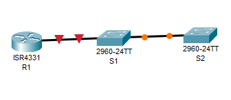
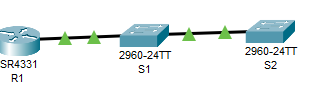

# LR12_Настройка протоколов CDP, LLDP и NTP

Работа выполнена на ПК с установленным Cisco Packet Tracer.

#### Топология



#### Таблица адресации

 Устройство| Интерфейс | IP-адрес     | Маска подсети| шлюз по ум
:---------:|:---------:|:------------:| :-----------:| :--------:
 R1        |Loopback 1  | 172.16.1.1  | 255.255.255.0 | 
 R1        | G0/0/1     | 10.22.0.1   | 255.255.255.0 |
 S1        | SVI VLAN 1 | 10.22.0.2   | 255.255.255.0 | 10.22.0.1
 S2        | SVI VLAN 1 | 10.22.0.3   | 255.255.255.0 | 10.22.0.1


### Часть 1. Настройка основного сетевого устройства

#### Шаг 1.1. Базовая настройка маршрутизаторов.

```
Router>en
Router#conf t
Enter configuration commands, one per line.  End with CNTL/Z.
Router(config)#ho
Router(config)#hostname R1
R1(config)#no ip domain-l
R1(config)#no ip domain-lookup 
R1(config)#en
R1(config)#ena
R1(config)#enable se
R1(config)#enable secret class
R1(config)#lin
R1(config)#line c
R1(config)#line console 0
R1(config-line)#pas
R1(config-line)#password cisco
R1(config-line)#login
R1(config-line)#exit
R1(config)#lin
R1(config)#line v
R1(config)#line vty 0 4
R1(config-line)#pas
R1(config-line)#password cisco
R1(config-line)#login
R1(config-line)#exit
R1(config)#ser
R1(config)#service pas
R1(config)#service password-encryption 
R1(config)#ban
R1(config)#banner mo
R1(config)#banner motd #aaaaaaaaaaaaaaaaaaaaaaaaaaaaaaaaaaaaaaaaaaaaaaaaaaaaaaaaaaaaaaaaaaaaaaaaaaaaaaaaaaaaaaaaaaaaaaaaaaaaaaaaaaaaaaaaaaaaaaaaaaa#
R1(config)#int loop
R1(config)#int loopback 1

R1(config-if)#
%LINK-5-CHANGED: Interface Loopback1, changed state to up

%LINEPROTO-5-UPDOWN: Line protocol on Interface Loopback1, changed state to up

R1(config-if)#des
R1(config-if)#description 
% Incomplete command.
R1(config-if)#description LOOPBCK_R1
R1(config-if)#ip ad
R1(config-if)#ip address 172.16.1.1 255.255.255.0
R1(config-if)#exit
R1(config)#int g0/0/1
R1(config-if)#des
R1(config-if)#description TO_S1
R1(config-if)#ip ad
R1(config-if)#ip address 10.22.0.1 255.255.255.0
R1(config-if)#no sh
R1(config-if)#no shutdown 

R1(config-if)#
%LINK-5-CHANGED: Interface GigabitEthernet0/0/1, changed state to up

%LINEPROTO-5-UPDOWN: Line protocol on Interface GigabitEthernet0/0/1, changed state to up
exit
R1(config)#end
R1#
%SYS-5-CONFIG_I: Configured from console by console
cop
R1#copy r
R1#copy running-config st
R1#copy running-config startup-config 
Destination filename [startup-config]? 
Building configuration...
[OK]
```

#### Шаг 1.2. Настройте базовые параметры каждого коммутатора


```
Switch>en
Switch#conf t
Enter configuration commands, one per line.  End with CNTL/Z.
Switch(config)#hos
Switch(config)#hostname S1
S1(config)#no ip domain-l
S1(config)#no ip domain-lookup 
S1(config)#ena
S1(config)#enable se
S1(config)#enable secret class
S1(config)#lin
S1(config)#line co
S1(config)#line console 0
S1(config-line)#pas
S1(config-line)#password cisco
S1(config-line)#login
S1(config-line)#exit
S1(config)#li
S1(config)#line v
S1(config)#line vty 0 4
S1(config-line)#pas
S1(config-line)#password cisco
S1(config-line)#login
S1(config-line)#exit
S1(config)#ser
S1(config)#service pas
S1(config)#service password-encryption 
S1(config)#ba
S1(config)#banner m
S1(config)#banner motd #nonomynonosquare#
S1(config)#int ra f0/2-4, f0/6-24, g0/1-2
S1(config-if-range)#shu
S1(config-if-range)#shutdown 

%LINK-5-CHANGED: Interface FastEthernet0/2, changed state to administratively down

%LINK-5-CHANGED: Interface FastEthernet0/3, changed state to administratively down

%LINK-5-CHANGED: Interface FastEthernet0/4, changed state to administratively down

%LINK-5-CHANGED: Interface FastEthernet0/6, changed state to administratively down

%LINK-5-CHANGED: Interface FastEthernet0/7, changed state to administratively down

%LINK-5-CHANGED: Interface FastEthernet0/8, changed state to administratively down

%LINK-5-CHANGED: Interface FastEthernet0/9, changed state to administratively down

%LINK-5-CHANGED: Interface FastEthernet0/10, changed state to administratively down

%LINK-5-CHANGED: Interface FastEthernet0/11, changed state to administratively down

%LINK-5-CHANGED: Interface FastEthernet0/12, changed state to administratively down

%LINK-5-CHANGED: Interface FastEthernet0/13, changed state to administratively down

%LINK-5-CHANGED: Interface FastEthernet0/14, changed state to administratively down

%LINK-5-CHANGED: Interface FastEthernet0/15, changed state to administratively down

%LINK-5-CHANGED: Interface FastEthernet0/16, changed state to administratively down

%LINK-5-CHANGED: Interface FastEthernet0/17, changed state to administratively down

%LINK-5-CHANGED: Interface FastEthernet0/18, changed state to administratively down

%LINK-5-CHANGED: Interface FastEthernet0/19, changed state to administratively down

%LINK-5-CHANGED: Interface FastEthernet0/20, changed state to administratively down

%LINK-5-CHANGED: Interface FastEthernet0/21, changed state to administratively down

%LINK-5-CHANGED: Interface FastEthernet0/22, changed state to administratively down

%LINK-5-CHANGED: Interface FastEthernet0/23, changed state to administratively down

%LINK-5-CHANGED: Interface FastEthernet0/24, changed state to administratively down

%LINK-5-CHANGED: Interface GigabitEthernet0/1, changed state to administratively down

%LINK-5-CHANGED: Interface GigabitEthernet0/2, changed state to administratively down
S1(config-if-range)#exit
S1(config)#end
S1#
%SYS-5-CONFIG_I: Configured from console by console
cop
S1#copy r
S1#copy running-config st
S1#copy running-config startup-config 
Destination filename [startup-config]? 
Building configuration...
[OK]
```

```
Switch>en
Switch#conf t
Enter configuration commands, one per line.  End with CNTL/Z.
Switch(config)#hos
Switch(config)#hostname S2
S2(config)#no ip domain-lo
S2(config)#no ip domain-lookup 
S2(config)#ena
S2(config)#enable s
S2(config)#enable secret class
S2(config)#enable secret class
S2(config)#lin
S2(config)#line c
S2(config)#line console 0
S2(config-line)#pas
S2(config-line)#password cisco
S2(config-line)#login
S2(config-line)#exit
S2(config)#li
S2(config)#line v
S2(config)#line vty 0 4
S2(config-line)#pas
S2(config-line)#password cisco
S2(config-line)#login
S2(config-line)#exit
S2(config)#se
S2(config)#se
S2(config)#service pa
S2(config)#service password-encryption 
S2(config)#ban
S2(config)#banner m
S2(config)#banner motd #nonononononnonon#
S2(config)#int ra f0/2-24, g0/1-2
S2(config-if-range)#sh
S2(config-if-range)#shutdown 

%LINK-5-CHANGED: Interface FastEthernet0/2, changed state to administratively down

%LINK-5-CHANGED: Interface FastEthernet0/3, changed state to administratively down

%LINK-5-CHANGED: Interface FastEthernet0/4, changed state to administratively down

%LINK-5-CHANGED: Interface FastEthernet0/5, changed state to administratively down

%LINK-5-CHANGED: Interface FastEthernet0/6, changed state to administratively down

%LINK-5-CHANGED: Interface FastEthernet0/7, changed state to administratively down

%LINK-5-CHANGED: Interface FastEthernet0/8, changed state to administratively down

%LINK-5-CHANGED: Interface FastEthernet0/9, changed state to administratively down

%LINK-5-CHANGED: Interface FastEthernet0/10, changed state to administratively down

%LINK-5-CHANGED: Interface FastEthernet0/11, changed state to administratively down

%LINK-5-CHANGED: Interface FastEthernet0/12, changed state to administratively down

%LINK-5-CHANGED: Interface FastEthernet0/13, changed state to administratively down

%LINK-5-CHANGED: Interface FastEthernet0/14, changed state to administratively down

%LINK-5-CHANGED: Interface FastEthernet0/15, changed state to administratively down

%LINK-5-CHANGED: Interface FastEthernet0/16, changed state to administratively down

%LINK-5-CHANGED: Interface FastEthernet0/17, changed state to administratively down

%LINK-5-CHANGED: Interface FastEthernet0/18, changed state to administratively down

%LINK-5-CHANGED: Interface FastEthernet0/19, changed state to administratively down

%LINK-5-CHANGED: Interface FastEthernet0/20, changed state to administratively down

%LINK-5-CHANGED: Interface FastEthernet0/21, changed state to administratively down

%LINK-5-CHANGED: Interface FastEthernet0/22, changed state to administratively down

%LINK-5-CHANGED: Interface FastEthernet0/23, changed state to administratively down

%LINK-5-CHANGED: Interface FastEthernet0/24, changed state to administratively down

%LINK-5-CHANGED: Interface GigabitEthernet0/1, changed state to administratively down

%LINK-5-CHANGED: Interface GigabitEthernet0/2, changed state to administratively down
S2(config-if-range)#exit
S2(config)#end
S2#
%SYS-5-CONFIG_I: Configured from console by console
cop
S2#copy r
S2#copy running-config st
S2#copy running-config startup-config 
Destination filename [startup-config]? 
Building configuration...
[OK]
```



### Часть 2. Обнаружение сетевых ресурсов с помощью протокола CDP

На устройствах Cisco протокол CDP включен по умолчанию. Воспользуйтесь CDP, чтобы обнаружить порты, к которым подключены кабели.

a.	На R1 используйте соответствующую команду show cdp, чтобы определить, сколько интерфейсов включено CDP, сколько из них включено и сколько отключено.
 
```
R1#show cd
R1#show cdp 
Global CDP information:
    Sending CDP packets every 60 seconds
    Sending a holdtime value of 180 seconds
    Sending CDPv2 advertisements is enabled

R1#show cdp ?
  entry      Information for specific neighbor entry
  interface  CDP interface status and configuration
  neighbors  CDP neighbor entries
  <cr>
R1#show cdp n
R1#show cdp neighbors 
Capability Codes: R - Router, T - Trans Bridge, B - Source Route Bridge
                  S - Switch, H - Host, I - IGMP, r - Repeater, P - Phone
Device ID    Local Intrfce   Holdtme    Capability   Platform    Port ID
S1           Gig 0/0/1        158            S       2960        Fas 0/5
```

- Сколько интерфейсов участвует в объявлениях CDP? Какие из них активны?
В данной задаче два интерфейса, а так работает на всех активных интерфейсах.Активны g0/0/1 и loopback 1/

b.	На R1 используйте соответствующую команду show cdp, чтобы определить версию IOS, используемую на S1.
R1 # show cdp entry  S1
-------------------------
Device ID: S1
Entry address(es):
Platform: cisco WS-C2960+24LC-L, Capabilities: Switch IGMP 
Interface: GigabitEthernet0/0/1, Port ID (outgoing port): FastEthernet0/5
Holdtime : 125 sec

Version :
Cisco IOS Software, C2960 Software (C2960-LANBASEK9-M), Version 15.2(4)E8, RELEASE SOFTWARE (fc3) 
Technical Support: http://www.cisco.com/techsupport
Copyright (c) 1986-2019 by Cisco Systems, Inc.
Compiled Fri 15-Mar-19 17:28 by prod_rel_team 

advertisement version: 2
VTP Management Domain: ''
Native VLAN: 1
Duplex: full

```
R1#show cdp e
R1#show cdp entry S1

Device ID: S1
Entry address(es): 
Platform: cisco 2960, Capabilities: Switch
Interface: GigabitEthernet0/0/1, Port ID (outgoing port): FastEthernet0/5
Holdtime: 134

Version :
Cisco IOS Software, C2960 Software (C2960-LANBASEK9-M), Version 15.0(2)SE4, RELEASE SOFTWARE (fc1)
Technical Support: http://www.cisco.com/techsupport
Copyright (c) 1986-2013 by Cisco Systems, Inc.
Compiled Wed 26-Jun-13 02:49 by mnguyen

advertisement version: 2
Duplex: full
```

- Какая версия IOS используется на  S1?
Используется Cisco IOS Software, C2960 Software (C2960-LANBASEK9-M), Version 15.0(2)SE4, RELEASE SOFTWARE (fc1)
 
c.	На S1 используйте соответствующую команду show cdp, чтобы определить, сколько пакетов CDP было выданных.
S1# show cdp traffic
CDP counters : 
        Total packets output: 179, Input: 148 
        Hdr syntax: 0, Chksum error: 0, Encaps failed: 0 
        No memory: 0, Invalid packet: 0, 
        CDP version 1 advertisements output: 0, Input: 0 
        CDP version 2 advertisements output: 179, Input: 148


```
S1#show cdp traffic
            ^
% Invalid input detected at '^' marker.
S1#show cdp 
Global CDP information:
    Sending CDP packets every 60 seconds
    Sending a holdtime value of 180 seconds
    Sending CDPv2 advertisements is enabled
```

d.	Настройте SVI для VLAN 1 на S1 и S2, используя IP-адреса, указанные в таблице адресации выше. Настройте шлюз по умолчанию для каждого коммутатора на основе таблицы адресов.

```
S1(config)#interface vl
S1(config)#interface vlan 1
S1(config-if)#ip ad
S1(config-if)#ip address 10.22.0.2 255.255.255.0
S1(config-if)#no sh
S1(config-if)#no shutdown 

S1(config-if)#
%LINK-5-CHANGED: Interface Vlan1, changed state to up

%LINEPROTO-5-UPDOWN: Line protocol on Interface Vlan1, changed state to up
exit
S1(config)#ip de
S1(config)#ip default-gateway 10.22.0.1
S1(config)#end
S1#
%SYS-5-CONFIG_I: Configured from console by console
cop
S1#copy r
S1#copy running-config st
S1#copy running-config startup-config 
Destination filename [startup-config]? 
Building configuration...
[OK]
```

```
Password: 
S2#conf t
Enter configuration commands, one per line.  End with CNTL/Z.
S2(config)#int vl
S2(config)#int vlan 1
S2(config-if)#ip ad
S2(config-if)#ip address 10.22.0.3 255.255.255.0
S2(config-if)#no sh
S2(config-if)#no shutdown 

S2(config-if)#
%LINK-5-CHANGED: Interface Vlan1, changed state to up

%LINEPROTO-5-UPDOWN: Line protocol on Interface Vlan1, changed state to up
exit
S2(config)#de
S2(config)#default g
S2(config)#ip de
S2(config)#ip default-gateway 10.22.0.1
S2(config)#end
S2#
%SYS-5-CONFIG_I: Configured from console by console
cop
S2#copy r
S2#copy running-config st
S2#copy running-config startup-config 
Destination filename [startup-config]? 
Building configuration...
[OK]
```

e.	На R1 выполните команду show cdp entry S1 . 

```
R1#show cdp entry S1

Device ID: S1
Entry address(es): 
  IP address : 10.22.0.2
Platform: cisco 2960, Capabilities: Switch
Interface: GigabitEthernet0/0/1, Port ID (outgoing port): FastEthernet0/5
Holdtime: 129

Version :
Cisco IOS Software, C2960 Software (C2960-LANBASEK9-M), Version 15.0(2)SE4, RELEASE SOFTWARE (fc1)
Technical Support: http://www.cisco.com/techsupport
Copyright (c) 1986-2013 by Cisco Systems, Inc.
Compiled Wed 26-Jun-13 02:49 by mnguyen

advertisement version: 2
Duplex: full
```

- Какие дополнительные сведения доступны теперь?
Появился айпи адрес устройства.

f.	Отключить CDP глобально на всех устройствах. 

```
R1(config)#no cdp run 
```

Прописано всем устройствам

### Часть 3. Обнаружение сетевых ресурсов с помощью протокола LLDP

На устройствах Cisco протокол LLDP может быть включен по умолчанию. Воспользуйтесь LLDP, чтобы обнаружить порты, к которым подключены кабели.

a.	Введите соответствующую команду lldp, чтобы включить LLDP на всех устройствах в топологии.

```
R1(config)#lld
R1(config)#lldp ter
R1(config)#lldp ?
  run  Enable LLDP
R1(config)#lldp r
R1(config)#lldp run 
```

b.	На S1 выполните соответствующую команду lldp, чтобы предоставить подробную информацию о S2. 


```
S1#show lldp e
S1#show lldp en
S1#show lldp ?
  neighbors  LLDP neighbor entries
  <cr>
S1#show lldp n
S1#show lldp neighbors 
Capability codes:
    (R) Router, (B) Bridge, (T) Telephone, (C) DOCSIS Cable Device
    (W) WLAN Access Point, (P) Repeater, (S) Station, (O) Other
Device ID           Local Intf     Hold-time  Capability      Port ID
S2                  Fa0/1          120        B               Fa0/1
R1                  Fa0/5          120        R               Gig0/0/1

Total entries displayed: 2

S1#lldp ?
% Unrecognized command
S1#sh
S1#show ll
S1#show lldp n
S1#show lldp neighbors ?
  detail  Show detailed information
  <cr>
S1#show lldp neighbors de
S1#show lldp neighbors detail ?
  <cr>
S1#show lldp neighbors detail 
------------------------------------------------
Chassis id: 0003.E404.C501
Port id: Fa0/1
Port Description: FastEthernet0/1
System Name: S2
System Description:
Cisco IOS Software, C2960 Software (C2960-LANBASEK9-M), Version 15.0(2)SE4, RELEASE SOFTWARE (fc1)
Technical Support: http://www.cisco.com/techsupport
Copyright (c) 1986-2013 by Cisco Systems, Inc.
Compiled Wed 26-Jun-13 02:49 by mnguyen
Time remaining: 90 seconds
System Capabilities: B
Enabled Capabilities: B
Management Addresses - not advertised
Auto Negotiation - supported, enabled
Physical media capabilities:
    100baseT(FD)
    100baseT(HD)
    1000baseT(HD)
Media Attachment Unit type: 10
Vlan ID: 1
------------------------------------------------
Chassis id: 00E0.A36B.A902
Port id: Gig0/0/1
Port Description: GigabitEthernet0/0/1
System Name: R1
System Description:
Cisco IOS Software [Everest], ISR Software (X86_64_LINUX_IOSD-UNIVERSALK9-M), Version 16.6.4,RELEASE SOFTWARE (fc3)
Technical Support: http://www.cisco.com/techsupport
Copyright (c) 1986-2018 by Cisco Systems, Inc.
Compiled Sun 08-Jul-18 04:33 by mcpre
Time remaining: 90 seconds
System Capabilities: R
Enabled Capabilities: R
Management Addresses - not advertised
Auto Negotiation - supported, enabled
Physical media capabilities:
    1000baseT(FD)
    100baseT(FD)
Media Attachment Unit type: 10
Vlan ID: 1

Total entries displayed: 2
```

- Что такое chassis ID  для коммутатора S2?
Это мак адрес устройства. 

c.	Соединитесь через консоль на всех устройствах и используйте команды LLDP, необходимые для отображения топологии физической сети только из выходных данных команды show.

```
S2#sh
S2#show lld
S2#show lldp ?
  neighbors  LLDP neighbor entries
  <cr>
S2#show lldp n
S2#show lldp neighbors ?
  detail  Show detailed information
  <cr>
S2#show lldp neighbors de
S2#show lldp neighbors detail ?
  <cr>
S2#show lldp neighbors detail 
------------------------------------------------
Chassis id: 000B.BE3C.1C01
Port id: Fa0/1
Port Description: FastEthernet0/1
System Name: S1
System Description:
Cisco IOS Software, C2960 Software (C2960-LANBASEK9-M), Version 15.0(2)SE4, RELEASE SOFTWARE (fc1)
Technical Support: http://www.cisco.com/techsupport
Copyright (c) 1986-2013 by Cisco Systems, Inc.
Compiled Wed 26-Jun-13 02:49 by mnguyen
Time remaining: 90 seconds
System Capabilities: B
Enabled Capabilities: B
Management Addresses - not advertised
Auto Negotiation - supported, enabled
Physical media capabilities:
    100baseT(FD)
    100baseT(HD)
    1000baseT(HD)
Media Attachment Unit type: 10
Vlan ID: 1

Total entries displayed: 1
```

```
R1#sh
R1#show ll
R1#show lldp ?
  neighbors  LLDP neighbor entries
  <cr>
R1#show lldp n
R1#show lldp neighbors ?
  detail  Show detailed information
  <cr>
R1#show lldp neighbors d
R1#show lldp neighbors detail ?
  <cr>
R1#show lldp neighbors detail 
------------------------------------------------
Chassis id: 000B.BE3C.1C05
Port id: Fa0/5
Port Description: FastEthernet0/5
System Name: S1
System Description:
Cisco IOS Software, C2960 Software (C2960-LANBASEK9-M), Version 15.0(2)SE4, RELEASE SOFTWARE (fc1)
Technical Support: http://www.cisco.com/techsupport
Copyright (c) 1986-2013 by Cisco Systems, Inc.
Compiled Wed 26-Jun-13 02:49 by mnguyen
Time remaining: 90 seconds
System Capabilities: B
Enabled Capabilities: B
Management Addresses - not advertised
Auto Negotiation - supported, enabled
Physical media capabilities:
    100baseT(FD)
    100baseT(HD)
    1000baseT(HD)
Media Attachment Unit type: 10
Vlan ID: 1

Total entries displayed: 1
```

### Часть 4. Настройка NTP

#### Шаг 1.1. Выведите на экран текущее время.

Введите команду show clock для отображения текущего времени на R1. 

```
R1#show clock 
*0:54:23.10 UTC Mon Mar 1 1993
```

дата      | время    | часовой пояс | Ист времени
:--------------:|:---------:|:------------:| :--------:
Mon Mar 1 1993| 0:54:53.256 | UTC         | нЕТ

#### Шаг 1.2. Установите время.

С помощью команды clock set установите время на маршрутизаторе R1. Введенное время должно быть в формате UTC. 

```
R1#clock se
R1#clock set 18:30:00 9 Oct 2026
```

#### Шаг 1.3. Настройте главный сервер NTP.

Настройте R1 в качестве хозяина NTP с уровнем слоя 4.

```
R1(config)#nt
R1(config)#ntp ma
R1(config)#ntp master 4
```

#### Шаг 1.4. Настройте клиент NTP.

a.	Выполните соответствующую команду на S1 и S2, чтобы просмотреть настроенное время. 

```
S1#show clock 
*1:2:18.500 UTC Mon Mar 1 1993
```

```
S2#sh
S2#show cl
S2#show clock 
*1:2:47.870 UTC Mon Mar 1 1993
```
  	
дата      | время    | часовой пояс | Ист времени
:--------------:|:---------:|:------------:| :--------:
Mon Mar 1 1993| 1:2:18.500 | UTC         | нЕТ
Mon Mar 1 1993| 1:2:47.870| UTC         | нЕТ

b.	Настройте S1 и S2 в качестве клиентов NTP. Используйте соответствующие команды NTP для получения времени от интерфейса G0/0/1 R1, а также для периодического обновления календаря или аппаратных часов коммутатора.

```
S2(config)#ntp se
S2(config)#ntp server 10.22.0.1
S2(config)#exit
S2#
%SYS-5-CONFIG_I: Configured from console by console
cop
S2#copy r
S2#copy running-config st
S2#copy running-config startup-config 
Destination filename [startup-config]? 
Building configuration...
[OK]
```

```
S1(config)#nt
S1(config)#ntp se
S1(config)#ntp server 10.22.0.1
S1(config)#exit
S1#
%SYS-5-CONFIG_I: Configured from console by console
cop
S1#copy r
S1#copy running-config st
S1#copy running-config startup-config 
Destination filename [startup-config]? 
Building configuration...
[OK]
```

#### Шаг 1.5. Проверьте настройку NTP.

a.	Используйте соответствующую команду show , чтобы убедиться, что S1 и S2 синхронизированы с R1.
Примечание. Синхронизация метки времени на маршрутизаторе R2 с меткой времени на маршрутизаторе R1 может занять несколько минут.

```
S1#show ntp status 
Clock is synchronized, stratum 16, reference is 10.22.0.1
nominal freq is 250.0000 Hz, actual freq is 249.9990 Hz, precision is 2**24
reference time is 2D76C8F1.0000000C (12:5:5.012 UTC Wed May 19 2060)
clock offset is 0.00 msec, root delay is 0.00  msec
root dispersion is 10.21 msec, peer dispersion is 0.12 msec.
loopfilter state is 'CTRL' (Normal Controlled Loop), drift is - 0.000001193 s/s system poll interval is 4, last update was 9 sec ago.
```

```
S2#show ntp status 
Clock is synchronized, stratum 16, reference is 10.22.0.1
nominal freq is 250.0000 Hz, actual freq is 249.9990 Hz, precision is 2**24
reference time is 2D76C90D.00000072 (12:5:33.114 UTC Wed May 19 2060)
clock offset is 0.00 msec, root delay is 0.00  msec
root dispersion is 10.59 msec, peer dispersion is 0.12 msec.
loopfilter state is 'CTRL' (Normal Controlled Loop), drift is - 0.000001193 s/s system poll interval is 4, last update was 11 sec ago.
```

b.	Выполните соответствующую команду на S1 и S2, чтобы просмотреть настроенное время и сравнить ранее записанное время.


```
S1#show clock 
18:37:58.825 UTC Fri Oct 9 2026
```

```
S2#show clock 
18:38:8.198 UTC Fri Oct 9 2026
```

#### Вопрос для повторения

- Для каких интерфейсов в пределах сети не следует использовать протоколы обнаружения сетевых ресурсов? 
На тех интерфейсах, которые имеют выход в открытую сеть, так как они дают информацию о сети, а это в первую очередь безопасность.


