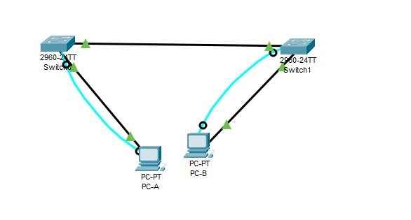
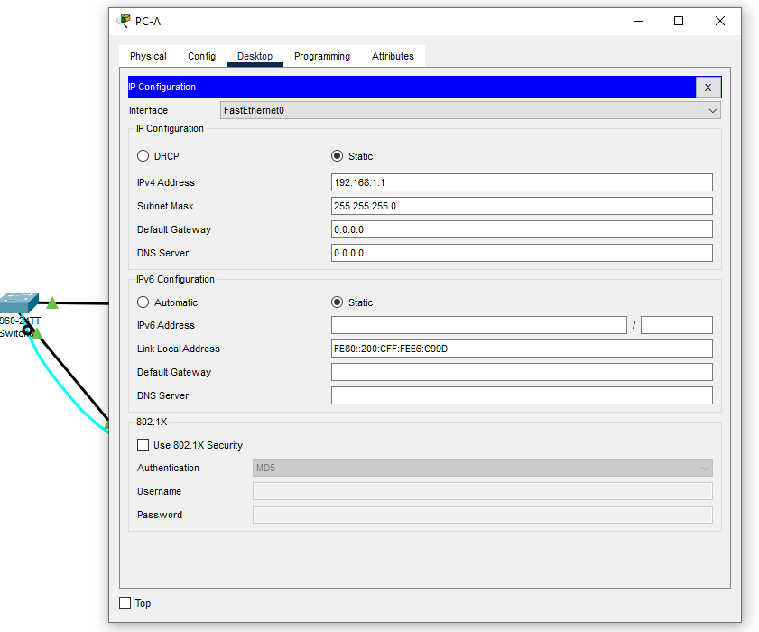

# 网作业

Работа выполнена на ПК с установленным Cisco Packet Tracer.

### Часть 1. Создание и настройка сети

#### 1.1 Топология



#### 1.2 Настроить узлы ПК

Назначены IP и MAC в соответствии с таблицей.



#### 1.3 Выполнить инициализацию и перезагрузку коммутаторов

#### 1.4 Настроить базовые параметры каждого коммутатора

 Устройство | Интерфейс | IP-адрес/префикс
:----------:|:---------:|:------------------:
 S1         | VLAN 1    | 192.168.1.11/24
 S2         | VLAN 1    | 192.168.1.12/24
 PC-A       | NIC       | 192.168.1.1/24
 PC-B       | NIC       | 192.168.1.2/24

a. Настраиваем имена устройств в соответствии с топологией.

```
Switch>en
Switch>enable 
Switch#conf t
Switch(config)#hostname S1
S1(config)#
```

```
Switch>enable
Switch#
Switch#conf t
Enter configuration commands, one per line.  End with CNTL/Z.
Switch(config)#ho
Switch(config)#hostname 
Switch(config)#hostname S2
```


b. Настройте IP-адреса, как указано в таблице адресации.

Коммутатор - S1

```
Enter configuration commands, one per line.  End with CNTL/Z.
S1(config)#no ip domain-lookup 
S1(config)#ba
S1(config)#banner m
S1(config)#banner motd # NIHAO #
S1(config)#int vlan 1
S1(config-if)#no shutdown
S1(config-if)#ip ad
S1(config-if)#ip address 192.168.1.1 255.255.255.0
S1(config-if)#
```

Коммутатор - S2

```
S2(config)#ban
S2(config)#banner m
S2(config)#banner motd # NIHAO #
S2(config)#int vl
S2(config)#int vlan 
% Incomplete command.
S2(config)#int vlan 1
S2(config-if)#no sh
S2(config-if)#no shutdown 
S2(config-if)#ip a
S2(config-if)#ip address  192.168.1.12 255.255.255.0
```

c. Назначьте cisco в качестве паролей консоли и VTY.

Коммутатор - S1

```
S1>ena
S1>enable 
Password: 
S1#conf t
Enter configuration commands, one per line.  End with CNTL/Z.
S1(config)#line 
S1(config)#line c
S1(config)#line console 0
S1(config-line)#pass
S1(config-line)#exit
S1(config)#line vty 0 15
S1(config-line)#pass
S1(config-line)#password cisco
S1(config-line)#login
S1(config-line)#
S1(config-line)#exit
S1(config)#line console 0
S1(config-line)#pas
S1(config-line)#password cisco
S1(config-line)#login
S1(config-line)#loggin synchronous 
```

Коммутатор - S2

```
S2>enable
Password: 
Password: 
S2#conf t
Enter configuration commands, one per line.  End with CNTL/Z.
S2(config)#line v
S2(config)#line vty 0 15
S2(config-line)#pass
S2(config-line)#password cisco
S2(config-line)#login
S2(config-line)#exit
S2(config)#line co
S2(config)#line console 
% Incomplete command.
S2(config)#line console 0
S2(config-line)#pas
S2(config-line)#password cisco
S2(config-line)#login
S2(config-line)#loggin synchronous 
S2(config-line)#
```

d. Назначьте class в качестве пароля доступа к привилегированному режиму EXEC.

Коммутатор - S1

```
S1(config)#ser
S1(config)#service p
S1(config)#service password-encryption 
S1(config)#en
S1(config)#ena
S1(config)#enable  se
S1(config)#enable  secret class
```

Коммутатор - S2

```
S2(config)#serv
S2(config)#service 
S2(config)#service pa
S2(config)#service password-encryption 
S2(config)#ena
S2(config)#enable  se
S2(config)#enable  secret class
```

### Часть 2. Изучение таблицы МАС-адресов коммутатора

#### 2.1 Запишите МАС-адреса сетевых устройств.

a. Открываем командную строку на PC-A и PC-B и введим команду 

```
ipconfig /all.
```

Компьютер PC-A

```
C:\>ipconfig /all 

FastEthernet0 Connection:(default port)

   Connection-specific DNS Suffix..: 
   Physical Address................: 0000.0CE6.C99D
   Link-local IPv6 Address.........: FE80::200:CFF:FEE6:C99D
   IPv6 Address....................: ::
   IPv4 Address....................: 192.168.1.1
   Subnet Mask.....................: 255.255.255.0
   Default Gateway.................: ::
                                     0.0.0.0
   DHCP Servers....................: 0.0.0.0
   DHCPv6 IAID.....................: 
   DHCPv6 Client DUID..............: 00-01-00-01-A4-B3-A7-2B-00-00-0C-E6-C9-9D
   DNS Servers.....................: ::
                                     0.0.0.0

Bluetooth Connection:

   Connection-specific DNS Suffix..: 
   Physical Address................: 0001.4350.4733
   Link-local IPv6 Address.........: ::
   IPv6 Address....................: ::
   IPv4 Address....................: 0.0.0.0
   Subnet Mask.....................: 0.0.0.0
   Default Gateway.................: ::
                                     0.0.0.0
   DHCP Servers....................: 0.0.0.0
   DHCPv6 IAID.....................: 
   DHCPv6 Client DUID..............: 00-01-00-01-A4-B3-A7-2B-00-00-0C-E6-C9-9D
   DNS Servers.....................: ::
                                     0.0.0.0
```

Компьютер PC-B

```
C:\>ipconfig /all 

FastEthernet0 Connection:(default port)

   Connection-specific DNS Suffix..: 
   Physical Address................: 0090.2B27.9C22
   Link-local IPv6 Address.........: FE80::290:2BFF:FE27:9C22
   IPv6 Address....................: ::
   IPv4 Address....................: 192.168.1.1
   Subnet Mask.....................: 255.255.255.0
   Default Gateway.................: ::
                                     0.0.0.0
   DHCP Servers....................: 0.0.0.0
   DHCPv6 IAID.....................: 
   DHCPv6 Client DUID..............: 00-01-00-01-21-40-29-89-00-90-2B-27-9C-22
   DNS Servers.....................: ::
                                     0.0.0.0

Bluetooth Connection:

   Connection-specific DNS Suffix..: 
   Physical Address................: 0090.212D.8B37
   Link-local IPv6 Address.........: ::
   IPv6 Address....................: ::
   IPv4 Address....................: 0.0.0.0
   Subnet Mask.....................: 0.0.0.0
   Default Gateway.................: ::
                                     0.0.0.0
   DHCP Servers....................: 0.0.0.0
   DHCPv6 IAID.....................: 
   DHCPv6 Client DUID..............: 00-01-00-01-21-40-29-89-00-90-2B-27-9C-22
   DNS Servers.....................: ::
                                     0.0.0.0
```

Физические адреса адаптера Ethernet:
- MAC-адрес компьютера PC-A: 0000.0CE6.C99D
- MAC-адрес компьютера PC-B: 0090.2B27.9C2


b. Подключаемся к коммутаторам S1 и S2 через консоль и введим команду 
```
show interface F0/1
```
Коммутатор - S1

```
 NIHAO 

User Access Verification

Password: 

S1>enable
Password: 
S1#sho
S1#show  int
S1#show  interfaces f0/1
FastEthernet0/1 is up, line protocol is up (connected)
  Hardware is Lance, address is 00d0.583a.8401 (bia 00d0.583a.8401)
 BW 100000 Kbit, DLY 1000 usec,
     reliability 255/255, txload 1/255, rxload 1/255
  Encapsulation ARPA, loopback not set
  Keepalive set (10 sec)
  Full-duplex, 100Mb/s
  input flow-control is off, output flow-control is off
  ARP type: ARPA, ARP Timeout 04:00:00
  Last input 00:00:08, output 00:00:05, output hang never
  Last clearing of "show interface" counters never
  Input queue: 0/75/0/0 (size/max/drops/flushes); Total output drops: 0
  Queueing strategy: fifo
  Output queue :0/40 (size/max)
  5 minute input rate 0 bits/sec, 0 packets/sec
  5 minute output rate 0 bits/sec, 0 packets/sec
     956 packets input, 193351 bytes, 0 no buffer
     Received 956 broadcasts, 0 runts, 0 giants, 0 throttles
     0 input errors, 0 CRC, 0 frame, 0 overrun, 0 ignored, 0 abort
     0 watchdog, 0 multicast, 0 pause input
     0 input packets with dribble condition detected
     2357 packets output, 263570 bytes, 0 underruns
     0 output errors, 0 collisions, 10 interface resets
     0 babbles, 0 late collision, 0 deferred
     0 lost carrier, 0 no carrier
     0 output buffer failures, 0 output buffers swapped out
```

Коммутатор - S2

```
User Access Verification

Password: 

S2>en
S2>enable 
Password: 
S2#show int f0/1
FastEthernet0/1 is up, line protocol is up (connected)
  Hardware is Lance, address is 0001.64db.4c01 (bia 0001.64db.4c01)
 BW 100000 Kbit, DLY 1000 usec,
     reliability 255/255, txload 1/255, rxload 1/255
  Encapsulation ARPA, loopback not set
  Keepalive set (10 sec)
  Full-duplex, 100Mb/s
  input flow-control is off, output flow-control is off
  ARP type: ARPA, ARP Timeout 04:00:00
  Last input 00:00:08, output 00:00:05, output hang never
  Last clearing of "show interface" counters never
  Input queue: 0/75/0/0 (size/max/drops/flushes); Total output drops: 0
  Queueing strategy: fifo
  Output queue :0/40 (size/max)
  5 minute input rate 0 bits/sec, 0 packets/sec
  5 minute output rate 0 bits/sec, 0 packets/sec
     956 packets input, 193351 bytes, 0 no buffer
     Received 956 broadcasts, 0 runts, 0 giants, 0 throttles
     0 input errors, 0 CRC, 0 frame, 0 overrun, 0 ignored, 0 abort
     0 watchdog, 0 multicast, 0 pause input
     0 input packets with dribble condition detected
     2357 packets output, 263570 bytes, 0 underruns
     0 output errors, 0 collisions, 10 interface resets
     0 babbles, 0 late collision, 0 deferred
     0 lost carrier, 0 no carrier
     0 output buffer failures, 0 output buffers swapped out
```

Адреса оборудования во второй строке выходных данных команды (или зашитый адрес — bia).
- МАС-адрес коммутатора S1 Fast Ethernet 0/1: 00d0.583a.8401
- МАС-адрес коммутатора S2 Fast Ethernet 0/1: 0001.64db.4c01

#### 2.2 Просмотрите таблицу МАС-адресов коммутатора.

Подключитесь к коммутатору S2 через консоль и просмотрите таблицу МАС-адресов до и после тестирования сетевой связи с помощью эхо-запросов.

a. Подключаемся к коммутатору S2 через консоль и входим в привилегированный режим EXEC.
Открываем окно конфигурации.

b. В привилегированном режиме EXEC вводим команду 

```
show mac address-table
``` 

```
S2# show mac address-table
          Mac Address Table
-------------------------------------------

Vlan    Mac Address       Type        Ports
----    -----------       --------    -----

   1    00d0.583a.8401    DYNAMIC     Fa0/1
```

- Записаны ли в таблице МАС-адресов какие-либо МАС-адреса?: Да
- Какие МАС-адреса записаны в таблице?: 00d0.583a.8401
- С какими портами коммутатора они сопоставлены и каким устройствам принадлежат?: коммутатору S1
- Если вы не записали МАС-адреса сетевых устройств в шаге 1, как можно определить, каким устройствам принадлежат МАС-адреса, используя только выходные данные команды show mac address-table?: 
- Работает ли это решение в любой ситуации?: Нет.


#### 2.3 Очищаем таблицу МАС-адресов коммутатора S2 и снова её отображаем.

a. В привилегированном режиме EXEC введите команду clear mac address-table dynamic и нажмите клавишу Enter.
S2# clear mac address-table dynamic

b. Снова быстро введите команду show mac address-table.

- Указаны ли в таблице МАС-адресов адреса для VLAN 1? Указаны ли другие МАС-адреса?
Через 10 секунд введите команду show mac address-table и нажмите клавишу ввода. Появились ли в таблице МАС-адресов новые адреса?


#### 2.4 С компьютера PC-B отправляем эхо-запросы устройствам в сети и просматриваем таблицу МАС-адресов коммутатора.

a. На компьютере PC-B откройте командную строку и еще раз введите команду arp -a.
Откройте командную строку.

- Не считая адресов многоадресной и широковещательной рассылки, сколько пар IP- и МАС-адресов устройств было получено через протокол ARP?

b. Из командной строки PC-B отправьте эхо-запросы на компьютер PC-A, а также коммутаторы S1 и S2.

- От всех ли устройств получены ответы? Если нет, проверьте кабели и IP-конфигурации.
Закройте командную строку.

c. Подключившись через консоль к коммутатору S2, введите команду show mac address-table.
Откройте окно конфигурации

- Добавил ли коммутатор в таблицу МАС-адресов дополнительные МАС-адреса? Если да, то какие адреса и устройства?
На компьютере PC-B откройте командную строку и еще раз введите команду arp -a.

- Появились ли в ARP-кэше компьютера PC-B дополнительные записи для всех сетевых устройств, которым были отправлены эхо-запросы?


### 4. Вопросы для повторения

В сетях Ethernet данные передаются на устройства по соответствующим МАС-адресам. Для этого коммутаторы и компьютеры динамически создают ARP-кэш и таблицы МАС-адресов. Если компьютеров в сети немного, эта процедура выглядит достаточно простой. Какие сложности могут возникнуть в крупных сетях?


