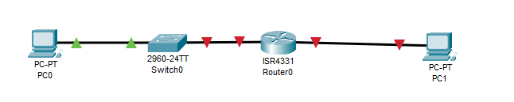
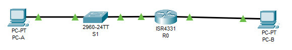
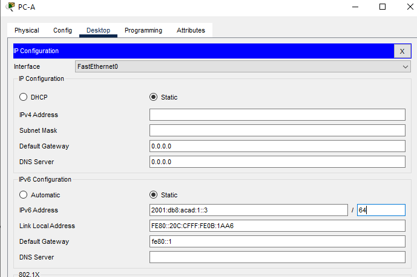
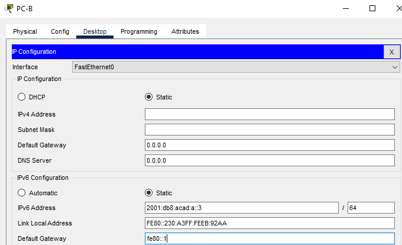

# Настройка IPv6-адресов на сетевых устройствах

Работа выполнена на ПК с установленным Cisco Packet Tracer.

#### Топология



#### Таблица адресации


 Устройство | Интерфейс |   IPv6-адрес       | Link local IPv6-адрес| Длина префикса | Шлюз по умол.
:----------:|:---------:|:------------------:| :-------------------:|:------------:|:---------:
 R1         | G0/0/1    | 2001:db8:acad:a::1 |       fe80::1       |     64        |
 R1         | G0/0/1    | 2001:db8:acad:1::1 |       fe80::1       |      64       |
 S1         | VLAN 1    | 2001:db8:acad:1::b |       fe80::b       |      64       |
 PC-A       | NIC       | 2001:db8:acad:1::3 |        SLACC        |        64     | fe80::1
 PC-B       | NIC       | 2001:db8:acad:a::3 |        SLACC        |         64    | fe80::1


### Часть 1. Настройка топологии и конфигурация основных параметров маршрутизатора и коммутатора

#### Шаг 1.1. Настройте маршрутизатор.
Назначьте имя хоста и настройте основные параметры устройства.

```
Router>en
Router#conf t
Enter configuration commands, one per line.  End with CNTL/Z.
Router(config)#hos
Router(config)#hostname 
Router(config)#hostname R1
R1(config)#NO IP DOMAI
R1(config)#NO IP DOMAIIN
R1(config)#NO IP DOMAIN-
R1(config)#NO IP DOMAIN-L
R1(config)#NO IP DOMAIN-Lookup 
R1(config)#
R1(config)#ENA
R1(config)#ENAble se
R1(config)#ENAble secret class
R1(config)#li
R1(config)#lin
R1(config)#line c
R1(config)#line console 0
R1(config)#line console 0
R1(config-line)#pas
R1(config-line)#password cisco
R1(config-line)#login
R1(config-line)#exit
R1(config)#l
R1(config)#lin
R1(config)#line vt
R1(config)#line vty 0 4
R1(config-line)#pas
R1(config-line)#password cisco
R1(config-line)#login
R1(config-line)#exit
R1(config)#
R1(config)#
R1(config)#ser
R1(config)#service en
R1(config)#service encr
R1(config)#service pass
R1(config)#service password-encryption 
R1(config)#bane
R1(config)#bane
R1(config)#ban
R1(config)#banner m
R1(config)#banner motd #what to writee#
R1(config)#R1(config)#end
R1#
%SYS-5-CONFIG_I: Configured from console by console
wr m
Building configuration...
[OK]
```

#### Шаг 1.2. Настройте коммутатор.
Назначьте имя хоста и настройте основные параметры устройства.

```
Switch>en
Switch#conf t
Enter configuration commands, one per line.  End with CNTL/Z.
Switch(config)#host
Switch(config)#hostname 
Switch(config)#hostname S1
S1(config)#no ip
S1(config)#no ip dom
S1(config)#no ip domain
S1(config)#no ip domain-
S1(config)#no ip domain-l
S1(config)#no ip domain-lookup 
S1(config)#
S1(config)#en
S1(config)#enable s
S1(config)#enable secret class
S1(config)#
S1(config)#line
S1(config)#line cons
S1(config)#line console 0
S1(config-line)#password cisco
S1(config-line)#login
S1(config)#line vty 0 4
S1(config-line)#password cisco
S1(config-line)#login
S1(config-line)#exit
S1(config)#service password-encryption
S1(config)#ba
S1(config)#banner m
S1(config)#banner motd #what to write#
S1(config)#end
S1#
%SYS-5-CONFIG_I: Configured from console by console
S1#wr m
Building configuration...
[OK]
S1#
```

### Часть 2. Ручная настройка IPv6-адресов

#### Шаг 2.1. Назначьте IPv6-адреса интерфейсам Ethernet на R1.

a.	Назначьте глобальные индивидуальные IPv6-адреса, указанные в таблице адресации обоим интерфейсам Ethernet на R1.


```
R1(config)#int
R1(config)#interface g0/0/0
R1(config-if)#de1
R1(config-if)#des
R1(config-if)#description to_PC-B
R1(config-if)#IPv
R1(config-if)#IPv6 ad
R1(config-if)#IPv6 address 2001:db8:acad:a::1/64
R1(config-if)#no sh
R1(config-if)#no shutdown 

R1(config-if)#
%LINK-5-CHANGED: Interface GigabitEthernet0/0/0, changed state to up

%LINEPROTO-5-UPDOWN: Line protocol on Interface GigabitEthernet0/0/0, changed state to up
exit
R1(config)#interface g0/0/1
R1(config-if)#description to_S1
R1(config-if)#IPv6 address 2001:db8:acad:1::1/64
R1(config-if)#no shutdown 

R1(config-if)#
%LINK-5-CHANGED: Interface GigabitEthernet0/0/1, changed state to up

%LINEPROTO-5-UPDOWN: Line protocol on Interface GigabitEthernet0/0/1, changed state to up
exit
R1(config)#sh
R1(config)#sho
R1(config)#exit
R1#
```

b.	Введите команду show ipv6 interface brief, чтобы проверить, назначен ли каждому интерфейсу корректный индивидуальный IPv6-адрес.
Отображаемый локальный адрес канала основан на адресации EUI-64, которая автоматически использует MAC-адрес интерфейса для создания 128-битного локального IPv6-адреса канала.


```
R1#show ipv6 interface br
R1#show ipv6 interface brief 
GigabitEthernet0/0/0       [up/up]
    FE80::240:BFF:FEC8:2401
    2001:DB8:ACAD:A::1
GigabitEthernet0/0/1       [up/up]
    FE80::240:BFF:FEC8:2402
    2001:DB8:ACAD:1::1
GigabitEthernet0/0/2       [administratively down/down]
    unassigned
Vlan1                      [administratively down/down]
    unassigned
```


c.	Чтобы обеспечить соответствие локальных адресов канала индивидуальному адресу, вручную введите локальные адреса канала на каждом интерфейсе Ethernet на R1.
Примечание. Каждый интерфейс маршрутизатора относится к отдельной сети. Пакеты с локальным адресом канала никогда не выходят за пределы локальной сети, а значит, для обоих интерфейсов можно указывать один и тот же локальный адрес канала.

```
R1#conf t
Enter configuration commands, one per line.  End with CNTL/Z.
R1(config)#interface g0/0/0
R1(config-if)#ipv
R1(config-if)#ipv6 ad
R1(config-if)#ipv6 address fe80::1 link-local
R1(config-if)#exit
R1(config)#interface g0/0/1
R1(config-if)#ipv6 address fe80::1 link-local
R1(config-if)#exit
R1(config)#
```

d.	Используйте выбранную команду, чтобы убедиться, что локальный адрес связи изменен на fe80::1.  


```
show ipv6 interface brief 
GigabitEthernet0/0/0       [up/up]
    FE80::1
    2001:DB8:ACAD:A::1
GigabitEthernet0/0/1       [up/up]
    FE80::1
    2001:DB8:ACAD:1::1
GigabitEthernet0/0/2       [administratively down/down]
    unassigned
Vlan1                      [administratively down/down]
    unassigned
```



- Какие группы многоадресной рассылки назначены интерфейсу G0/0?
Ответ:Первая, вторая и третья.

#### Шаг 2.2. Активируйте IPv6-маршрутизацию на R1.

a.	В командной строке на PC-B введите команду ipconfig, чтобы получить данные IPv6-адреса, назначенного интерфейсу ПК.

```
C:\>ipconfig

FastEthernet0 Connection:(default port)

   Connection-specific DNS Suffix..: 
   Link-local IPv6 Address.........: FE80::230:A3FF:FEEB:92AA
   IPv6 Address....................: ::
   IPv4 Address....................: 0.0.0.0
   Subnet Mask.....................: 0.0.0.0
   Default Gateway.................: ::
                                     0.0.0.0

Bluetooth Connection:

   Connection-specific DNS Suffix..: 
   Link-local IPv6 Address.........: ::
   IPv6 Address....................: ::
   IPv4 Address....................: 0.0.0.0
   Subnet Mask.....................: 0.0.0.0
   Default Gateway.................: ::
                                     0.0.0.0
```

- Назначен ли индивидуальный IPv6-адрес сетевой интерфейсной карте (NIC) на PC-B?
нЕТ, только линк-локал.

b.	Активируйте IPv6-маршрутизацию на R1 с помощью команды IPv6 unicast-routing.
, чтобы убедиться, что новая многоадресная группа назначена интерфейсу G0/0/0. Обратите внимание, что в списке групп для интерфейса G0/0 отображается группа многоадресной рассылки всех маршрутизаторов (FF02::2).
Это позволит компьютерам получать IP-адреса и данные шлюза по умолчанию с помощью функции SLAAC (Stateless Address Autoconfiguration (Автоконфигурация без сохранения состояния адреса)).


```
R1(config)#ipv6 un
R1(config)#ipv6 unicast-routing 
R1(config)#
```

c.	Теперь, когда R1 входит в группу многоадресной рассылки всех маршрутизаторов, еще раз введите команду ipconfig на PC-B. Проверьте данные IPv6-адреса.


```
C:\>ipconfig

FastEthernet0 Connection:(default port)

   Connection-specific DNS Suffix..: 
   Link-local IPv6 Address.........: FE80::230:A3FF:FEEB:92AA
   IPv6 Address....................: 2001:DB8:ACAD:A:230:A3FF:FEEB:92AA
   IPv4 Address....................: 0.0.0.0
   Subnet Mask.....................: 0.0.0.0
   Default Gateway.................: FE80::1
                                     0.0.0.0

Bluetooth Connection:

   Connection-specific DNS Suffix..: 
   Link-local IPv6 Address.........: ::
   IPv6 Address....................: ::
   IPv4 Address....................: 0.0.0.0
   Subnet Mask.....................: 0.0.0.0
   Default Gateway.................: ::
                                     0.0.0.0
```

- Почему PC-B получил глобальный префикс маршрутизации и идентификатор подсети, которые вы настроили на R1?
из-за того, что включили юникастовую рассылку на маршрутизаторе и пк подтянул те настройку, которые были на самом роуторе.

#### Шаг 2.3. Назначьте IPv6-адреса интерфейсу управления (SVI) на S1.

a.	Назначьте адрес IPv6 для S1. Также назначьте этому интерфейсу локальный адрес канала fe80::b.


```
S1(config)#int
S1(config)#interface vl
S1(config)#interface vlan 1
S1(config-if)#des
S1(config-if)#description management_SVI
S1(config-if)#ipv
S1(config-if)#ipv
S1(config-if)#ipv6ad
S1(config-if)#ipv
S1(config-if)#ip
S1(config-if)#ip v
S1(config-if)#ipv
S1(config-if)#ipv6
S1(config-if)#ipv6 ad
S1(config-if)#exit
S1(config)#exit
```

Коммутатор не поддерживает ipv6, смотрим, что можно сделать

```
S1#show sd
S1#show sdm pr
S1#show sdm prefer 
 The current template is "default" template.
 The selected template optimizes the resources in
 the switch to support this level of features for
 0 routed interfaces and 1024 VLANs.

  number of unicast mac addresses:                  8K
  number of IPv4 IGMP groups + multicast routes:    0.25K
  number of IPv4 unicast routes:                    0
  number of IPv6 multicast groups:                  0
  number of directly-connected IPv6 addresses:      0
  number of indirect IPv6 unicast routes:           0
  number of IPv4 policy based routing aces:         0
  number of IPv4/MAC qos aces:                      0.125k
  number of IPv4/MAC security aces:                 0.375k
  number of IPv6 policy based routing aces:         0
  number of IPv6 qos aces:                          20
  number of IPv6 security aces:                     25

S1#conf t
Enter configuration commands, one per line.  End with CNTL/Z.
S1(config)#sd
S1(config)#sdm pr
S1(config)#sdm prefer du
S1(config)#sdm prefer dual-ipv4-and-ipv6 
% Incomplete command.
S1(config)#sdm prefer dual-ipv4-and-ipv6 
% Incomplete command.
S1(config)#sdm prefer dual-ipv4-and-ipv6 ?
  default  Default bias
S1(config)#sdm prefer dual-ipv4-and-ipv6 d
S1(config)#sdm prefer dual-ipv4-and-ipv6 default 
Changes to the running SDM preferences have been stored, but cannot take effect until the next reload.
```
Перезагружаю коммутатор

```
S1(config)#int
S1(config)#interface vla
S1(config)#interface vlan 1
S1(config-if)#des
S1(config-if)#description management_SVI
S1(config-if)#ip
S1(config-if)#ipv
S1(config-if)#ipv6 ad
S1(config-if)#ipv6 address 2001:db8:acad:1::b/64
S1(config-if)#ipv6 addres fe80::b link-local
S1(config-if)#no sh
S1(config-if)#no shutdown 

S1(config-if)#
%LINK-5-CHANGED: Interface Vlan1, changed state to up

%LINEPROTO-5-UPDOWN: Line protocol on Interface Vlan1, changed state to up
exit
```

Получилось

b.	Проверьте правильность назначения IPv6-адресов интерфейсу управления с помощью команды show ipv6 interface vlan1.

```
S1#show ipv6 interface vl
S1#show ipv6 interface vlan 1
Vlan1 is up, line protocol is up
  IPv6 is enabled, link-local address is FE80::B
  No Virtual link-local address(es):
  Global unicast address(es):
    2001:DB8:ACAD:1::B, subnet is 2001:DB8:ACAD:1::/64
  Joined group address(es):
    FF02::1
    FF02::1:FF00:B
  MTU is 1500 bytes
  ICMP error messages limited to one every 100 milliseconds
  ICMP redirects are enabled
  ICMP unreachables are sent
  Output features: Check hwidb
  ND DAD is enabled, number of DAD attempts: 1
  ND reachable time is 30000 milliseconds
```

#### Шаг 2.4. Назначьте компьютерам статические IPv6-адреса.

a.	Откройте окно Свойства Ethernet для каждого ПК и назначьте адресацию IPv6.
Убедитесь, что оба компьютера имеют правильную информацию адреса IPv6
Примечание. При выполнении работы в среде Cisco Packet Tracer установите статический и SLACC адреса на компьютеры последовательно, отразив результаты в отчете





### Часть 3. Проверка сквозного подключения

С PC-A отправьте эхо-запрос на FE80::1. Это локальный адрес канала, назначенный G0/1 на R1.
Отправьте эхо-запрос на интерфейс управления S1 с PC-A.
Введите команду tracert на PC-A, чтобы проверить наличие сквозного подключения к PC-B.
С PC-B отправьте эхо-запрос на PC-A.
С PC-B отправьте эхо-запрос на локальный адрес канала G0/0 на R1.

Примечание.  В случае отсутствия сквозного подключения проверьте, правильно ли указаны IPv6-адреса на всех устройствах.

С ПК-А 

```
C:\>ping fe80::1

Pinging fe80::1 with 32 bytes of data:

Reply from FE80::1: bytes=32 time<1ms TTL=255
Reply from FE80::1: bytes=32 time=2ms TTL=255
Reply from FE80::1: bytes=32 time=3ms TTL=255
Reply from FE80::1: bytes=32 time<1ms TTL=255

Ping statistics for FE80::1:
    Packets: Sent = 4, Received = 4, Lost = 0 (0% loss),
Approximate round trip times in milli-seconds:
    Minimum = 0ms, Maximum = 3ms, Average = 1ms

C:\>ping 2001:db8:acad:1::b

Pinging 2001:db8:acad:1::b with 32 bytes of data:

Reply from 2001:DB8:ACAD:1::B: bytes=32 time<1ms TTL=255
Reply from 2001:DB8:ACAD:1::B: bytes=32 time<1ms TTL=255
Reply from 2001:DB8:ACAD:1::B: bytes=32 time<1ms TTL=255
Reply from 2001:DB8:ACAD:1::B: bytes=32 time<1ms TTL=255

Ping statistics for 2001:DB8:ACAD:1::B:
    Packets: Sent = 4, Received = 4, Lost = 0 (0% loss),
Approximate round trip times in milli-seconds:
    Minimum = 0ms, Maximum = 0ms, Average = 0ms

C:\>ping 2001:db8:acad:a::3

Pinging 2001:db8:acad:a::3 with 32 bytes of data:

Reply from 2001:DB8:ACAD:A::3: bytes=32 time=4ms TTL=127
Reply from 2001:DB8:ACAD:A::3: bytes=32 time<1ms TTL=127
Reply from 2001:DB8:ACAD:A::3: bytes=32 time<1ms TTL=127
Reply from 2001:DB8:ACAD:A::3: bytes=32 time<1ms TTL=127

Ping statistics for 2001:DB8:ACAD:A::3:
    Packets: Sent = 4, Received = 4, Lost = 0 (0% loss),
Approximate round trip times in milli-seconds:
    Minimum = 0ms, Maximum = 4ms, Average = 1ms

C:\>tracert 2001:db8:acad:a::3

Tracing route to 2001:db8:acad:a::3 over a maximum of 30 hops: 

  1   3 ms      1 ms      0 ms      2001:DB8:ACAD:1::1
  2   1 ms      0 ms      0 ms      2001:DB8:ACAD:A::3

Trace complete.
```

С ПК-Б

```
C:\>ping 2001:db8:acad:1::3

Pinging 2001:db8:acad:1::3 with 32 bytes of data:

Reply from 2001:DB8:ACAD:1::3: bytes=32 time<1ms TTL=127
Reply from 2001:DB8:ACAD:1::3: bytes=32 time<1ms TTL=127
Reply from 2001:DB8:ACAD:1::3: bytes=32 time<1ms TTL=127
Reply from 2001:DB8:ACAD:1::3: bytes=32 time<1ms TTL=127

Ping statistics for 2001:DB8:ACAD:1::3:
    Packets: Sent = 4, Received = 4, Lost = 0 (0% loss),
Approximate round trip times in milli-seconds:
    Minimum = 0ms, Maximum = 0ms, Average = 0ms

C:\>ping fe80::1

Pinging fe80::1 with 32 bytes of data:

Reply from FE80::1: bytes=32 time<1ms TTL=255
Reply from FE80::1: bytes=32 time<1ms TTL=255
Reply from FE80::1: bytes=32 time<1ms TTL=255
Reply from FE80::1: bytes=32 time<1ms TTL=255

Ping statistics for FE80::1:
    Packets: Sent = 4, Received = 4, Lost = 0 (0% loss),
Approximate round trip times in milli-seconds:
    Minimum = 0ms, Maximum = 0ms, Average = 0ms
```

### Вопросы для повторения

1.	Почему обоим интерфейсам Ethernet на R1 можно назначить один и тот же локальный адрес канала — FE80::1? В таком случае сеть становиться локальной и не пересылает трафик за пределы данного линлокала и у каждого устройства свой сегмент на котором он указан.

2.	Какой идентификатор подсети в индивидуальном IPv6-адресе 2001:db8:acad::aaaa:1234/64?
Идентификатор аааа

