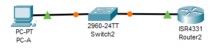
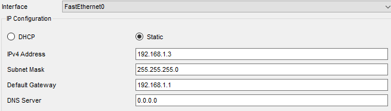
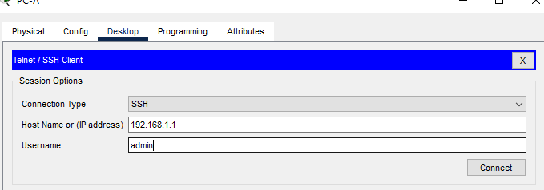
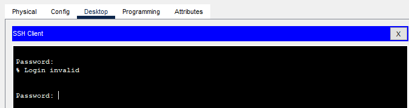
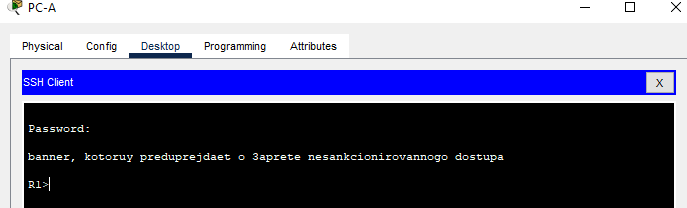
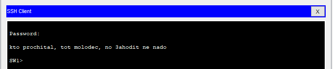

# Доступ к сетевым устройствам по протоколу SSH

Работа выполнена на ПК с установленным Cisco Packet Tracer.

#### Топология



#### Таблица адресации

 Устройство | Интерфейс | IP-адрес/префикс | Шюз по умол.
:----------:|:---------:|:----------------:| :---------:
 R1         | G0/0/1    | 192.168.1.1/24 | -
 S1         | VLAN 1    | 192.168.1.11/24 | 192.168.1.1
 PC-A       | NIC       | 192.168.1.3/24  | 192.168.1.1

### Часть 1. Настройка основных параметров устройства

#### Шаг 1.1. Создаём сеть согласно топологии.

#### Шаг 1.2. Выполняем инициализацию и перезагрузку маршрутизатора и коммутатора.

#### Шаг 1.3. Настраиваем маршрутизатор.

a.	Подключитесь к маршрутизатору с помощью консоли и активируйте привилегированный режим EXEC.

b.	Войдите в режим конфигурации.

```
Router>en
Router#conf t
```

c.	Отключите поиск DNS, чтобы предотвратить попытки маршрутизатора неверно преобразовывать введенные команды таким образом, как будто они являются именами узлов.

```
R1(config)#no ip domain-lookup
```

d.	Назначьте class в качестве зашифрованного пароля привилегированного режима EXEC.

```
R1(config)#enable secret class
```

e.	Назначьте cisco в качестве пароля консоли и включите вход в систему по паролю.

```
R1(config)#line console 0
R1(config-line)#password cisco
R1(config-line)#logging synchronous 
```

f.	Назначьте cisco в качестве пароля VTY и включите вход в систему по паролю.

```
R1(config)#line vty 0 15
R1(config-line)#password cisco
R1(config-line)#login 
```

g.	Зашифруйте открытые пароли.

```
R1(config)#service password-encryption
```

h.	Создайте баннер, который предупреждает о запрете несанкционированного доступа.

```
R1(config)#banner motd #banner, kotoruy preduprejdaet o 3aprete nesankcionirovannogo dostupa#
```

i.	Настройте и активируйте на маршрутизаторе интерфейс G0/0/1, используя информацию, приведенную в таблице адресации.

```
R1(config)#int gigabitEthernet 0/0/1
R1(config-if)#ip address 192.168.1.1 255.255.255.0
R1(config-if)#no shutdown 
```

j.	Сохраните текущую конфигурацию в файл загрузочной конфигурации.

```
R1(config-if)#exit
R1(config)#exit
R1#write memory 
```
 Делаю проверку:

 ```
 R1#show running-config

Building configuration...

Current configuration : 923 bytes
!
version 16.6.4
no service timestamps log datetime msec
no service timestamps debug datetime msec
service password-encryption
!
hostname R1
!
!
!
enable secret 5 $1$mERr$9cTjUIEqNGurQiFU.ZeCi1
!
!
ip cef
no ipv6 cef
!
!
no ip domain-lookup
!
!
spanning-tree mode pvst
!
!
!
interface GigabitEthernet0/0/0
 no ip address
 duplex auto
 speed auto
 shutdown
!
interface GigabitEthernet0/0/1
 ip address 192.168.1.1 255.255.255.0
 duplex auto
 speed auto
!
interface GigabitEthernet0/0/2
 no ip address
 duplex auto
 speed auto
 shutdown
!
interface Vlan1
 no ip address
 shutdown
!
ip classless
!
ip flow-export version 9
!
!
!
banner motd ^Cbanner, kotoruy preduprejdaet o 3aprete nesankcionirovannogo dostupa^C
!
!
!
line con 0
 password 7 0822455D0A16
 logging synchronous
!
line aux 0
!
line vty 0 4
 password 7 0822455D0A16
 login
line vty 5 15
 password 7 0822455D0A16
 login
!
!
!
end
```
Не включен запрос пароля при входе в консоль

```
R1(config)#line console 0
R1(config-line)#password cisco
R1(config-line)#login 
```

#### Шаг 1.4 Настраиваем компьютер PC-A.

a.	Настройте для PC-A IP-адрес и маску подсети.
b.	Настройте для PC-A шлюз по умолчанию.



#### Шаг 1.5. Проверяем подключение к сети.

Посылаем с PC-A команду Ping на маршрутизатор R1. 

```
C:\>ping 192.168.1.1

Pinging 192.168.1.1 with 32 bytes of data:

Reply from 192.168.1.1: bytes=32 time<1ms TTL=255
Reply from 192.168.1.1: bytes=32 time<1ms TTL=255
Reply from 192.168.1.1: bytes=32 time<1ms TTL=255
Reply from 192.168.1.1: bytes=32 time<1ms TTL=255

Ping statistics for 192.168.1.1:
    Packets: Sent = 4, Received = 4, Lost = 0 (0% loss),
Approximate round trip times in milli-seconds:
    Minimum = 0ms, Maximum = 0ms, Average = 0ms
```

### Часть 2. Настройка маршрутизатора для доступа по протоколу SSH

Подключение к сетевым устройствам по протоколу Telnet сопряжено с риском для безопасности, поскольку вся информация передается в виде открытого текста. Протокол SSH шифрует данные сеанса и обеспечивает аутентификацию устройств, поэтому для удаленных подключений рекомендуется использовать именно этот протокол. В части 2 вам нужно настроить маршрутизатор для приема соединений SSH по линиям VTY.

#### Шаг 2.1. Настраиваем аутентификацию устройств.

При генерации ключа шифрования в качестве его части используются имя устройства и домен. Поэтому эти имена необходимо указать перед вводом команды crypto key.

a.	Задайте имя устройства.

```
Router>en
Router#conf t
Enter configuration commands, one per line.  End with CNTL/Z.
R1(config)#hostname R1
```

b.	Задайте домен для устройства.

```
R1(config)#ip domain-name cisco.ru
```

#### Шаг 2.2. Создаем ключ шифрования с указанием его длины.

```
R1(config)#crypto key generate rsa 
The name for the keys will be: SW1.cisco.ru
Choose the size of the key modulus in the range of 360 to 2048 for your
  General Purpose Keys. Choosing a key modulus greater than 512 may take
  a few minutes.

How many bits in the modulus [512]: 2048
% Generating 2048 bit RSA keys, keys will be non-exportable...[OK]
```

#### Шаг 2.3. Создаем имя пользователя в локальной базе учетных записей.

Настройте имя пользователя, используя admin в качестве имени пользователя и Adm1nP @55 в качестве пароля.

```
R1(config)#username admin secret Adm1nP @55 

*Mar 1 3:50:27.53: %SSH-5-ENABLED: SSH 1.99 has been enabled
```

#### Шаг 4. Активируем протокол SSH на линиях VTY.

a.	Активируйте протоколы Telnet и SSH на входящих линиях VTY с помощью команды transport input.

```
R1(config)#service password-encryption 
R1(config)#line vty 0 15
R1(config-line)#transport input ssh
R1(config-line)#transport input telnet

```

b.	Измените способ входа в систему таким образом, чтобы использовалась проверка пользователей по локальной базе учетных записей.

```
R1(config-line)#login local 
```

#### Шаг 5. Сохраняем текущую конфигурацию в файл загрузочной конфигурации.

```
R1#write memory 
```

#### Шаг 6. Устанавливаем соединение с маршрутизатором по протоколу SSH.

a.	Запустите Tera Term с PC-A.



b.	Установите SSH-подключение к R1. Use the username admin and password Adm1nP@55. У вас должно получиться установить SSH-подключение к R1.



Не принимает пароль, ищу проблему. Проверила и повторила настройки, не помогает.

```
R1#show running-config 
Building configuration...

Current configuration : 1082 bytes
!
version 16.6.4
no service timestamps log datetime msec
no service timestamps debug datetime msec
service password-encryption
!
hostname R1
!
!
enable secret 5 $1$mERr$9cTjUIEqNGurQiFU.ZeCi1
!
!
!
ip cef
no ipv6 cef
!
!
!
username admin secret 5 $1$mERr$d3prnlS1yj1z4R7kKSFHN/
!
!
!
ip ssh version 2
no ip domain-lookup
ip domain-name cisco.ru
!
!
spanning-tree mode pvst
!
!
interface GigabitEthernet0/0/0
 no ip address
 duplex auto
 speed auto
 shutdown
!
interface GigabitEthernet0/0/1
 ip address 192.168.1.1 255.255.255.0
 duplex auto
 speed auto
!
interface GigabitEthernet0/0/2
 no ip address
 duplex auto
 speed auto
 shutdown
!
interface Vlan1
 no ip address
 shutdown
!
ip classless
!
ip flow-export version 9
!
!
banner motd ^Cbanner, kotoruy preduprejdaet o 3aprete nesankcionirovannogo dostupa^C
!
!
line con 0
 password 7 0822455D0A16
 logging synchronous
 login
!
line aux 0
!
line vty 0 4
 password 7 0822455D0A16
 login local
 transport input ssh
line vty 5 15
 password 7 0822455D0A16
 login local
 transport input ssh
!
!
!
end
```

Попробовала сменить пароль на "admin55" из-за подозрения на ошибку из-за специальных символов. Не помогло. 
Делаю схему заново, заработало. предположительно конфликт предложенных и прописаных настроек, так как в этот раз был отказ от быстрых настроек.



### Часть 3. Настройка коммутатора для доступа по протоколу SSH

#### Шаг 3.1. Настройте основные параметры коммутатора.

a.	Подключитесь к коммутатору с помощью консольного подключения и активируйте привилегированный режим EXEC.
b.	Войдите в режим конфигурации.
c.	Отключите поиск DNS, чтобы предотвратить попытки маршрутизатора неверно преобразовывать введенные команды таким образом, как будто они являются именами узлов.

```
Switch>
Switch>enable 
Switch#conf t
Enter configuration commands, one per line.  End with CNTL/Z.
Switch(config)#hostname SW1
SW1(config)#no ip domain-lookup 
```

d.	Назначьте class в качестве зашифрованного пароля привилегированного режима EXEC.

```
SW1(config)#enable secret class
```

e.	Назначьте cisco в качестве пароля консоли и включите вход в систему по паролю.

```
SW1(config)#line console 0
SW1(config-line)#password cisco
SW1(config-line)#login
```

f.	Назначьте cisco в качестве пароля VTY и включите вход в систему по паролю.

```
SW1(config)#line vty 0 15
SW1(config-line)#password cisco
SW1(config-line)#login
```

g.	Зашифруйте открытые пароли.

```
SW1(config)#service password-encryption
```

h.	Создайте баннер, который предупреждает о запрете несанкционированного доступа.

```
SW1(config)#banner motd #kto prochital, tot molodec, no 3ahodit ne nado#
```

i.	Настройте и активируйте на коммутаторе интерфейс VLAN 1, используя информацию, приведенную в таблице адресации.

```
SW1(config)#interface vlan 1
SW1(config-if)#ip address 192.168.1.11 255.255.255.0
SW1(config-if)#no shutdown 

SW1(config-if)#
%LINK-5-CHANGED: Interface Vlan1, changed state to up

%LINEPROTO-5-UPDOWN: Line protocol on Interface Vlan1, changed state to up
exit
SW1(config)#ip de
SW1(config)#ip default-gateway 192.168.1.1
```

j.	Сохраните текущую конфигурацию в файл загрузочной конфигурации.

```
SW1(config)#exit
SW1#
%SYS-5-CONFIG_I: Configured from console by console

SW1#wr
Building configuration...
[OK]
```
Проверка

```
SW1#show running-config 
Building configuration...

Current configuration : 1333 bytes
!
version 15.0
no service timestamps log datetime msec
no service timestamps debug datetime msec
service password-encryption
!
hostname SW1
!
enable secret 5 $1$mERr$9cTjUIEqNGurQiFU.ZeCi1
!
!
!
no ip domain-lookup
!
!
!
spanning-tree mode pvst
spanning-tree extend system-id
!
interface FastEthernet0/1
!
interface FastEthernet0/2
!
interface FastEthernet0/3
!
interface FastEthernet0/4
!
interface FastEthernet0/5
!
interface FastEthernet0/6
!
interface FastEthernet0/7
!
interface FastEthernet0/8
!
interface FastEthernet0/9
!
interface FastEthernet0/10
!
interface FastEthernet0/11
!
interface FastEthernet0/12
!
interface FastEthernet0/13
!
interface FastEthernet0/14
!
interface FastEthernet0/15
!
interface FastEthernet0/16
!
interface FastEthernet0/17
!
interface FastEthernet0/18
!
interface FastEthernet0/19
!
interface FastEthernet0/20
!
interface FastEthernet0/21
!
interface FastEthernet0/22
!
interface FastEthernet0/23
!
interface FastEthernet0/24
!
interface GigabitEthernet0/1
!
interface GigabitEthernet0/2
!
interface Vlan1
 ip address 192.168.1.11 255.255.255.0
!
ip default-gateway 192.168.1.1
!
banner motd ^Ckto prochital, tot molodec, no 3ahodit ne nado^C
!
!
!
line con 0
 password 7 0822455D0A16
 login
!
line vty 0 4
 password 7 0822455D0A16
 login
line vty 5 15
 password 7 0822455D0A16
 login
!
!
end
```

#### Шаг 3.2. Настройте коммутатор для соединения по протоколу SSH.

Для настройки протокола SSH на коммутаторе используйте те же команды, которые применялись для аналогичной настройки маршрутизатора в части 2.

a.	Настройте имя устройства, как указано в таблице адресации.

```
Switch(config)#hostname SW1
```

b.	Задайте домен для устройства.

```
SW1(config)#ip domain-name otus.suto
```

c.	Создайте ключ шифрования с указанием его длины.


```
SW1(config)#crypto key generate rsa general-keys 
The name for the keys will be: SW1.otus.suto
Choose the size of the key modulus in the range of 360 to 2048 for your
  General Purpose Keys. Choosing a key modulus greater than 512 may take
  a few minutes.

How many bits in the modulus [512]: 2048
% Generating 2048 bit RSA keys, keys will be non-exportable...[OK]
```

d.	Создайте имя пользователя в локальной базе учетных записей.

```
SW1(config)#username admin secret Admin55
```

e.	Активируйте протоколы Telnet и SSH на линиях VTY.

```
SW1(config)#line vty 0 15
SW1(config-line)#transport input telnet 
SW1(config-line)#transport input ssh 
```

f.	Измените способ входа в систему таким образом, чтобы использовалась проверка пользователей по локальной базе учетных записей.

```
SW1(config-line)#login local 
```

#### Шаг 3.3 Установите соединение с коммутатором по протоколу SSH.

Запустите программу Tera Term на PC-A, затем установите подключение по протоколу SSH к интерфейсу SVI коммутатора S1.



Вопрос:
- Удалось ли вам установить SSH-соединение с коммутатором?: Да, удалось

### Часть 4. SSH через интерфейс командной строки (CLI) коммутатора

#### Шаг 4.1. Посмотрите доступные параметры для клиента SSH в Cisco IOS.

Используйте вопросительный знак (?), чтобы отобразить варианты параметров для команды ssh.

```
SW1#ssh ?
  -l  Log in using this user name
  -v  Specify SSH Protocol Version
```

#### Шаг 4.2. Установите с коммутатора S1 соединение с маршрутизатором R1 по протоколу SSH.

a.	Чтобы подключиться к маршрутизатору R1 по протоколу SSH, введите команду –l admin. Это позволит вам войти в систему под именем admin. При появлении приглашения введите в качестве пароля Adm1nP@55

```
SW1#ssh -l admin 192.168.1.1

Password: 

banner, kotoruy preduprejdaet o 3aprete nesankcionirovannogo dostupa

R1>
```

b.	Чтобы вернуться к коммутатору S1, не закрывая сеанс SSH с маршрутизатором R1, нажмите комбинацию клавиш Ctrl+Shift+6. Отпустите клавиши Ctrl+Shift+6 и нажмите x. Отображается приглашение привилегированного режима EXEC коммутатора.

```
R1>
SW1#
```

c.	Чтобы вернуться к сеансу SSH на R1, нажмите клавишу Enter в пустой строке интерфейса командной строки. Чтобы увидеть окно командной строки маршрутизатора, нажмите клавишу Enter еще раз.

```
R1>
SW1#
SW1#
[Resuming connection 1 to 192.168.1.1 ... ]

R1>
R1>
```

d.	Чтобы завершить сеанс SSH на маршрутизаторе R1, введите в командной строке маршрутизатора команду exit.
R1# exit

[Connection to 192.168.1.1 closed by foreign host]
S1#

```
R1>exit

[Connection to 192.168.1.1 closed by foreign host]
SW1#
SW1#
```

- Какие версии протокола SSH поддерживаются при использовании интерфейса командной строки? : В циско используются всего два протокола - первый и второй.

#### Вопрос для повторения

- Как предоставить доступ к сетевому устройству нескольким пользователям, у каждого из которых есть собственное имя пользователя? : 
Необхлдимо создать локальных пользователей на устройстве и настроить линии VTY для них.

