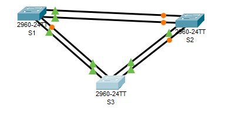
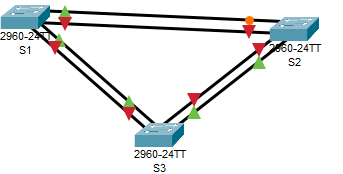
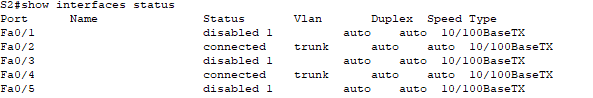
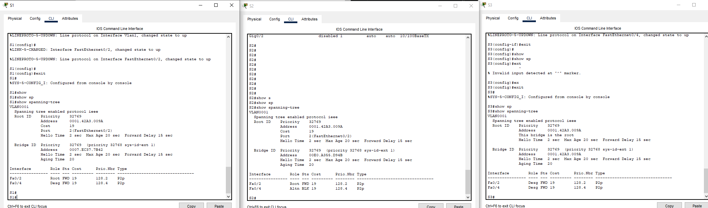
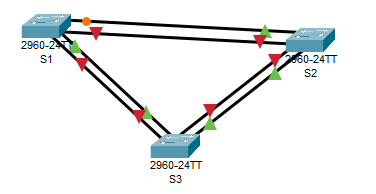
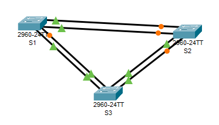

# Развертывание коммутируемой сети с резервными каналами

Работа выполнена на ПК с установленным Cisco Packet Tracer.

#### Топология



#### Таблица адресации

 Устройство | Интерфейс | IP-адрес/префикс | Маска подсети.
:----------:|:---------:|:----------------:| :---------:
 S1         | VLAN 1  | 192.168.1.1      | 255.255.255.0
 S2         | VLAN 1  | 192.168.1.2      | 255.255.255.0
 S3       | VLAN 1   | 192.168.1.3      | 255.255.255.0

### Часть 1. Создание сети и настройка основных параметров устройства

#### Шаг 1.1. Настройте базовые параметры каждого коммутатора.

a.	Отключите поиск DNS.

```
Switch(config)#no  ip domain-lookup 

```

b.	Присвойте имена устройствам в соответствии с топологией.

```
Switch(config)#hostname S1
S1(config)#
```

```
Switch(config)#hostname S2
S2(config)#
```

```
Switch(config)#hostname S3
S3(config)#
```

c.	Назначьте class в качестве зашифрованного пароля доступа к привилегированному режиму.

```
S1(config)#enable secret class

```


```
S2(config)#enab
S2(config)#enable se
S2(config)#enable secret class
```


```
S3config)#enable secret class
```

d.	Назначьте cisco в качестве паролей консоли и VTY и активируйте вход для консоли и VTY каналов.

```
S1(config)#line console 0
S1(config-line)#pas
S1(config-line)#password cisco
S1(config-line)#login
S1(config-line)#exit
S1(config)#line vty 0 4
S1(config-line)#pas
S1(config-line)#password cisco
S1(config-line)#login
S1(config-line)#exit
```


```
S2(config)#line c
S2(config)#line console 0
S2(config-line)#pas
S2(config-line)#password cisco
S2(config-line)#login
S2(config-line)#exit
S2(config)#line v
S2(config)#line vty 0 
S2(config)#line vty 0 4
S2(config-line)#pa
S2(config-line)#pas
S2(config-line)#password cisco
S2(config-line)#login
S2(config-line)#exit
```


```
S3(config)#line console 0
S3(config-line)#pass
S3(config-line)#password cisco
S3(config-line)#login
S3(config-line)#login 
S3(config-line)#pas
S3(config-line)#log
S3(config-line)#logi
S3(config-line)#logg
S3(config-line)#logging syn
S3(config-line)#logging synchronous 
S3(config-line)#exit
S3(config)#line
S3(config)#line v
S3(config)#line vty 0 4
S3(config-line)#pas
S3(config-line)#password cisco
S3(config-line)#login
```

e.	Настройте logging synchronous для консольного канала.

```
S1(config)#line console 0
S1(config-line)#logg
S1(config-line)#logging synch
S1(config-line)#logging synchronous
```


```
S2(config)#line console 0
S2(config-line)#logg
S2(config-line)#logging sy
S2(config-line)#logging synchronous 
S2(config-line)#
```


```
S3(config-line)#logg
S3(config-line)#logging syn
S3(config-line)#logging synchronous 
S3(config-line)#exit
```

f.	Настройте баннерное сообщение дня (MOTD) для предупреждения пользователей о запрете несанкционированного доступа.

```
S1(config)#banner m
S1(config)#banner motd #PUSH B#
```


```
S2(config)#banner m
S2(config)#banner motd #PUSH A#
```


```
S3(config)#banner motd ##
S3(config)#banner motd #PUSH MID#
```

g.	Задайте IP-адрес, указанный в таблице адресации для VLAN 1 на всех коммутаторах.

```
S1(config)#int
S1(config)#interface vl
S1(config)#interface vlan 1
S1(config-if)#ip ad
S1(config-if)#ip address 192.168.1.1 255.255.255.0
S1(config-if)#no sh
S1(config-if)#no shutdown 

S1(config-if)#
%LINK-5-CHANGED: Interface Vlan1, changed state to up

%LINEPROTO-5-UPDOWN: Line protocol on Interface Vlan1, changed state to up
```


```
S2(config)#INTerface vlan 1
S2(config-if)#ip ad
S2(config-if)#ip address 192.168.1.2 255.255.255.0
S2(config-if)#no sh
S2(config-if)#no shutdown 

S2(config-if)#
%LINK-5-CHANGED: Interface Vlan1, changed state to up

%LINEPROTO-5-UPDOWN: Line protocol on Interface Vlan1, changed state to up

S2(config-if)#end
```


```
S3(config)#INT
S3(config)#INTerface vl
S3(config)#INTerface vlan 1
S3(config-if)#ip ad
S3(config-if)#ip address 192.168.1.3 255.255.255.0
S3(config-if)#no shut
S3(config-if)#no shutdown 

S3(config-if)#
%LINK-5-CHANGED: Interface Vlan1, changed state to up

%LINEPROTO-5-UPDOWN: Line protocol on Interface Vlan1, changed state to up

```

h.	Скопируйте текущую конфигурацию в файл загрузочной конфигурации.

```
S1#wr m
Building configuration...
[OK]
S1#co
S1#cop
S1#copy ru
S1#copy running-config s
S1#copy running-config st
S1#copy running-config startup-config 
Destination filename [startup-config]? 
Building configuration...
[OK]
```


```
S2#w m
Building configuration...
[OK]
S2#copy running-config startup-config
Destination filename [startup-config]? 
Building configuration...
[OK]
```


```
S3(config)#wr m
           ^
% Invalid input detected at '^' marker.
	
S3(config)#co
S3(config)#cop
S3(config)#end
S3#
%SYS-5-CONFIG_I: Configured from console by console

S3#cop
S3#copy r
S3#copy running-config s
S3#copy running-config st
S3#copy running-config startup-config 
Destination filename [startup-config]? 
Building configuration...
[OK]
S3#
```

#### Шаг 1.2. Проверьте связь

Проверьте способность компьютеров обмениваться эхо-запросами.
Успешно ли выполняется эхо-запрос от коммутатора S1 на коммутатор S2?	DA
Успешно ли выполняется эхо-запрос от коммутатора S1 на коммутатор S3? DA
Успешно ли выполняется эхо-запрос от коммутатора S2 на коммутатор S3? DA


```
S1#ping 192.168.1.2

Type escape sequence to abort.
Sending 5, 100-byte ICMP Echos to 192.168.1.2, timeout is 2 seconds:
..!!!
Success rate is 60 percent (3/5), round-trip min/avg/max = 0/0/0 ms

S1#ping 192.168.1.3

Type escape sequence to abort.
Sending 5, 100-byte ICMP Echos to 192.168.1.3, timeout is 2 seconds:
..!!!
Success rate is 60 percent (3/5), round-trip min/avg/max = 0/0/0 ms
```


```
S2#ping 192.168.1.1

Type escape sequence to abort.
Sending 5, 100-byte ICMP Echos to 192.168.1.1, timeout is 2 seconds:
!!!!!
Success rate is 100 percent (5/5), round-trip min/avg/max = 0/0/2 ms

S2#ping 192.168.1.3

Type escape sequence to abort.
Sending 5, 100-byte ICMP Echos to 192.168.1.3, timeout is 2 seconds:
..!!!
Success rate is 60 percent (3/5), round-trip min/avg/max = 0/0/0 ms
```


```
S3#ping 192.168.1.1

Type escape sequence to abort.
Sending 5, 100-byte ICMP Echos to 192.168.1.1, timeout is 2 seconds:
!!!!!
Success rate is 100 percent (5/5), round-trip min/avg/max = 0/0/0 ms

S3#ping 192.168.1.2

Type escape sequence to abort.
Sending 5, 100-byte ICMP Echos to 192.168.1.2, timeout is 2 seconds:
!!!!!
Success rate is 100 percent (5/5), round-trip min/avg/max = 0/0/2 ms
```

### Часть 2. 	Определение корневого моста

#### Шаг 2.1.	Отключите все порты на коммутаторах.

```
S1(config)#in
S1(config)#interface ra
S1(config)#interface range f0/1-24
S1(config-if-range)#sh
S1(config-if-range)#shutdown 


%LINK-5-CHANGED: Interface FastEthernet0/5, changed state to administratively down

%LINK-5-CHANGED: Interface FastEthernet0/6, changed state to administratively down

%LINK-5-CHANGED: Interface FastEthernet0/7, changed state to administratively down

%LINK-5-CHANGED: Interface FastEthernet0/8, changed state to administratively down

%LINK-5-CHANGED: Interface FastEthernet0/9, changed state to administratively down

%LINK-5-CHANGED: Interface FastEthernet0/10, changed state to administratively down

%LINK-5-CHANGED: Interface FastEthernet0/11, changed state to administratively down

%LINK-5-CHANGED: Interface FastEthernet0/12, changed state to administratively down

%LINK-5-CHANGED: Interface FastEthernet0/13, changed state to administratively down

%LINK-5-CHANGED: Interface FastEthernet0/14, changed state to administratively down

%LINK-5-CHANGED: Interface FastEthernet0/15, changed state to administratively down

%LINK-5-CHANGED: Interface FastEthernet0/16, changed state to administratively down

%LINK-5-CHANGED: Interface FastEthernet0/17, changed state to administratively down

%LINK-5-CHANGED: Interface FastEthernet0/18, changed state to administratively down

%LINK-5-CHANGED: Interface FastEthernet0/19, changed state to administratively down

%LINK-5-CHANGED: Interface FastEthernet0/20, changed state to administratively down

%LINK-5-CHANGED: Interface FastEthernet0/21, changed state to administratively down

%LINK-5-CHANGED: Interface FastEthernet0/22, changed state to administratively down

%LINK-5-CHANGED: Interface FastEthernet0/23, changed state to administratively down

%LINK-5-CHANGED: Interface FastEthernet0/24, changed state to administratively down
S1(config-if-range)#
%LINK-5-CHANGED: Interface FastEthernet0/1, changed state to administratively down

%LINEPROTO-5-UPDOWN: Line protocol on Interface FastEthernet0/1, changed state to down

%LINK-5-CHANGED: Interface FastEthernet0/2, changed state to administratively down

%LINEPROTO-5-UPDOWN: Line protocol on Interface FastEthernet0/2, changed state to down

%LINK-5-CHANGED: Interface FastEthernet0/3, changed state to administratively down

%LINEPROTO-5-UPDOWN: Line protocol on Interface FastEthernet0/3, changed state to down

%LINK-5-CHANGED: Interface FastEthernet0/4, changed state to administratively down

%LINEPROTO-5-UPDOWN: Line protocol on Interface FastEthernet0/4, changed state to down

%LINEPROTO-5-UPDOWN: Line protocol on Interface Vlan1, changed state to down

S1(config-if-range)#interface range g0/1-2
S1(config-if-range)#sh
S1(config-if-range)#shutdown 

%LINK-5-CHANGED: Interface GigabitEthernet0/1, changed state to administratively down

%LINK-5-CHANGED: Interface GigabitEthernet0/2, changed state to administratively down
```
Сделано для всех трёх коммутаторов

#### Шаг 2.2.	Настройте подключенные порты в качестве транковых. Включите порты F0/2 и F0/4 на всех коммутаторах.

```
S1(config)#interface f0/2
S1(config-if)#sw
S1(config-if)#switchport m
S1(config-if)#switchport mode tr
S1(config-if)#switchport mode trunk 
S1(config-if)#no sh
S1(config-if)#no shutdown 

%LINK-5-CHANGED: Interface FastEthernet0/2, changed state to down
S1(config-if)#exit
S1(config)#interface f0/4
S1(config-if)#sw
S1(config-if)#switchport m
S1(config-if)#switchport mode tr
S1(config-if)#switchport mode trunk 
S1(config-if)#no sh
S1(config-if)#no shutdown 

%LINK-5-CHANGED: Interface FastEthernet0/4, changed state to down
S1(config-if)#exit
S1(config)#
```


```
S3(config)#in
S3(config)#interface f0/2
S3(config-if)#sw
S3(config-if)#switchport m
S3(config-if)#switchport mode tr
S3(config-if)#switchport mode trunk 
S3(config-if)#no sh
S3(config-if)#no shutdown 

S3(config-if)#
%LINK-5-CHANGED: Interface FastEthernet0/2, changed state to up

%LINEPROTO-5-UPDOWN: Line protocol on Interface FastEthernet0/2, changed state to up

%LINEPROTO-5-UPDOWN: Line protocol on Interface Vlan1, changed state to up

S3(config-if)#exit
S3(config)#interface f0/4
S3(config-if)#switchport mode trunk 
S3(config-if)#no shutdown 

S3(config-if)#
%LINK-5-CHANGED: Interface FastEthernet0/4, changed state to up

%LINEPROTO-5-UPDOWN: Line protocol on Interface FastEthernet0/4, changed state to up

S3(config-if)#exit
```





Сделано для всех трёх коммутаторов

#### Шаг 2.4.	Отобразите данные протокола spanning-tree.



Коммутатор три стал рутом


- Какой коммутатор является корневым мостом? S3

- Почему этот коммутатор был выбран протоколом spanning-tree в качестве корневого моста? Выбор в пользу наименьшего идентификатора моста, в данном случае по мак адресуу

- Какие порты на коммутаторе являются корневыми портами?  Один порт в коммутаторе с наименьшей стоимостью и наименьшим путем достижеения рута. У САМОГО рута нет такого порта, что логично.

- Какие порты на коммутаторе являются назначенными портами? те порты, которые также имеют наименьший путь в данной точке сети.

- Какой порт отображается в качестве альтернативного и в настоящее время заблокирован? Порт f0/4 коммутатора S2 

- Почему протокол spanning-tree выбрал этот порт в качестве невыделенного (заблокированного) порта? Так как это альтернативный путь до рута, избыточный в нашей топологии и во избежании петель его заблокировали.


### Часть 3. Наблюдение за процессом выбора протоколом STP порта, исходя из стоимости портов

#### Шаг 3.1. Определите коммутатор с заблокированным портом.

```
S1#show spanning-tree 
VLAN0001
  Spanning tree enabled protocol ieee
  Root ID    Priority    32769
             Address     0001.42A3.009A
             Cost        19
             Port        2(FastEthernet0/2)
             Hello Time  2 sec  Max Age 20 sec  Forward Delay 15 sec

  Bridge ID  Priority    32769  (priority 32768 sys-id-ext 1)
             Address     0007.EC37.7B42
             Hello Time  2 sec  Max Age 20 sec  Forward Delay 15 sec
             Aging Time  20

Interface        Role Sts Cost      Prio.Nbr Type
---------------- ---- --- --------- -------- --------------------------------
Fa0/2            Root FWD 19        128.2    P2p
Fa0/4            Desg FWD 19        128.4    P2p
```

```
S2#show  spanning-tree 
VLAN0001
  Spanning tree enabled protocol ieee
  Root ID    Priority    32769
             Address     0001.42A3.009A
             Cost        19
             Port        2(FastEthernet0/2)
             Hello Time  2 sec  Max Age 20 sec  Forward Delay 15 sec

  Bridge ID  Priority    32769  (priority 32768 sys-id-ext 1)
             Address     00E0.A355.D94B
             Hello Time  2 sec  Max Age 20 sec  Forward Delay 15 sec
             Aging Time  20

Interface        Role Sts Cost      Prio.Nbr Type
---------------- ---- --- --------- -------- --------------------------------
Fa0/2            Root FWD 19        128.2    P2p
Fa0/4            Altn BLK 19        128.4    P2p
```

S2 с заблокированным портом


#### Шаг 3.2. Измените стоимость порта.

```
S2(config)#interface f0/2
S2(config-if)#sp
S2(config-if)#spa
S2(config-if)#spanning-tree vl
S2(config-if)#spanning-tree vlan 1 co
S2(config-if)#spanning-tree vlan 1 cost 18
```

#### Шаг 3.3. Просмотрите изменения протокола spanning-tree.

```
S1#show spanning-tree 
VLAN0001
  Spanning tree enabled protocol ieee
  Root ID    Priority    32769
             Address     0001.42A3.009A
             Cost        19
             Port        2(FastEthernet0/2)
             Hello Time  2 sec  Max Age 20 sec  Forward Delay 15 sec

  Bridge ID  Priority    32769  (priority 32768 sys-id-ext 1)
             Address     0007.EC37.7B42
             Hello Time  2 sec  Max Age 20 sec  Forward Delay 15 sec
             Aging Time  20

Interface        Role Sts Cost      Prio.Nbr Type
---------------- ---- --- --------- -------- --------------------------------
Fa0/2            Root FWD 19        128.2    P2p
Fa0/4            Altn BLK 19        128.4    P2p
```

```
S2#show spanning-tree 
VLAN0001
  Spanning tree enabled protocol ieee
  Root ID    Priority    32769
             Address     0001.42A3.009A
             Cost        18
             Port        2(FastEthernet0/2)
             Hello Time  2 sec  Max Age 20 sec  Forward Delay 15 sec

  Bridge ID  Priority    32769  (priority 32768 sys-id-ext 1)
             Address     00E0.A355.D94B
             Hello Time  2 sec  Max Age 20 sec  Forward Delay 15 sec
             Aging Time  20

Interface        Role Sts Cost      Prio.Nbr Type
---------------- ---- --- --------- -------- --------------------------------
Fa0/2            Root FWD 18        128.2    P2p
Fa0/4            Desg FWD 19        128.4    P2p
```

Рут остался прежним, а вот альтернативный порт теперь у первого коммутатора



- Почему протокол spanning-tree заменяет ранее заблокированный порт на назначенный порт и блокирует порт, который был назначенным портом на другом коммутаторе? Поменялась стоимость пути.

#### Шаг 3.4. Удалите изменения стоимости порта.

a.	Выполните команду no spanning-tree vlan 1 cost 18 режима конфигурации интерфейса, чтобы удалить запись стоимости, созданную ранее.

```
S2(config)#interface f0/2
S2(config-if)#no spanning-tree vlan 1 cost 18
S2(config-if)#end
```

b.	Повторно выполните команду show spanning-tree, чтобы подтвердить, что протокол STP сбросил порт на коммутаторе некорневого моста, вернув исходные настройки порта. Протоколу STP требуется примерно 30 секунд, чтобы завершить процесс перевода порта.


```
S2#show spanning-tree 
VLAN0001
  Spanning tree enabled protocol ieee
  Root ID    Priority    32769
             Address     0001.42A3.009A
             Cost        19
             Port        2(FastEthernet0/2)
             Hello Time  2 sec  Max Age 20 sec  Forward Delay 15 sec

  Bridge ID  Priority    32769  (priority 32768 sys-id-ext 1)
             Address     00E0.A355.D94B
             Hello Time  2 sec  Max Age 20 sec  Forward Delay 15 sec
             Aging Time  20

Interface        Role Sts Cost      Prio.Nbr Type
---------------- ---- --- --------- -------- --------------------------------
Fa0/2            Root FWD 19        128.2    P2p
Fa0/4            Altn BLK 19        128.4    P2p
```

### Часть 4. Наблюдение за процессом выбора протоколом STP порта, исходя из приоритета портов


Если стоимости портов равны, процесс сравнивает BID. Если BID равны, для определения корневого моста используются приоритеты портов. Значение приоритета по умолчанию — 128. STP объединяет приоритет порта с номером порта, чтобы разорвать связи. Наиболее низкие значения являются предпочтительными. В части 4 вам предстоит активировать избыточные пути до каждого из коммутаторов, чтобы просмотреть, каким образом протокол STP выбирает порт с учетом приоритета портов.


a.	Включите порты F0/1 и F0/3 на всех коммутаторах.

```
S1(config)#interface range f0/1, f0/3
S1(config-if-range)#no sh
S1(config-if-range)#no shutdown 

%LINK-5-CHANGED: Interface FastEthernet0/1, changed state to down

S1(config-if-range)#
%LINK-5-CHANGED: Interface FastEthernet0/3, changed state to up

%LINEPROTO-5-UPDOWN: Line protocol on Interface FastEthernet0/3, changed state to up

```


```
S2(config)#int
S2(config)#interface ra
S2(config)#interface range f0/1, f0/3
S2(config-if-range)#no shut
S2(config-if-range)#no shutdown 

%LINK-5-CHANGED: Interface FastEthernet0/1, changed state to down

%LINK-5-CHANGED: Interface FastEthernet0/3, changed state to down
```


```
S3#conf t
Enter configuration commands, one per line.  End with CNTL/Z.
S3(config)#interface range f0/1, f0/3
S3(config-if-range)#no sh
S3(config-if-range)#no shutdown 


S3(config-if-range)#
%LINK-5-CHANGED: Interface FastEthernet0/1, changed state to up

%LINEPROTO-5-UPDOWN: Line protocol on Interface FastEthernet0/1, changed state to up

%LINK-5-CHANGED: Interface FastEthernet0/3, changed state to up

%LINEPROTO-5-UPDOWN: Line protocol on Interface FastEthernet0/3, changed state to up
```



b.	Подождите 30 секунд, чтобы протокол STP завершил процесс перевода порта, после чего выполните команду show spanning-tree на коммутаторах некорневого моста. Обратите внимание, что порт корневого моста переместился на порт с меньшим номером, связанный с коммутатором корневого моста, и заблокировал предыдущий порт корневого моста.

```
S1#show spanning-tree 
VLAN0001
  Spanning tree enabled protocol ieee
  Root ID    Priority    32769
             Address     0001.42A3.009A
             Cost        19
             Port        1(FastEthernet0/1)
             Hello Time  2 sec  Max Age 20 sec  Forward Delay 15 sec

  Bridge ID  Priority    32769  (priority 32768 sys-id-ext 1)
             Address     0007.EC37.7B42
             Hello Time  2 sec  Max Age 20 sec  Forward Delay 15 sec
             Aging Time  20

Interface        Role Sts Cost      Prio.Nbr Type
---------------- ---- --- --------- -------- --------------------------------
Fa0/1            Root FWD 19        128.1    P2p
Fa0/2            Altn BLK 19        128.2    P2p
Fa0/3            Desg FWD 19        128.3    P2p
Fa0/4            Desg FWD 19        128.4    P2p
```


```
S2#show spanning-tree 
VLAN0001
  Spanning tree enabled protocol ieee
  Root ID    Priority    32769
             Address     0001.42A3.009A
             Cost        19
             Port        1(FastEthernet0/1)
             Hello Time  2 sec  Max Age 20 sec  Forward Delay 15 sec

  Bridge ID  Priority    32769  (priority 32768 sys-id-ext 1)
             Address     00E0.A355.D94B
             Hello Time  2 sec  Max Age 20 sec  Forward Delay 15 sec
             Aging Time  20

Interface        Role Sts Cost      Prio.Nbr Type
---------------- ---- --- --------- -------- --------------------------------
Fa0/3            Altn BLK 19        128.3    P2p
Fa0/2            Altn BLK 19        128.2    P2p
Fa0/1            Root FWD 19        128.1    P2p
Fa0/4            Altn BLK 19        128.4    P2p
```

Да, так и есть

#### Вопрос для повторения

- Какое значение протокол STP использует первым после выбора корневого моста, чтобы определить выбор порта?
Ответ: По минимальноЙ стоимости пути до корневого моста

- Если первое значение на двух портах одинаково, какое следующее значение будет использовать протокол STP при выборе порта?
Ответ: по идентификатору моста, который состоит из приоритета, расширенногшо ид. системы и МАК адреса моста

- Если оба значения на двух портах равны, каким будет следующее значение, которое использует протокол STP при выборе порта?
Ответ:  по идентификатору порта, из которого отправлено сообщение БПДУ.
