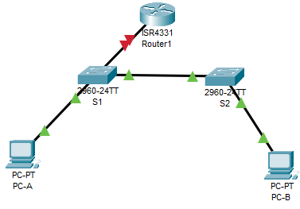
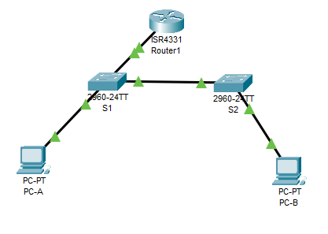

# Конфигурация безопасности коммутатора

Работа выполнена на ПК с установленным Cisco Packet Tracer.

#### Топология



#### Таблица адресации

 Устройство | Интерфейс | IP-адрес/префикс | Маска подсети.
:----------:|:---------:|:----------------:| :---------:
 R1         | G0/0/1      | 192.168.10.1      | 255.255.255.0
            | LOOPBACK 0  | 10.10.1.1       | 
 S1         | VLAN 10  | 192.168.10.201      | 255.255.255.0
 S2         | VLAN 10   | 192.168.10.202      | 255.255.255.0
  PC-A      | NIC       | DHCP             | 255.255.255.0
   PC-B     | NIC        | DHCP           | 255.255.255.0


### Часть 1. Настройка основного сетевого устройства

#### Шаг 1.1. Настройте маршрутизатор R1.

a.	Загрузите следующий конфигурационный скрипт на R1.
Откройте окно конфигурации
enable
configure terminal
hostname R1
no ip domain lookup
ip dhcp excluded-address 192.168.10.1 192.168.10.9
ip dhcp excluded-address 192.168.10.201 192.168.10.202
ip dhcp relay information trust-all
!
ip dhcp pool Students
 network 192.168.10.0 255.255.255.0
 default-router 192.168.10.1
 domain-name CCNA2.Lab-11.6.1
!
interface Loopback0
 ip address 10.10.1.1 255.255.255.0
!
interface GigabitEthernet0/0/1
 description Link to S1
 ip address 192.168.10.1 255.255.255.0
 no shutdown
!
line con 0
 logging synchronous
 exec-timeout 0 0


```
Router>enable
Router#configure terminal
Enter configuration commands, one per line.  End with CNTL/Z.
Router(config)#hostname R1
R1(config)#no ip domain lookup
R1(config)#ip dhcp excluded-address 192.168.10.1 192.168.10.9
R1(config)#ip dhcp excluded-address 192.168.10.201 192.168.10.202
R1(config)#ip dhcp relay information trust-all
R1(config)#!
R1(config)#ip dhcp pool Students
R1(dhcp-config)# network 192.168.10.0 255.255.255.0
R1(dhcp-config)# default-router 192.168.10.1
R1(dhcp-config)# domain-name CCNA2.Lab-11.6.1
R1(dhcp-config)#!
R1(dhcp-config)#interface Loopback0

R1(config-if)# ip address 10.10.1.1 255.255.255.0
R1(config-if)#!
R1(config-if)#interface GigabitEthernet0/0/1
R1(config-if)# description Link to S1
R1(config-if)# ip address 192.168.10.1 255.255.255.0
R1(config-if)# no shutdown

R1(config-if)#!
R1(config-if)#line con 0
R1(config-line)# logging synchronous
R1(config-line)# exec-timeout 0 0
R1(config-line)#
%LINK-5-CHANGED: Interface Loopback0, changed state to up

%LINEPROTO-5-UPDOWN: Line protocol on Interface Loopback0, changed state to up

%LINK-5-CHANGED: Interface GigabitEthernet0/0/1, changed state to up

%LINEPROTO-5-UPDOWN: Line protocol on Interface GigabitEthernet0/0/1, changed state to up
```


b.	Проверьте текущую конфигурацию на R1, используя следующую команду:
R1# show ip interface brief

```
R1#show ip interface brief 
Interface              IP-Address      OK? Method Status                Protocol 
GigabitEthernet0/0/0   unassigned      YES unset  administratively down down 
GigabitEthernet0/0/1   192.168.10.1    YES manual up                    up 
GigabitEthernet0/0/2   unassigned      YES unset  administratively down down 
Loopback0              10.10.1.1       YES manual up                    up 
Vlan1                  unassigned      YES unset  administratively down down
```

c.	Убедитесь, что IP-адресация и интерфейсы находятся в состоянии up / up (при необходимости устраните неполадки).

Всё поднято

#### Шаг 1.2. Настройка и проверка основных параметров коммутатора

a.	Настройте имя хоста для коммутаторов S1 и S2.

```
Switch#conf t
Enter configuration commands, one per line.  End with CNTL/Z.
Switch(config)#ho
Switch(config)#hostname S
Switch(config)#hostname S1
```


```
Switch#conf t
Enter configuration commands, one per line.  End with CNTL/Z.
Switch(config)#ho
Switch(config)#hostname S2
```


b.	Запретите нежелательный поиск в DNS.

```
S1(config)#no ip domain-lookup 
```


```
S2(config)#no ip domain-lookup 
```


c.	Настройте описания интерфейса для портов, которые используются в S1 и S2.

```
S1(config)#int
S1(config)#interface f0/5
S1(config-if)#desc
S1(config-if)#description trunk_R1_g0/0/1
S1(config-if)#exit
S1(config)#int
S1(config)#interface F0/1
S1(config-if)#de
S1(config-if)#description trunk_S2_f0/1
S1(config-if)#exit
S1(config)#int
S1(config)#interface f0/6
S1(config-if)#des
% Incomplete command.
S1(config-if)#de
S1(config-if)#description 
% Incomplete command.
S1(config-if)#description access_pc-
S1(config-if)#description access_PC-A
S1(config-if)#EXIT
```


```
S2(config)#int
S2(config)#interface f0/1
S2(config-if)#de
S2(config-if)#description trunk_S1_f0/1
S2(config-if)#exit
S2(config)#interface f0/18
S2(config-if)#des
S2(config-if)#description access_PC-B
```


d.	Установите для шлюза по умолчанию для VLAN управления значение 192.168.10.1 на обоих коммутаторах.

```
S1(config)#ip de
S1(config)#ip default-gateway 192.168.10.1
```


```
S2(config)#ip default-gateway 192.168.10.1
S2(config)#
```


### Часть 2. Настройка сетей VLAN на коммутаторах.

#### Шаг 2.1. Шаг 1. Сконфигруриуйте VLAN 10.

```
S1(config)#vlan 10
S1(config-vlan)#name Management
```


```
S2(config)#vla
S2(config)#vlan  10
S2(config-vlan)#n
S2(config-vlan)#na
S2(config-vlan)#name 
S2(config-vlan)#name Management
```

```
S2#show vlan brief 

VLAN Name                             Status    Ports
---- -------------------------------- --------- -------------------------------
1    default                          active    Fa0/1, Fa0/2, Fa0/3, Fa0/4
                                                Fa0/5, Fa0/6, Fa0/7, Fa0/8
                                                Fa0/9, Fa0/10, Fa0/11, Fa0/12
                                                Fa0/13, Fa0/14, Fa0/15, Fa0/16
                                                Fa0/17, Fa0/18, Fa0/19, Fa0/20
                                                Fa0/21, Fa0/22, Fa0/23, Fa0/24
                                                Gig0/1, Gig0/2
10   Management                       active    
1002 fddi-default                     active    
1003 token-ring-default               active    
1004 fddinet-default                  active    
1005 trnet-default                    active    
```

#### Шаг 2.2. Сконфигруриуйте SVI для VLAN 10.

```
S1(config)#interface v
S1(config)#interface vlan 10
S1(config-if)#
%LINK-5-CHANGED: Interface Vlan10, changed state to up
de
S1(config-if)#description Management_SVI_VLAN10
S1(config-if)#ip ad
S1(config-if)#ip address 192.168.10.201 255.255.255.0
S1(config-if)#no sh
S1(config-if)#no shutdown 
```


```
S2(config)#interface v
S2(config)#interface vlan 10
S2(config-if)#
%LINK-5-CHANGED: Interface Vlan10, changed state to up
des
S2(config-if)#description Management_SVI_VLAN10
S2(config-if)#IP AD
S2(config-if)#IP ADdress 192.168.10.202 255.255.255.0
S2(config-if)#noshu
S2(config-if)#no sh
S2(config-if)#no shutdown 
```


#### Шаг 2.3. Настройте VLAN 333 с именем Native и VLAN 999 с именем ParkingLot на S1 и S2.

```
S1(config)#vlan 333
S1(config-vlan)#na
S1(config-vlan)#name Native
S1(config-vlan)#exit
S1(config)#vlan 999
S1(config-vlan)#na
S1(config-vlan)#name ParkingLot
```


```
S2(config)#vlan 333
S2(config-vlan)#name Native
S2(config-vlan)#exit
S2(config)#vlan 999
S2(config-vlan)#na
S2(config-vlan)#name ParkingLot
S2(config-vlan)#
```

### Часть 3. Настройки безопасности коммутатора.

#### Шаг 3.1. Релизация магистральных соединений 802.1Q.

a.	Настройте все магистральные порты Fa0/1 на обоих коммутаторах для использования VLAN 333 в качестве native VLAN.

```
S1(config)#interface g0/1
S1(config-if)#sw
S1(config-if)#switchport m
S1(config-if)#switchport mode t
S1(config-if)#switchport mode trunk 
S1(config-if)#sw
S1(config-if)#switchport tr
S1(config-if)#switchport trunk vl
S1(config-if)#switchport trunk vla
S1(config-if)#switchport trunk vlan
S1(config-if)#switchport trunk vlan 333
                               ^
% Invalid input detected at '^' marker.
	
S1(config-if)#switchport trunk n
S1(config-if)#switchport trunk native v
S1(config-if)#switchport trunk native vlan 333
S1(config-if)#switchport trunk allowed vlan 10,333,999
```


```
S2(config)#int
S2(config)#interface g0/1
S2(config-if)#sw
S2(config-if)#switchport m
S2(config-if)#switchport mode t
S2(config-if)#switchport mode trunk 
S2(config-if)#sw
S2(config-if)#switchport tr
S2(config-if)#switchport trunk n
S2(config-if)#switchport trunk native v
S2(config-if)#switchport trunk native vlan 333
S2(config-if)#switchport trunk allowed vlan 10,333,999
```

#НА ЭТОМ МОМЕНТЕ ЗАМЕЧЕНА ОШИБКА, ЧТО ВЛАН НАСТРАИВАЛСЯ НЕ НА ТОТ ИНТЕРФЕЙС!!
Повторяю действия. Для безопасности отключаю транк в g0/1 на обоих свичах.


```
S1(config)#default int
S1(config)#default interface g0/1
Building configuration...


Interface GigabitEthernet0/1 set to default configuration
S1(config)#

S1(config-if)#shutdown
```


```
S2(config)#default int
S2(config)#default interface g0/1
Building configuration...


Interface GigabitEthernet0/1 set to default configuration
S2(config)#

S2(config-if)#shutdown
```

Настраиваю нужные интерфейсы


```
S1(config)#int f0/1
S1(config-if)#sw
S1(config-if)#switchport m
S1(config-if)#switchport mode t
S1(config-if)#switchport mode trunk 

S1(config-if)#
%LINEPROTO-5-UPDOWN: Line protocol on Interface FastEthernet0/1, changed state to down

%LINEPROTO-5-UPDOWN: Line protocol on Interface FastEthernet0/1, changed state to up

%LINEPROTO-5-UPDOWN: Line protocol on Interface Vlan10, changed state to up
sw
S1(config-if)#switchport tr
S1(config-if)#switchport trunk n
S1(config-if)#switchport trunk native v
S1(config-if)#switchport trunk native vlan 333
S1(config-if)#no sh
S1(config-if)#no shutdown 
S1(config-if)#
%CDP-4-NATIVE_VLAN_MISMATCH: Native VLAN mismatch discovered on FastEthernet0/1 (333), with S2 FastEthernet0/1 (1).
%SPANTREE-2-RECV_PVID_ERR: Received BPDU with inconsistent peer vlan id 1 on FastEthernet0/1 VLAN333.

%SPANTREE-2-BLOCK_PVID_LOCAL: Blocking FastEthernet0/1 on VLAN0333. Inconsistent local vlan.


%CDP-4-NATIVE_VLAN_MISMATCH: Native VLAN mismatch discovered on FastEthernet0/1 (333), with S2 FastEthernet0/1 (1).

%CDP-4-NATIVE_VLAN_MISMATCH: Native VLAN mismatch discovered on FastEthernet0/1 (333), with S2 FastEthernet0/1 (1).

%CDP-4-NATIVE_VLAN_MISMATCH: Native VLAN mismatch discovered on FastEthernet0/1 (333), with S2 FastEthernet0/1 (1).
```


```
S2(config)#int f0/1
S2(config-if)#sw
S2(config-if)#switchport m
S2(config-if)#switchport mode tr
S2(config-if)#switchport mode trunk 
S2(config-if)#sw
S2(config-if)#switchport tr
S2(config-if)#switchport trunk n
S2(config-if)#switchport trunk native v
S2(config-if)#switchport trunk native vlan 333
S2(config-if)#%SPANTREE-2-UNBLOCK_CONSIST_PORT: Unblocking FastEthernet0/1 on VLAN0333. Port consistency restored.

%SPANTREE-2-UNBLOCK_CONSIST_PORT: Unblocking FastEthernet0/1 on VLAN0001. Port consistency restored.

no sh
S2(config-if)#no shutdown 
S2(config-if)#
```

b.	Убедитесь, что режим транкинга успешно настроен на всех коммутаторах.
S1# show interface trunk

```
S1#show interfaces trunk 
Port        Mode         Encapsulation  Status        Native vlan
Fa0/1       on           802.1q         trunking      333

Port        Vlans allowed on trunk
Fa0/1       1-1005

Port        Vlans allowed and active in management domain
Fa0/1       1,10,333,999

Port        Vlans in spanning tree forwarding state and not pruned
Fa0/1       1,10,333,999
```


```
S2#show interfaces trunk 
Port        Mode         Encapsulation  Status        Native vlan
Fa0/1       on           802.1q         trunking      333

Port        Vlans allowed on trunk
Fa0/1       1-1005

Port        Vlans allowed and active in management domain
Fa0/1       1,10,333,999

Port        Vlans in spanning tree forwarding state and not pruned
Fa0/1       1,10,333,999
```

c.	Отключить согласование DTP F0/1 на S1 и S2. 

```
S1(config)#int f0/1
S1(config-if)#sw
S1(config-if)#switchport ne
S1(config-if)#switchport no
S1(config-if)#switchport nonegotiate 
```


```
S2(config)#int f0/1
S2(config-if)#sw
S2(config-if)#switchport no
S2(config-if)#switchport nonegotiate 
```

d.	Проверьте с помощью команды show interfaces.

```
S1#show interfaces f0/1 switchport | include Negotiation
Negotiation of Trunking: Off
```


```
S2#show interfaces f0/1 switchport | include Negotiation
Negotiation of Trunking: Off
```



#### Шаг 3.2. Настройка портов доступа

a.	На S1 настройте F0/5 и F0/6 в качестве портов доступа и свяжите их с VLAN 10.

```
S1(config)#int range f0/5, f0/6
S1(config-if-range)#sw
S1(config-if-range)#switchport m
S1(config-if-range)#switchport mode ac
S1(config-if-range)#switchport mode access 
S1(config-if-range)#sw
S1(config-if-range)#switchport ac
S1(config-if-range)#switchport access v
S1(config-if-range)#switchport access vlan 10
S1(config-if-range)#no sh
```


b.	На S2 настройте порт доступа Fa0/18 и свяжите его с VLAN 10.

```
S2(config)#int
S2(config)#interface ra
S2(config)#interface ra
S2(config)#interface range f0/18
S2(config-if-range)#sw
S2(config-if-range)#switchport m
S2(config-if-range)#switchport mode a
S2(config-if-range)#switchport mode access 
S2(config-if-range)#sw
S2(config-if-range)#switchport ac
S2(config-if-range)#switchport access vl
S2(config-if-range)#switchport access vlan 10
S2(config-if-range)#no sh
S2(config-if-range)#no shutdown 
```

#### Шаг 3.3. Безопасность неиспользуемых портов коммутатора

a.	На S1 и S2 переместите неиспользуемые порты из VLAN 1 в VLAN 999 и отключите неиспользуемые порты.

эТОТ ВЛАН уже был создан ранее, осталось переместить

```
S1(config)#interface ra
S1(config)#interface range f0/2-4, f0/7-24, g0/1-2
S1(config-if-range)#sw
S1(config-if-range)#switchport m
S1(config-if-range)#switchport mode ac
S1(config-if-range)#switchport mode access 
S1(config-if-range)#sw
S1(config-if-range)#switchport a
S1(config-if-range)#switchport access vl
S1(config-if-range)#switchport access vlan 999
S1(config-if-range)#shu
S1(config-if-range)#shutdown 

%LINK-5-CHANGED: Interface FastEthernet0/2, changed state to administratively down

%LINK-5-CHANGED: Interface FastEthernet0/3, changed state to administratively down

%LINK-5-CHANGED: Interface FastEthernet0/4, changed state to administratively down

%LINK-5-CHANGED: Interface FastEthernet0/7, changed state to administratively down

%LINK-5-CHANGED: Interface FastEthernet0/8, changed state to administratively down

%LINK-5-CHANGED: Interface FastEthernet0/9, changed state to administratively down

%LINK-5-CHANGED: Interface FastEthernet0/10, changed state to administratively down

%LINK-5-CHANGED: Interface FastEthernet0/11, changed state to administratively down

%LINK-5-CHANGED: Interface FastEthernet0/12, changed state to administratively down

%LINK-5-CHANGED: Interface FastEthernet0/13, changed state to administratively down

%LINK-5-CHANGED: Interface FastEthernet0/14, changed state to administratively down

%LINK-5-CHANGED: Interface FastEthernet0/15, changed state to administratively down

%LINK-5-CHANGED: Interface FastEthernet0/16, changed state to administratively down

%LINK-5-CHANGED: Interface FastEthernet0/17, changed state to administratively down

%LINK-5-CHANGED: Interface FastEthernet0/18, changed state to administratively down

%LINK-5-CHANGED: Interface FastEthernet0/19, changed state to administratively down

%LINK-5-CHANGED: Interface FastEthernet0/20, changed state to administratively down

%LINK-5-CHANGED: Interface FastEthernet0/21, changed state to administratively down

%LINK-5-CHANGED: Interface FastEthernet0/22, changed state to administratively down

%LINK-5-CHANGED: Interface FastEthernet0/23, changed state to administratively down

%LINK-5-CHANGED: Interface FastEthernet0/24, changed state to administratively down

%LINK-5-CHANGED: Interface GigabitEthernet0/2, changed state to administratively down
S1(config-if-range)#
```


```
S2(config)#in
S2(config)#interface r
S2(config)#interface range f0/2-17, f0/19-24, g0/1-2
S2(config-if-range)#sw
S2(config-if-range)#switchport m
S2(config-if-range)#switchport mode a
S2(config-if-range)#switchport mode access 
S2(config-if-range)#sw
S2(config-if-range)#switchport a
S2(config-if-range)#switchport access v
S2(config-if-range)#switchport access vlan 999
S2(config-if-range)#sh
S2(config-if-range)#shutdown 

%LINK-5-CHANGED: Interface FastEthernet0/2, changed state to administratively down

%LINK-5-CHANGED: Interface FastEthernet0/3, changed state to administratively down

%LINK-5-CHANGED: Interface FastEthernet0/4, changed state to administratively down

%LINK-5-CHANGED: Interface FastEthernet0/5, changed state to administratively down

%LINK-5-CHANGED: Interface FastEthernet0/6, changed state to administratively down

%LINK-5-CHANGED: Interface FastEthernet0/7, changed state to administratively down

%LINK-5-CHANGED: Interface FastEthernet0/8, changed state to administratively down

%LINK-5-CHANGED: Interface FastEthernet0/9, changed state to administratively down

%LINK-5-CHANGED: Interface FastEthernet0/10, changed state to administratively down

%LINK-5-CHANGED: Interface FastEthernet0/11, changed state to administratively down

%LINK-5-CHANGED: Interface FastEthernet0/12, changed state to administratively down

%LINK-5-CHANGED: Interface FastEthernet0/13, changed state to administratively down

%LINK-5-CHANGED: Interface FastEthernet0/14, changed state to administratively down

%LINK-5-CHANGED: Interface FastEthernet0/15, changed state to administratively down

%LINK-5-CHANGED: Interface FastEthernet0/16, changed state to administratively down

%LINK-5-CHANGED: Interface FastEthernet0/17, changed state to administratively down

%LINK-5-CHANGED: Interface FastEthernet0/19, changed state to administratively down

%LINK-5-CHANGED: Interface FastEthernet0/20, changed state to administratively down

%LINK-5-CHANGED: Interface FastEthernet0/21, changed state to administratively down

%LINK-5-CHANGED: Interface FastEthernet0/22, changed state to administratively down

%LINK-5-CHANGED: Interface FastEthernet0/23, changed state to administratively down

%LINK-5-CHANGED: Interface FastEthernet0/24, changed state to administratively down

%LINK-5-CHANGED: Interface GigabitEthernet0/1, changed state to administratively down

%LINK-5-CHANGED: Interface GigabitEthernet0/2, changed state to administratively down
S2(config-if-range)#
```

b.	Убедитесь, что неиспользуемые порты отключены и связаны с VLAN 999, введя команду  show.
S1# show interfaces status

```
S1#show interfaces status 
Port      Name               Status       Vlan       Duplex  Speed Type
Fa0/1     trunk_S2_f0/1      connected    trunk      auto    auto  10/100BaseTX
Fa0/2                        disabled 999        auto    auto  10/100BaseTX
Fa0/3                        disabled 999        auto    auto  10/100BaseTX
Fa0/4                        disabled 999        auto    auto  10/100BaseTX
Fa0/5     trunk_R1_g0/0/1    connected    10         auto    auto  10/100BaseTX
Fa0/6     access_PC-A        connected    10         auto    auto  10/100BaseTX
Fa0/7                        disabled 999        auto    auto  10/100BaseTX
Fa0/8                        disabled 999        auto    auto  10/100BaseTX
Fa0/9                        disabled 999        auto    auto  10/100BaseTX
Fa0/10                       disabled 999        auto    auto  10/100BaseTX
Fa0/11                       disabled 999        auto    auto  10/100BaseTX
Fa0/12                       disabled 999        auto    auto  10/100BaseTX
Fa0/13                       disabled 999        auto    auto  10/100BaseTX
Fa0/14                       disabled 999        auto    auto  10/100BaseTX
Fa0/15                       disabled 999        auto    auto  10/100BaseTX
Fa0/16                       disabled 999        auto    auto  10/100BaseTX
Fa0/17                       disabled 999        auto    auto  10/100BaseTX
Fa0/18                       disabled 999        auto    auto  10/100BaseTX
Fa0/19                       disabled 999        auto    auto  10/100BaseTX
Fa0/20                       disabled 999        auto    auto  10/100BaseTX
Fa0/21                       disabled 999        auto    auto  10/100BaseTX
Fa0/22                       disabled 999        auto    auto  10/100BaseTX
Fa0/23                       disabled 999        auto    auto  10/100BaseTX
Fa0/24                       disabled 999        auto    auto  10/100BaseTX
Gig0/1                       disabled 999        auto    auto  10/100BaseTX
Gig0/2                       disabled 999        auto    auto  10/100BaseTX

```

Переименую f0/5 так как это не транковый порт

```
S1(config)#int
S1(config)#interface f0/5
S1(config-if)#de
S1(config-if)#description Access_R1_g0/0/1
S1(config-if)#
```


```
S2#show interfaces status 
Port      Name               Status       Vlan       Duplex  Speed Type
Fa0/1     trunk_S1_f0/1      connected    trunk      auto    auto  10/100BaseTX
Fa0/2                        disabled 999        auto    auto  10/100BaseTX
Fa0/3                        disabled 999        auto    auto  10/100BaseTX
Fa0/4                        disabled 999        auto    auto  10/100BaseTX
Fa0/5                        disabled 999        auto    auto  10/100BaseTX
Fa0/6                        disabled 999        auto    auto  10/100BaseTX
Fa0/7                        disabled 999        auto    auto  10/100BaseTX
Fa0/8                        disabled 999        auto    auto  10/100BaseTX
Fa0/9                        disabled 999        auto    auto  10/100BaseTX
Fa0/10                       disabled 999        auto    auto  10/100BaseTX
Fa0/11                       disabled 999        auto    auto  10/100BaseTX
Fa0/12                       disabled 999        auto    auto  10/100BaseTX
Fa0/13                       disabled 999        auto    auto  10/100BaseTX
Fa0/14                       disabled 999        auto    auto  10/100BaseTX
Fa0/15                       disabled 999        auto    auto  10/100BaseTX
Fa0/16                       disabled 999        auto    auto  10/100BaseTX
Fa0/17                       disabled 999        auto    auto  10/100BaseTX
Fa0/18    access_PC-B        connected    10         auto    auto  10/100BaseTX
Fa0/19                       disabled 999        auto    auto  10/100BaseTX
Fa0/20                       disabled 999        auto    auto  10/100BaseTX
Fa0/21                       disabled 999        auto    auto  10/100BaseTX
Fa0/22                       disabled 999        auto    auto  10/100BaseTX
Fa0/23                       disabled 999        auto    auto  10/100BaseTX
Fa0/24                       disabled 999        auto    auto  10/100BaseTX
Gig0/1                       disabled 999        auto    auto  10/100BaseTX
Gig0/2                       disabled 999        auto    auto  10/100BaseTX
```


#### Шаг 3.4. Документирование и реализация функций безопасности порта.

Интерфейсы F0/6 на S1 и F0/18 на S2 настроены как порты доступа. На этом шаге вы также настроите безопасность портов на этих двух портах доступа.

a.	На S1, введите команду show port-security interface f0/6  для отображения настроек по умолчанию безопасности порта для интерфейса F0/6. Запишите свои ответы ниже.


```
S1#show port-security interface f0/6
```


 Функция                | Настройка по умолчанию
:----------------------:|:--------------------------------:
 Защита портов          |    Disabled
 Максимальное количество записей MAC-адресов  | 1
 Режим проверки на нарушение безопасности     | shutdown
 Aging Time                      |   0 mins
 Aging Type                     |   Absolute  
 Secure Static Address Aging   | 	Disabled 
 Sticky MAC Address            | 0


```
S1(config)#int f0/6
S1(config-if)#sw
S1(config-if)#switchport ?
  access         Set access mode characteristics of the interface
  mode           Set trunking mode of the interface
  nonegotiate    Device will not engage in negotiation protocol on this
                 interface
  port-security  Security related command
  priority       Set appliance 802.1p priority
  protected      Configure an interface to be a protected port
  trunk          Set trunking characteristics of the interface
  voice          Voice appliance attributes
S1(config-if)#switchport p
S1(config-if)#switchport po
S1(config-if)#switchport port-security 
S1(config-if)#switchport port-security ma
S1(config-if)#switchport port-security ?
  aging        Port-security aging commands
  mac-address  Secure mac address
  maximum      Max secure addresses
  violation    Security violation mode
  <cr>
S1(config-if)#switchport port-security max 3
S1(config-if)#switchport port-security ?
  aging        Port-security aging commands
  mac-address  Secure mac address
  maximum      Max secure addresses
  violation    Security violation mode
  <cr>
S1(config-if)#switchport port-security v
S1(config-if)#switchport port-security violation re
S1(config-if)#switchport port-security violation restrict 
S1(config-if)#switchport port-security ag
S1(config-if)#switchport port-security aging t
S1(config-if)#switchport port-security aging time 60
S1(config-if)#switchport port-security agin
S1(config-if)#switchport port-security aging t
S1(config-if)#switchport port-security aging ty
S1(config-if)#switchport port-security aging typ
S1(config-if)#switchport port-security aging 
% Incomplete command.
S1(config-if)#switchport port-security aging ?
  time  Port-security aging time
S1(config-if)#switchport port-security aging type ne
S1(config-if)#switchport port-security aging type in
S1(config-if)#switchport port-security aging type inactivity
                                              ^
% Invalid input detected at '^' marker.
	
S1(config-if)#switchport port-security ?
  aging        Port-security aging commands
  mac-address  Secure mac address
  maximum      Max secure addresses
  violation    Security violation mode
  <cr>
S1(config-if)#switchport port-security ag
S1(config-if)#switchport port-security aging ?
  time  Port-security aging time
```

aging type не поддерживается в моей рабочей версии пакеттрейсер 

c.	Verify port security on S1 F0/6.
S1# show port-security interface f0/6

```
S1#show port-security interface f0/6
Port Security              : Enabled
Port Status                : Secure-up
Violation Mode             : Restrict
Aging Time                 : 60 mins
Aging Type                 : Absolute
SecureStatic Address Aging : Disabled
Maximum MAC Addresses      : 3
Total MAC Addresses        : 0
Configured MAC Addresses   : 0
Sticky MAC Addresses       : 0
Last Source Address:Vlan   : 0000.0000.0000:0
Security Violation Count   : 0

S1#show port-security address 
               Secure Mac Address Table
-----------------------------------------------------------------------------
Vlan    Mac Address       Type                          Ports   Remaining Age
                                                                   (mins)
----    -----------       ----                          -----   -------------
-----------------------------------------------------------------------------
Total Addresses in System (excluding one mac per port)     : 0
Max Addresses limit in System (excluding one mac per port) : 1024
```

d.	Включите безопасность порта для F0 / 18 на S2. Настройте каждый активный порт доступа таким образом, чтобы он автоматически добавлял адреса МАС, изученные на этом порту, в текущую конфигурацию.
e.	Настройте следующие параметры безопасности порта на S2 F / 18:
o	Максимальное количество записей MAC-адресов: 2
o	Тип безопасности: Protect
o	Aging time: 60 мин.

```
S2(config)#int f0/18
S2(config-if)#sw
S2(config-if)#switchport p
S2(config-if)#switchport po
S2(config-if)#switchport port-security 
S2(config-if)#switchport port-security ma
S2(config-if)#switchport port-security max
S2(config-if)#switchport port-security maximum 2
S2(config-if)#switchport port-security vi
S2(config-if)#switchport port-security violation pr
S2(config-if)#switchport port-security violation protect 
S2(config-if)#switchport port-security ma
S2(config-if)#switchport port-security mac-
S2(config-if)#switchport port-security mac-address ?
  H.H.H   48 bit mac address
  sticky  Configure dynamic secure addresses as sticky
S2(config-if)#switchport port-security violation protect s
S2(config-if)#switchport port-security mac
S2(config-if)#switchport port-security mac-address s
S2(config-if)#switchport port-security mac-address sticky 
S2(config-if)#switchport port-security 
S2(config-if)#switchport port-security ?
  aging        Port-security aging commands
  mac-address  Secure mac address
  maximum      Max secure addresses
  violation    Security violation mode
  <cr>
S2(config-if)#switchport port-security ag
S2(config-if)#switchport port-security aging t
S2(config-if)#switchport port-security aging time 60
```

f.	Проверка функции безопасности портов на S2 F0/18.
S2# show port-security interface f0/18

```
S2#show port-security interface f0/18
Port Security              : Enabled
Port Status                : Secure-up
Violation Mode             : Protect
Aging Time                 : 60 mins
Aging Type                 : Absolute
SecureStatic Address Aging : Disabled
Maximum MAC Addresses      : 2
Total MAC Addresses        : 0
Configured MAC Addresses   : 0
Sticky MAC Addresses       : 0
Last Source Address:Vlan   : 0000.0000.0000:0
Security Violation Count   : 0
```

От ПК не приходили МАКи так как забыла включить DHCP.

```
S1#show port-security interface f0/6
Port Security              : Enabled
Port Status                : Secure-up
Violation Mode             : Restrict
Aging Time                 : 60 mins
Aging Type                 : Absolute
SecureStatic Address Aging : Disabled
Maximum MAC Addresses      : 3
Total MAC Addresses        : 1
Configured MAC Addresses   : 0
Sticky MAC Addresses       : 0
Last Source Address:Vlan   : 00E0.A301.5190:10
Security Violation Count   : 0

S1#show port-security interface f0/6
Port Security              : Enabled
Port Status                : Secure-up
Violation Mode             : Restrict
Aging Time                 : 60 mins
Aging Type                 : Absolute
SecureStatic Address Aging : Disabled
Maximum MAC Addresses      : 3
Total MAC Addresses        : 1
Configured MAC Addresses   : 0
Sticky MAC Addresses       : 0
Last Source Address:Vlan   : 00E0.A301.5190:10
Security Violation Count   : 0

S1#show port-security ADD
               Secure Mac Address Table
-----------------------------------------------------------------------------
Vlan    Mac Address       Type                          Ports   Remaining Age
                                                                   (mins)
----    -----------       ----                          -----   -------------
10	00E0.A301.5190	DynamicConfigured	FastEthernet0/6		-
-----------------------------------------------------------------------------
Total Addresses in System (excluding one mac per port)     : 0
Max Addresses limit in System (excluding one mac per port) : 1024
S1#
```

#### Шаг 3.5. Реализовать безопасность DHCP snooping.

a.	На S2 включите DHCP snooping и настройте DHCP snooping во VLAN 10.

```
S2(config)#ip d
S2(config)#ip dh
S2(config)#ip dhcp s
S2(config)#ip dhcp snooping 
S2(config)#ip dhcp snooping vl
S2(config)#ip dhcp snooping vlan 10
```

b.	Настройте магистральные порты на S2 как доверенные порты.

Магистральный порт у нас f0/1

```
S2(config)#int f0/1
S2(config-if)#ip dh
S2(config-if)#ip dhcp sn
S2(config-if)#ip dhcp snooping tr
S2(config-if)#ip dhcp snooping trust 
```

c.	Ограничьте ненадежный порт Fa0/18 на S2 пятью DHCP-пакетами в секунду.

```
S2#conf t
Enter configuration commands, one per line.  End with CNTL/Z.
S2(config)#int f0/18
S2(config-if)#ip dhcp snooping l
S2(config-if)#ip dhcp snooping limit r
S2(config-if)#ip dhcp snooping limit rate 5
S2(config-if)#end
S2#
%SYS-5-CONFIG_I: Configured from console by console
show ip dhcp snooping 
Switch DHCP snooping is enabled
DHCP snooping is configured on following VLANs:
10
Insertion of option 82 is enabled
Option 82 on untrusted port is not allowed
Verification of hwaddr field is enabled
Interface                  Trusted    Rate limit (pps)
-----------------------    -------    ----------------
FastEthernet0/1            yes        unlimited       
FastEthernet0/18           no         5         
```

d.	Проверка DHCP Snooping на S2.
S2# show ip dhcp snooping

```
S2#
%SYS-5-CONFIG_I: Configured from console by console
show ip dhcp snooping 
Switch DHCP snooping is enabled
DHCP snooping is configured on following VLANs:
10
Insertion of option 82 is enabled
Option 82 on untrusted port is not allowed
Verification of hwaddr field is enabled
Interface                  Trusted    Rate limit (pps)
-----------------------    -------    ----------------
FastEthernet0/1            yes        unlimited       
FastEthernet0/18           no         5          
```

e.	В командной строке на PC-B освободите, а затем обновите IP-адрес.
C:\Users\Student> ipconfig /release
C:\Users\Student> ipconfig /renew

```
C:\>ipconfig /release

   IP Address......................: 0.0.0.0
   Subnet Mask.....................: 0.0.0.0
   Default Gateway.................: 0.0.0.0
   DNS Server......................: 0.0.0.0

C:\>ipconfig /renew

   IP Address......................: 192.168.10.11
   Subnet Mask.....................: 255.255.255.0
   Default Gateway.................: 192.168.10.1
   DNS Server......................: 0.0.0.0
```

f.	Проверьте привязку отслеживания DHCP с помощью команды show ip dhcp snooping binding.


```
S2#show ip dhcp snooping binding 
MacAddress          IpAddress        Lease(sec)  Type           VLAN  Interface
------------------  ---------------  ----------  -------------  ----  -----------------
00:60:47:DE:6E:CB   192.168.10.11    0           dhcp-snooping  10    FastEthernet0/18
Total number of bindings: 1
```

#### Шаг 3.6. Реализация PortFast и BPDU Guard.

a.	Настройте PortFast на всех портах доступа, которые используются на обоих коммутаторах.

```
S1(config)#int
S1(config)#interface R
S1(config)#interface Range f0/5, f0/6
S1(config-if-range)#sp
S1(config-if-range)#spa
S1(config-if-range)#spanning-tree po
S1(config-if-range)#spanning-tree portfast 
%Warning: portfast should only be enabled on ports connected to a single
host. Connecting hubs, concentrators, switches, bridges, etc... to this
interface  when portfast is enabled, can cause temporary bridging loops.
Use with CAUTION

%Portfast has been configured on FastEthernet0/5 but will only
have effect when the interface is in a non-trunking mode.
%Warning: portfast should only be enabled on ports connected to a single
host. Connecting hubs, concentrators, switches, bridges, etc... to this
interface  when portfast is enabled, can cause temporary bridging loops.
Use with CAUTION

%Portfast has been configured on FastEthernet0/6 but will only
have effect when the interface is in a non-trunking mode.
S1(config-if-range)#
```


```
S2(config)#int f0/18
S2(config-if)#spa
S2(config-if)#spanning-tree po
S2(config-if)#spanning-tree portfast 
%Warning: portfast should only be enabled on ports connected to a single
host. Connecting hubs, concentrators, switches, bridges, etc... to this
interface  when portfast is enabled, can cause temporary bridging loops.
Use with CAUTION

%Portfast has been configured on FastEthernet0/18 but will only
have effect when the interface is in a non-trunking mode.
S2(config-if)#
```

b.	Включите защиту BPDU на портах доступа VLAN 10 S1 и S2, подключенных к PC-A и PC-B.

```
S1(config)#int f0/6
S1(config-if)#sp
S1(config-if)#spa
S1(config-if)#spanning-tree bp
S1(config-if)#spanning-tree bpduguard en
S1(config-if)#spanning-tree bpduguard enable 
S1(config-if)#
```


```
S2(config)#int f0/18
S2(config-if)#spa
S2(config-if)#spanning-tree bp
S2(config-if)#spanning-tree bpduguard e
S2(config-if)#spanning-tree bpduguard enable 
```

c.	Убедитесь, что защита BPDU и PortFast включены на соответствующих портах.

```
S1#show spanning-tree interface f0/6 detail 

Port 6 (FastEthernet0/6) of VLAN0010 is designated forwarding
  Port path cost 19, Port priority 128, Port Identifier 128.6
  Designated root has priority 32778, address 0003.E48A.CC53
  Designated bridge has priority 32778, address 00D0.580A.57A0
  Designated port id is 128.6, designated path cost 19
  Timers: message age 16, forward delay 0, hold 0
  Number of transitions to forwarding state: 1
  The port is in the portfast mode
  Link type is point-to-point by default
```


```
S2#show spanning-tree interface f0/18 detail 

Port 18 (FastEthernet0/18) of VLAN0010 is designated forwarding
  Port path cost 19, Port priority 128, Port Identifier 128.18
  Designated root has priority 32778, address 0003.E48A.CC53
  Designated bridge has priority 32778, address 0003.E48A.CC53
  Designated port id is 128.18, designated path cost 19
  Timers: message age 16, forward delay 0, hold 0
  Number of transitions to forwarding state: 1
  The port is in the portfast mode
  Link type is point-to-point by default
```

Пакеттрейсер не отображает в этой команде BPDU, посмотрим через команду: S1#show running-config 

```
interface FastEthernet0/6
 description access_PC-A
 switchport access vlan 10
 switchport mode access
 switchport port-security
 switchport port-security maximum 3
 switchport port-security violation restrict 
 switchport port-security aging time 60
 spanning-tree portfast
 spanning-tree bpduguard enable
```

```
interface FastEthernet0/18
 description access_PC-B
 switchport access vlan 10
 ip dhcp snooping limit rate 5
 switchport mode access
 switchport port-security
 switchport port-security maximum 2
 switchport port-security mac-address sticky 
 switchport port-security violation protect 
 switchport port-security mac-address sticky 0060.47DE.6ECB
 switchport port-security aging time 60
 spanning-tree portfast
 spanning-tree bpduguard enable
```

#### Шаг 3.7. Проверьте наличие сквозного подключения.
Проверьте PING свзяь между всеми устройствами в таблице IP-адресации. В случае сбоя проверки связи может потребоваться отключить брандмауэр на хостах.

```
C:\>ping 192.168.10.1

Pinging 192.168.10.1 with 32 bytes of data:

Reply from 192.168.10.1: bytes=32 time<1ms TTL=255
Reply from 192.168.10.1: bytes=32 time<1ms TTL=255
Reply from 192.168.10.1: bytes=32 time<1ms TTL=255
Reply from 192.168.10.1: bytes=32 time<1ms TTL=255

Ping statistics for 192.168.10.1:
    Packets: Sent = 4, Received = 4, Lost = 0 (0% loss),
Approximate round trip times in milli-seconds:
    Minimum = 0ms, Maximum = 0ms, Average = 0ms

C:\>ping 192.168.10.201

Pinging 192.168.10.201 with 32 bytes of data:

Request timed out.
Reply from 192.168.10.201: bytes=32 time<1ms TTL=255
Reply from 192.168.10.201: bytes=32 time<1ms TTL=255
Reply from 192.168.10.201: bytes=32 time<1ms TTL=255

Ping statistics for 192.168.10.201:
    Packets: Sent = 4, Received = 3, Lost = 1 (25% loss),
Approximate round trip times in milli-seconds:
    Minimum = 0ms, Maximum = 0ms, Average = 0ms

C:\>ping 192.168.10.202

Pinging 192.168.10.202 with 32 bytes of data:

Request timed out.
Reply from 192.168.10.202: bytes=32 time<1ms TTL=255
Reply from 192.168.10.202: bytes=32 time<1ms TTL=255
Reply from 192.168.10.202: bytes=32 time<1ms TTL=255

Ping statistics for 192.168.10.202:
    Packets: Sent = 4, Received = 3, Lost = 1 (25% loss),
Approximate round trip times in milli-seconds:
    Minimum = 0ms, Maximum = 0ms, Average = 0ms

C:\>ping 192.168.10.11

Pinging 192.168.10.11 with 32 bytes of data:

Reply from 192.168.10.11: bytes=32 time=1ms TTL=128
Reply from 192.168.10.11: bytes=32 time<1ms TTL=128
Reply from 192.168.10.11: bytes=32 time=3ms TTL=128
Reply from 192.168.10.11: bytes=32 time<1ms TTL=128

Ping statistics for 192.168.10.11:
    Packets: Sent = 4, Received = 4, Lost = 0 (0% loss),
Approximate round trip times in milli-seconds:
    Minimum = 0ms, Maximum = 3ms, Average = 1ms

C:\>ping 10.10.1.1

Pinging 10.10.1.1 with 32 bytes of data:

Reply from 10.10.1.1: bytes=32 time<1ms TTL=255
Reply from 10.10.1.1: bytes=32 time<1ms TTL=255
Reply from 10.10.1.1: bytes=32 time<1ms TTL=255
Reply from 10.10.1.1: bytes=32 time<1ms TTL=255

Ping statistics for 10.10.1.1:
    Packets: Sent = 4, Received = 4, Lost = 0 (0% loss),
Approximate round trip times in milli-seconds:
    Minimum = 0ms, Maximum = 0ms, Average = 0ms
```


```
C:\>ping 192.168.10.1

Pinging 192.168.10.1 with 32 bytes of data:

Reply from 192.168.10.1: bytes=32 time<1ms TTL=255
Reply from 192.168.10.1: bytes=32 time<1ms TTL=255
Reply from 192.168.10.1: bytes=32 time<1ms TTL=255
Reply from 192.168.10.1: bytes=32 time<1ms TTL=255

Ping statistics for 192.168.10.1:
    Packets: Sent = 4, Received = 4, Lost = 0 (0% loss),
Approximate round trip times in milli-seconds:
    Minimum = 0ms, Maximum = 0ms, Average = 0ms

C:\>ping 192.168.10.201

Pinging 192.168.10.201 with 32 bytes of data:

Request timed out.
Reply from 192.168.10.201: bytes=32 time<1ms TTL=255
Reply from 192.168.10.201: bytes=32 time<1ms TTL=255
Reply from 192.168.10.201: bytes=32 time<1ms TTL=255

Ping statistics for 192.168.10.201:
    Packets: Sent = 4, Received = 3, Lost = 1 (25% loss),
Approximate round trip times in milli-seconds:
    Minimum = 0ms, Maximum = 0ms, Average = 0ms

C:\>ping 192.168.10.202

Pinging 192.168.10.202 with 32 bytes of data:

Request timed out.
Reply from 192.168.10.202: bytes=32 time<1ms TTL=255
Reply from 192.168.10.202: bytes=32 time<1ms TTL=255
Reply from 192.168.10.202: bytes=32 time<1ms TTL=255

Ping statistics for 192.168.10.202:
    Packets: Sent = 4, Received = 3, Lost = 1 (25% loss),
Approximate round trip times in milli-seconds:
    Minimum = 0ms, Maximum = 0ms, Average = 0ms

C:\>ping 192.168.10.10

Pinging 192.168.10.10 with 32 bytes of data:

Reply from 192.168.10.10: bytes=32 time<1ms TTL=128
Reply from 192.168.10.10: bytes=32 time<1ms TTL=128
Reply from 192.168.10.10: bytes=32 time<1ms TTL=128
Reply from 192.168.10.10: bytes=32 time<1ms TTL=128

Ping statistics for 192.168.10.10:
    Packets: Sent = 4, Received = 4, Lost = 0 (0% loss),
Approximate round trip times in milli-seconds:
    Minimum = 0ms, Maximum = 0ms, Average = 0ms

C:\>ping 192.168.10.11

Pinging 192.168.10.11 with 32 bytes of data:

Reply from 192.168.10.11: bytes=32 time=2ms TTL=128
Reply from 192.168.10.11: bytes=32 time=4ms TTL=128
Reply from 192.168.10.11: bytes=32 time=4ms TTL=128
Reply from 192.168.10.11: bytes=32 time=2ms TTL=128

Ping statistics for 192.168.10.11:
    Packets: Sent = 4, Received = 4, Lost = 0 (0% loss),
Approximate round trip times in milli-seconds:
    Minimum = 2ms, Maximum = 4ms, Average = 3ms

C:\>ping 10.10.1.1

Pinging 10.10.1.1 with 32 bytes of data:

Reply from 10.10.1.1: bytes=32 time<1ms TTL=255
Reply from 10.10.1.1: bytes=32 time<1ms TTL=255
Reply from 10.10.1.1: bytes=32 time=3ms TTL=255
Reply from 10.10.1.1: bytes=32 time<1ms TTL=255

Ping statistics for 10.10.1.1:
    Packets: Sent = 4, Received = 4, Lost = 0 (0% loss),
Approximate round trip times in milli-seconds:
    Minimum = 0ms, Maximum = 3ms, Average = 0ms
```

Далее все устройства пингуются нормально
 
#### Вопрос для повторения

- С точки зрения безопасности порта на S2, почему нет значения таймера для оставшегося возраста в минутах, когда было сконфигурировано динамическое обучение - sticky?
Ответ: Потому что стики подразумевает постоянное хранение, МАК-адрес  постоянно остается в записи.

- Что касается безопасности порта на S2, если вы загружаете скрипт текущей конфигурации на S2, почему порту 18 на PC-B никогда не получит IP-адрес через DHCP?
Ответ: Так как сконфигурировано динамическое обучение - sticky, и если ПК будет иметь МАК отлиный от сохраненноо, то IP не пройдет. 

- Что касается безопасности порта, в чем разница между типом абсолютного устаревания и типом устаревание по неактивности?
Ответ: В абсолютном удаляется МАК удаляется всегда по истечению заданного времени, а инактив удаляет только при неактивности оборудования.

